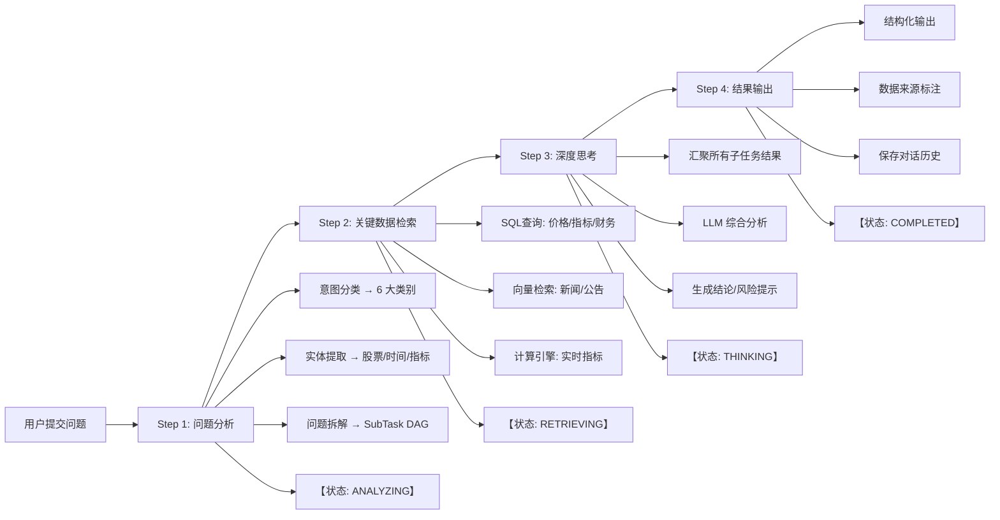
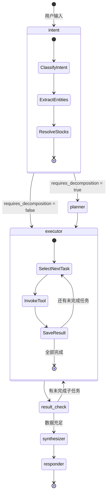

# Stock AI Agent — 开发规范

## 项目概述

基于 LangGraph 的多市场股票智能问答 AI Agent 系统，支持 A 股、港股、美股三大市场的查询与分析。

**技术栈**: Python 3.12+ / FastAPI / LangGraph / PydanticAI / SQLAlchemy 2.0 / Supabase (PostgreSQL + pgvector) / Streamlit

**核心学习目标**:
- LangGraph: 有状态 Agent 的图编排
- PydanticAI: 类型安全的 Agent 开发
- 意图理解: LLM 意图分类与实体提取
- 问题拆解: 复杂问题分解为子任务 DAG
- RAG: 向量检索增强生成
- Text-to-SQL: 自然语言转 SQL 查询

---

## 快速命令

### 环境管理
```bash
# 安装依赖
uv sync

# 激活虚拟环境
source .venv/bin/activate

# 添加依赖
uv add <package>
```

### 代码质量
```bash
# Lint 检查
ruff check .

# 代码格式化
ruff format .

# 类型检查
mypy stock_agent/

# 运行测试
pytest tests/ -v

# 单文件测试
pytest tests/test_xxx.py -v -k "test_name"
```

### 运行服务
```bash
# API 服务
uvicorn stock_agent.main:app --reload --port 8000

# Streamlit 前端
streamlit run stock_agent/frontend/app.py
```

### 数据管道（手动执行，按顺序）

> [!IMPORTANT]
> MVP 阶段不需要定时任务或自动调度。所有数据获取通过手动执行脚本完成。

```bash
# 1. A 股数据获取（601127 赛力斯、688981 中芯国际）
python -m data_pipeline.akshare_fetcher

# 2. 港股/美股数据获取
python -m data_pipeline.yfinance_fetcher

# 3. 技术指标计算（依赖上面两步）
python -m data_pipeline.indicator_calculator

# 4. 新闻获取
python -m data_pipeline.news_fetcher

# 5. 新闻向量化入库
python -m data_pipeline.embedding_pipeline

# 6. SQL 示例向量化入库
python -m data_pipeline.sql_examples_seeder
```

---

## 代码风格规范

### Python 通用
- 使用 Python 3.12+ 语法特性
- 所有函数必须有 **type hints**
- 使用 `async def` 处理所有 I/O 操作（数据库调用、API 请求、文件 I/O）
- 变量命名: `snake_case`
- 类名: `PascalCase`
- 常量: `UPPER_SNAKE_CASE`
- 字符串使用双引号 `"`
- 导入排序: stdlib → third-party → local (ruff 自动处理)

### FastAPI 专项
- 使用 Pydantic v2 BaseModel 做请求/响应 Schema
- 使用 FastAPI 依赖注入管理 DB Session 和 Settings
- 所有 endpoint 必须有 `response_model` 和 `status_code`
- 错误处理统一使用 `HTTPException`
- 路由命名: `/api/v1/{resource}` RESTful 风格

### SQLAlchemy 专项
- 使用 SQLAlchemy 2.0 声明式映射 (`Mapped`, `mapped_column`)
- 使用 async session (`AsyncSession`)
- 表名使用 snake_case
- **主键策略**:
  - 用户/会话表主键用 UUID v4
  - 行情/指标表用自增 id
- 时间字段统一用 UTC + `func.now()`
- `trade_date` 类型为 VARCHAR(10)，格式 'YYYY-MM-DD'

### LangGraph 专项
- State 使用 TypedDict 定义，字段添加 `Annotated`
- 节点函数签名: `async def node_name(state: AgentState) -> dict`
- 边和条件路由使用类型安全的字面量
- 每个节点单独文件，放在 `agent/nodes/` 目录
- Prompt 模板放在 `agent/prompts/` 目录

### Supabase / pgvector 专项
- 所有向量表统一使用 `VECTOR(1536)` 维度
- MVP 阶段使用 IVFFlat 索引 + `vector_cosine_ops`
- 向量索引配置: `lists = 50~100`, `probes = 10`
- 数据库变更必须通过 migration (Supabase MCP 的 `apply_migration`)
- 变更后运行 `get_advisors` 检查安全/性能建议

---

## 项目结构

```
stock_agent/
├── config/
│   └── settings.py           # Pydantic Settings (环境变量配置)
├── database/
│   ├── base.py               # SQLAlchemy Base
│   ├── session.py            # Async session 工厂
│   └── models/
│       ├── stock.py          # A股数据模型 (11 表)
│       ├── stock_hk.py       # 港股数据模型 (11 表)
│       ├── stock_us.py       # 美股数据模型 (11 表)
│       ├── vector.py         # 向量表 (3 张)
│       ├── user.py           # User / ChatSession / ChatMessage
│       └── agent_log.py      # AgentExecutionLog
├── agent/
│   ├── graph.py              # LangGraph StateGraph 定义
│   ├── state.py              # AgentState TypedDict
│   ├── nodes/
│   │   ├── intent.py        # 意图分类 + 实体提取
│   │   ├── planner.py       # 计划生成 (问题拆解)
│   │   ├── executor.py      # 工具执行
│   │   ├── synthesizer.py    # 综合分析
│   │   └── responder.py      # 回复生成
│   └── prompts/
│       ├── intent_prompt.py          # 意图分类 prompt
│       ├── planner_prompt.py         # 计划生成 prompt
│       ├── synthesis_prompt.py       # 综合分析 prompt
│       └── text_to_sql_prompt.py     # Text-to-SQL prompt
├── tools/
│   ├── stock_price.py         # 价格查询工具
│   ├── tech_indicator.py      # 技术指标查询
│   ├── tech_signal.py        # 策略信号分析
│   ├── financial_data.py      # 财务数据查询
│   ├── news_search.py        # 新闻 RAG 检索
│   ├── text_to_sql.py        # 自然语言转 SQL
│   └── stock_resolver.py     # 股票名称解析
├── services/
│   ├── embedding.py          # Embedding 服务 (多 Provider)
│   ├── rag.py                # RAG 检索服务
│   └── llm.py               # LLM 服务 (多 Provider)
├── data_pipeline/
│   ├── akshare_fetcher.py    # A股数据获取
│   ├── yfinance_fetcher.py   # 港股/美股数据获取
│   ├── indicator_calculator.py # 技术指标计算
│   ├── news_fetcher.py       # 新闻获取
│   ├── embedding_pipeline.py  # 向量化管道
│   └── sql_examples_seeder.py # SQL 示例向量化
├── api/
│   ├── chat.py              # 聊天 API (SSE 流式推送)
│   └── session.py           # 会话管理 API
├── frontend/
│   └── app.py               # Streamlit 应用
└── main.py                 # FastAPI 入口
```

---

## 重要约定

1. **设计文档不可随意修改**: 不要修改 `docs/` 目录中的设计文档（`PRD_stock_ai_agent.md`、`architecture.md`、`technical_design.md`、`plan.md`），除非明确要求。

2. **开发阶段确认**: 新增功能前先查看 `docs/plan.md` 确认当前阶段，避免超前开发。

3. **数据库变更规范**: 数据库变更必须通过 migration（或 Supabase MCP 的 `apply_migration`），切勿直接在数据库中修改表结构。

4. **敏感信息管理**: 敏感信息（API Key、DB URL）只能放在 `.env`，不得硬编码到代码中。

5. **测试覆盖要求**: 每个 PR 必须包含对应的测试。

6. **提交信息格式**: `<type>(<scope>): <description>`
   - `type`: `feat` / `fix` / `refactor` / `test` / `docs` / `chore`
   - 示例: `feat(tools): add news_search_tool for RAG`

7. **文档查询规范**: 使用 Context7 MCP 查询库文档，避免使用过时 API。

8. **SQL 安全约束**: Text-to-SQL 工具仅允许生成 SELECT 语句，禁止 INSERT/UPDATE/DELETE/DROP。

---

## MVP 股票池

> MVP 阶段仅关注以下 12 支股票，确保数据可快速准备，同时覆盖三大市场核心场景。

| 市场 | 股票 | Ticker | 选择理由 |
|------|------|--------|----------|
| **美股 (NASDAQ)** | Apple | `AAPL` | 市值最大 |
| | Microsoft | `MSFT` | 云+AI 领军 |
| | NVIDIA | `NVDA` | AI 芯片 |
| | Alphabet (Google) | `GOOG` | 搜索+AI |
| | Amazon | `AMZN` | 电商+云 |
| | Meta | `META` | 社交+AI |
| | Tesla | `TSLA` | 新能源+自动驾驶 |
| **港股** | 阿里巴巴 | `9988.HK` | 电商平台 |
| | 腾讯 | `0700.HK` | 社交+游戏 |
| | 快手 | `1024.HK` | 短视频+AI |
| **A股** | 赛力斯 | `601127` | 新能源汽车 |
| | 中芯国际 | `688981` | 半导体 |

---

## 用户问题分类体系

Agent 将用户问题分为 **6 大类、18 个子类**：

| 类别 | 意图标签 | 示例问题 | 数据来源 |
|------|----------|----------|----------|
| **行情价格类** (`QUOTE`) | `quote.price` | "GOOGLE 最近的股价表现" | `stock_daily_price` |
| | `quote.change` | "茅台最近一周涨了多少" | `stock_daily_price` |
| | `quote.compare` | "对比万科和保利3个月涨跌幅" | `stock_daily_price` |
| **技术分析类** (`TECHNICAL`) | `tech.indicator` | "宁德时代的 MACD 指标" | `stock_technical_indicators` |
| | `tech.signal` | "赛力斯是否有买入信号" | 策略信号表 x5 |
| | `tech.pattern` | "腾讯目前是上升趋势吗" | 技术指标 + 计算 |
| **基本面分析类** (`FUNDAMENTAL`) | `fund.data` | "茅台2025年的ROE" | `financial_metrics` |
| | `fund.analysis` | "宁德时代财务健康状况" | `financial_metrics` |
| | `fund.valuation` | "比亚迪估值是否合理" | `financial_metrics` |
| **信息事件类** (`NEWS_EVENT`) | `news.company` | "快手最近有什么利好消息" | `stock_news` (RAG) |
| | `news.industry` | "新能源行业最新政策" | `stock_news` (RAG) |
| | `news.sentiment` | "隆基绿能有负面新闻吗" | `stock_news` + 情感分析 |
| **综合分析类** (`COMPOSITE`) | `composite.full` | "从技术面和基本面分析茅台" | 多工具组合 |
| | `composite.screen` | "找出医药行业ROE>15%且上升趋势的股票" | SQL筛选 + 技术判断 |
| | `composite.risk` | "结合快手AI业务分析风险和走势" | 新闻RAG + 技术 + 基本面 |
| **知识科普类** (`KNOWLEDGE`) | `knowledge.concept` | "什么是 MACD 金叉" | LLM 知识 + RAG |
| | `knowledge.education` | "杜邦分析法怎么用" | LLM 知识 + RAG |
| | `knowledge.usage` | "RSI 超买超卖的阈值是什么" | LLM 知识 |

---

## Agent 执行流程



---

## 环境变量配置

### LLM Provider 配置
```bash
LLM_PROVIDER=openai                # openai | gemini | zhipu
LLM_BASE_URL=                     # 可选，自定义 API 端点
LLM_API_KEY=sk-xxx
LLM_MODEL=gpt-4o                  # gpt-4o | gemini-2.0-flash | glm-4
LLM_TEMPERATURE=0.1               # Agent 场景建议低温度
LLM_MAX_TOKENS=4096
```

### Embedding Provider 配置
```bash
EMBEDDING_PROVIDER=openai          # openai | gemini | zhipu
EMBEDDING_BASE_URL=               # 可选
EMBEDDING_API_KEY=sk-xxx
EMBEDDING_MODEL=text-embedding-3-small
EMBEDDING_DIMENSIONS=1536          # 统一向量维度
```

### Supabase 配置
```bash
SUPABASE_URL=https://xxx.supabase.co
SUPABASE_KEY=xxx
SUPABASE_DB_URL=postgresql://...
```

### 应用配置
```bash
APP_ENV=development
LOG_LEVEL=INFO
MAX_RETRIES=3
TOOL_TIMEOUT_SECONDS=30
MAX_SUB_TASKS=10
RAG_TOP_K=10
SQL_MAX_ROWS=500
```

---

## 数据库表概览

### 结构化数据表（按市场拆分）

| 类型 | A 股表名 | 港股表名 | 美股表名 |
|------|-----------|-----------|-----------|
| 日K线 | `stock_daily_price` | `stock_daily_price_hk` | `stock_daily_price_us` |
| 技术指标 | `stock_technical_indicators` | `stock_technical_indicators_hk` | `stock_technical_indicators_us` |
| 趋势信号 | `stock_technical_trend_signal_indicators` | `..._hk` | `..._us` |
| 均值回归 | `stock_technical_mean_reversion_signal_indicators` | `..._hk` | `..._us` |
| 动量信号 | `stock_technical_momentum_signal_indicators` | `..._hk` | `..._us` |
| 波动率 | `stock_technical_volatility_signal_indicators` | `..._hk` | `..._us` |
| 统计套利 | `stock_technical_stat_arb_signal_indicators` | `..._hk` | `..._us` |
| 财务指标 | `financial_metrics` | `financial_metrics_hk` | `financial_metrics_us` |
| 基本信息 | `stock_basic_info` | `stock_basic_hk` | `stock_basic_us` |
| 公司信息 | `stock_company_info` | `stock_company_info_hk` | `stock_company_info_us` |

### 向量数据表（统一）

| 表名 | 用途 |
|------|------|
| `stock_news_embeddings` | 新闻/公告向量 (VECTOR(1536)) |
| `sql_examples_embeddings` | SQL 示例向量 (RAG 增强 Text-to-SQL) |
| `conversation_embeddings` | 对话历史向量 (支持跨会话上下文检索) |

### Agent / 用户数据表

| 表名 | 用途 |
|------|------|
| `users` | 用户信息 |
| `chat_sessions` | 聊天会话 |
| `chat_messages` | 聊天消息历史 |
| `agent_execution_log` | Agent 执行日志（每步操作的追踪） |

---

## LangGraph 状态图



---

## 关键设计文档

| 文档 | 路径 | 内容 |
|------|------|------|
| **产品需求文档** | `docs/PRD_stock_ai_agent.md` | 产品定位、6 大问题类别、Agent 意图理解与问题拆解、数据架构、分期路线图 |
| **系统架构文档** | `docs/architecture.md` | C4 模型（上下文/容器/组件）、数据架构、通信架构（SSE）、LLM/Embedding Provider 抽象、部署架构、ADR |
| **技术实现文档** | `docs/technical_design.md` | 配置管理、核心数据模型、数据库模型详解、Agent Graph 实现、工具实现、服务层、API 层、数据管道、Prompt 工程 |
| **开发计划** | `docs/plan.md` | 6 Phase 开发路线图、各阶段任务清单、里程碑检查点、MVP 股票池 |

---

## SSE 事件格式

Agent 执行过程通过 SSE 流式推送，前端使用 `EventSource` API 消费。

```typescript
// 状态更新事件
{ "type": "status", "status": "analyzing" | "retrieving" | "thinking" | "completed" }

// 步骤详情事件
{ "type": "step", "step_name": "query_stock_price", "status": "running", "params": {...} }

// Token 流式输出
{ "type": "token", "content": "根据技术分析..." }

// 最终结果
{ "type": "result", "content": "...", "sources": [...], "disclaimer": "..." }

// 错误
{ "type": "error", "message": "..." }

// 结束标记
[DONE]
```

---
