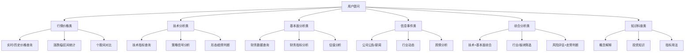
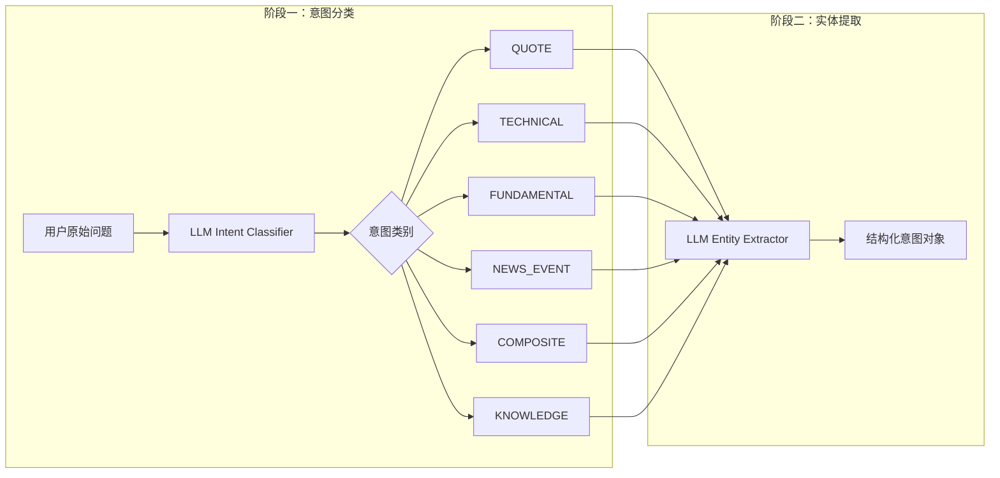
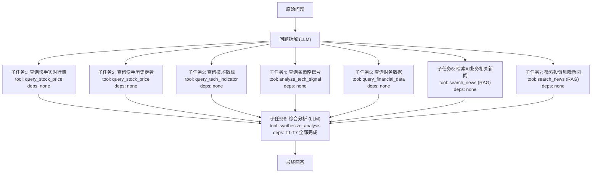
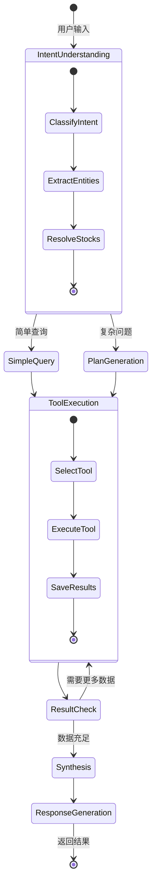
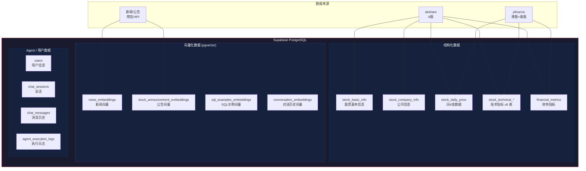
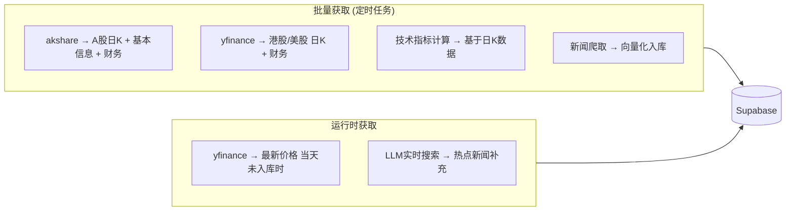
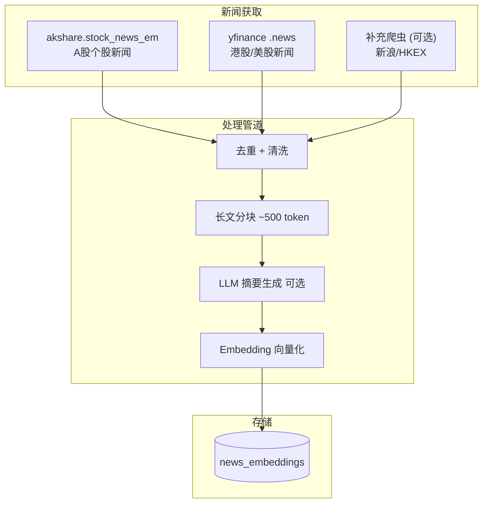
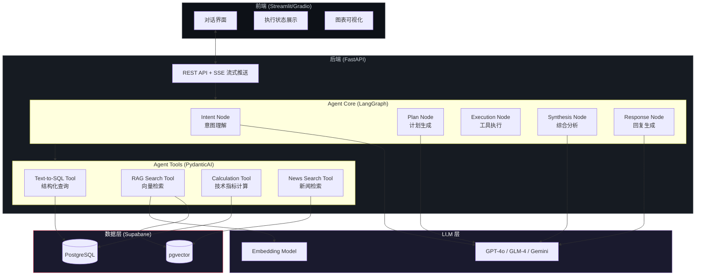
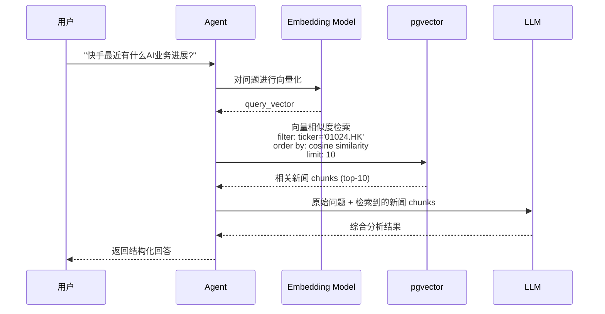

# Stock AI Agent 产品需求文档 (PRD)

> **版本**: v1.0  
> **日期**: 2026-02-10  
> **定位**: 个人练手项目，深入学习 LangGraph + PydanticAI 的 Agent 开发  
> **参考产品**: 牛牛AI (富途) 智能问答系统

---

## 1. 产品概述

### 1.1 产品定位

一个基于 LLM 大模型的 **股票智能问答 AI Agent 系统**，面向个人投资者，支持 **A股、港股、美股（纳斯达克）** 三大市场。系统能够理解用户关于股票市场的自然语言问题，通过意图识别、问题拆解、多工具协作，结合 RAG 技术查询结构化数据和向量数据，最终返回专业的分析结果。

### 1.2 核心学习目标

| 技术方向 | 学习目标 |
|---------|---------|
| **LangGraph** | 理解有状态 Agent 的图编排，掌握节点/边/条件路由的设计 |
| **PydanticAI** | 掌握类型安全的 Agent 开发，理解 Tool/Dependency 注入模式 |
| **意图理解** | LLM 如何对用户问题进行分类和实体提取 |
| **问题拆解** | 复杂问题如何拆解成可执行的子任务 DAG |
| **RAG** | 向量检索增强生成，提升 LLM 的信息准确度 |
| **Text-to-SQL** | 自然语言转 SQL 查询结构化数据库 |

### 1.3 产品愿景参考

从你分享的牛牛AI截图可以看到标杆产品的工作流程：

```
用户提问 → 问题分析(理解问题/确认所需数据) → 关键数据检索(多维度并行) → 深度思考 → 核心结论
```

我们的系统将实现类似的流程，但更聚焦于可观测性和学习价值。

---

## 2. 用户问题分类体系

### 2.1 六大问题类别

根据股票领域的用户提问场景，系统将问题分为 **6 大类、18 个子类**：



### 2.2 各类别详细说明与实例

#### 📊 类别一：行情价格类 (`QUOTE`)

用户查询具体股票的价格数据、涨跌表现。

| 子类 | 意图标签 | 示例问题 | 数据来源 | Agent 工具 |
|-----|---------|---------|---------|-----------|
| 实时/历史价格 | `quote.price` | "GOOGLE 最近的股价表现" | `stock_daily_price` | `query_stock_price` |
| 涨跌幅统计 | `quote.change` | "茅台最近一周涨了多少" | `stock_daily_price` | `query_price_change` |
| 个股对比 | `quote.compare` | "对比万科和保利3个月涨跌幅" | `stock_daily_price` | `compare_stocks` |

**关键实体提取**：股票名称/代码、时间范围、对比对象

#### 📈 类别二：技术分析类 (`TECHNICAL`)

用户围绕技术指标、策略信号进行分析。

| 子类 | 意图标签 | 示例问题 | 数据来源 | Agent 工具 |
|-----|---------|---------|---------|-----------|
| 指标查询 | `tech.indicator` | "宁德时代的 MACD 指标" | `stock_technical_indicators` | `query_tech_indicator` |
| 策略信号 | `tech.signal` | "赛力斯是否有买入信号" | 各策略信号表 | `analyze_tech_signal` |
| 形态/趋势 | `tech.pattern` | "腾讯目前是上升趋势吗" | 技术指标 + 计算 | `analyze_trend` |

**涉及数据表**：
- `stock_technical_indicators` — 基础技术指标 (MA/BOLL/KDJ/RSI/MACD)
- `stock_technical_trend_signal_indicators` — 趋势跟踪策略
- `stock_technical_mean_reversion_signal_indicators` — 均值回归策略
- `stock_technical_momentum_signal_indicators` — 动量策略
- `stock_technical_volatility_signal_indicators` — 波动率策略
- `stock_technical_stat_arb_signal_indicators` — 统计套利策略

#### 💰 类别三：基本面分析类 (`FUNDAMENTAL`)

用户查询和分析公司财务状况。

| 子类 | 意图标签 | 示例问题 | 数据来源 | Agent 工具 |
|-----|---------|---------|---------|-----------|
| 财务数据 | `fund.data` | "茅台2025年的ROE" | `financial_metrics` | `query_financial_data` |
| 财务指标 | `fund.analysis` | "宁德时代财务健康状况" | `financial_metrics` | `analyze_financials` |
| 估值分析 | `fund.valuation` | "比亚迪估值是否合理" | `financial_metrics` | `analyze_valuation` |

#### 📰 类别四：信息事件类 (`NEWS_EVENT`)

用户关注公司新闻、公告、事件。

| 子类 | 意图标签 | 示例问题 | 数据来源 | Agent 工具 |
|-----|---------|---------|---------|-----------|
| 公告/新闻 | `news.company` | "快手最近有什么利好消息" | `stock_news` (向量检索) | `search_news` |
| 行业动态 | `news.industry` | "新能源行业最新政策" | `stock_news` (向量检索) | `search_industry_news` |
| 舆情分析 | `news.sentiment` | "隆基绿能有负面新闻吗" | `stock_news` + LLM 情感分析 | `analyze_sentiment` |

> [!NOTE]
> 新闻事件类是 RAG 技术的核心应用场景。新闻数据存入 Supabase 后进行向量化，用户提问时通过语义相似度检索相关新闻，再由 LLM 综合分析。

#### 🔍 类别五：综合分析类 (`COMPOSITE`)

涉及多个维度的深度分析，是 Agent 问题拆解能力的核心考验。

| 子类 | 意图标签 | 示例问题 | 涉及工具 |
|-----|---------|---------|---------|
| 技术+基本面 | `composite.full` | "从技术面和基本面分析，茅台值得投资吗" | 多工具组合 |
| 板块筛选 | `composite.screen` | "找出医药行业 ROE>15% 且上升趋势的股票" | SQL筛选 + 技术判断 |
| 风险+走势 | `composite.risk` | "结合快手AI业务，分析当前位置风险和走势" | 新闻RAG + 技术 + 基本面 |

**这类问题的核心挑战**：
1. 需要 Agent 将问题拆解成多个子任务
2. 子任务之间可能有依赖关系（先查数据再分析）
3. 最终需要 LLM 综合多个来源的信息给出结论

#### 📚 类别六：知识科普类 (`KNOWLEDGE`)

用户询问投资相关概念知识。

| 子类 | 意图标签 | 示例问题 | 数据来源 |
|-----|---------|---------|---------|
| 概念解释 | `knowledge.concept` | "什么是 MACD 金叉" | LLM 知识 + RAG |
| 投资知识 | `knowledge.education` | "杜邦分析法怎么用" | LLM 知识 + RAG |
| 指标用法 | `knowledge.usage` | "RSI 超买超卖的阈值是什么" | LLM 知识 |

---

## 3. Agent 意图理解与问题拆解

### 3.1 意图理解机制

Agent 意图理解分为 **两阶段**：



**阶段一：意图分类 (Intent Classification)**

通过 LLM + structured output (PydanticAI) 进行意图分类：

```python
class IntentClassification(BaseModel):
    """意图分类结果"""
    primary_intent: IntentCategory       # 主要意图类别
    sub_intent: str                      # 子意图标签 (如 tech.indicator)
    confidence: float                    # 置信度 0-1
    requires_decomposition: bool         # 是否需要问题拆解
    reasoning: str                       # LLM 的分类理由
```

**阶段二：实体提取 (Entity Extraction)**

从问题中提取关键实体：

```python
class ExtractedEntities(BaseModel):
    """提取的实体"""
    stocks: list[StockEntity]            # 股票列表 [{name, ticker, market}]
    time_range: TimeRange | None         # 时间范围
    indicators: list[str]                # 技术指标名称
    financial_metrics: list[str]         # 财务指标名称
    comparison_targets: list[str]        # 对比目标
    keywords: list[str]                  # 关键词 (用于新闻检索)
```

**关于股票实体的模糊匹配**：

用户输入可能是 "茅台"、"贵州茅台"、"600519"、"MOUTAI" 等多种形式。需要一个 **股票名称解析服务**：

```python
class StockResolver:
    """基于 stock_basic_info + stock_company_info 表的模糊匹配"""
    async def resolve(self, query: str) -> StockEntity:
        # 1. 精确匹配 ticker (600519, 01024.HK, GOOG)
        # 2. 精确匹配 stock_name
        # 3. 模糊匹配 (向量相似度 或 LIKE 查询)
        # 4. 返回 {ticker, name, market} 或请求用户澄清
```

### 3.2 问题拆解机制 (Question Decomposition)

对于综合分析类等复杂问题，需要将问题拆解为可执行的子任务图 (DAG)。

**示例**：用户问 "结合快手AI业务发展情况，结合股价走势，分析当前位置风险和走势判断"



**拆解结果的数据结构**：

```python
class SubTask(BaseModel):
    """子任务"""
    task_id: str                         # 唯一标识
    description: str                     # 任务描述
    tool_name: str                       # 需要调用的工具
    tool_params: dict                    # 工具参数
    dependencies: list[str]              # 依赖的其他 task_id
    status: TaskStatus                   # pending/running/completed/failed
    result: Any | None                   # 执行结果

class DecompositionPlan(BaseModel):
    """问题拆解计划"""
    original_question: str
    tasks: list[SubTask]
    execution_order: list[list[str]]     # 分层执行顺序 [[并行层1], [并行层2], ...]
```

### 3.3 LangGraph 状态图设计

整个 Agent 的执行流程用 LangGraph 编排为一个有状态的 DAG：



**LangGraph State 定义**：

```python
class AgentState(TypedDict):
    """Agent 全局状态"""
    # 对话上下文
    session_id: str
    user_id: str
    messages: list[BaseMessage]
    
    # 意图理解结果
    intent: IntentClassification
    entities: ExtractedEntities
    resolved_stocks: list[StockEntity]
    
    # 执行计划
    plan: DecompositionPlan | None
    current_step: int
    
    # 工具执行结果
    tool_results: dict[str, Any]        # task_id -> result
    
    # 最终输出
    analysis_result: str
    data_sources: list[str]             # 引用的数据来源
    risk_disclaimer: str                # 风险提示
```

---

## 4. Agent 执行流程与状态管理

### 4.1 完整执行流程

下面是一次用户提问从接收到返回的完整流程（对标牛牛AI的 "问题分析 → 关键数据检索 → 深度思考 → 核心结论" ）：

```
┌─────────────────────────────────────────────────────────────┐
│                      用户提交问题                            │
└──────────────────────────┬──────────────────────────────────┘
                           │
                           ▼
┌─────────────────────────────────────────────────────────────┐
│  Step 1: 问题分析 (Intent Understanding)                     │
│  ├── 1.1 意图分类 → COMPOSITE / TECHNICAL / ...              │
│  ├── 1.2 实体提取 → 股票代码, 时间范围, 指标                    │
│  ├── 1.3 股票解析 → ticker + market 确认                     │
│  └── 1.4 问题拆解 → 生成 SubTask DAG (复杂问题)               │
│  【状态: ANALYZING】                                         │
└──────────────────────────┬──────────────────────────────────┘
                           │
                           ▼
┌─────────────────────────────────────────────────────────────┐
│  Step 2: 关键数据检索 (Data Retrieval)                        │
│  ├── SQL查询: 价格/技术指标/财务数据 (Text-to-SQL)              │
│  ├── 向量检索: 新闻/公告语义搜索 (RAG)                         │
│  ├── 计算引擎: 实时技术指标计算 (如需)                          │
│  └── 子任务按依赖关系分层并行执行                                │
│  【状态: RETRIEVING】                                        │
└──────────────────────────┬──────────────────────────────────┘
                           │
                           ▼
┌─────────────────────────────────────────────────────────────┐
│  Step 3: 深度思考 (Synthesis & Reasoning)                     │
│  ├── 汇聚所有子任务结果                                       │
│  ├── LLM 综合分析多维度数据                                    │
│  ├── 生成结论、风险提示                                        │
│  └── 引用数据来源标注                                          │
│  【状态: THINKING】                                          │
└──────────────────────────┬──────────────────────────────────┘
                           │
                           ▼
┌─────────────────────────────────────────────────────────────┐
│  Step 4: 结果输出 (Response Generation)                       │
│  ├── 结构化格式输出 (标题/核心结论/详细分析/风险提示)              │
│  ├── 数据来源标注 (如 [41] [53] 式引用)                        │
│  └── 保存对话历史                                             │
│  【状态: COMPLETED】                                         │
└─────────────────────────────────────────────────────────────┘
```

### 4.2 执行状态枚举 & 存储

Agent 执行过程中的状态需要持久化，支持前端轮询展示进度。

```python
class ExecutionStatus(str, Enum):
    """Agent 执行状态"""
    PENDING = "pending"            # 等待执行
    ANALYZING = "analyzing"        # 问题分析中
    PLANNING = "planning"          # 生成执行计划中
    RETRIEVING = "retrieving"      # 数据检索中
    COMPUTING = "computing"        # 计算/分析中
    THINKING = "thinking"          # LLM 深度思考中
    COMPLETED = "completed"        # 执行完成
    FAILED = "failed"              # 执行失败
    CANCELLED = "cancelled"        # 用户取消
```

**状态持久化方案**：

每次执行写入 `agent_execution_logs` 表，前端通过 session_id 查询最新状态：

```sql
-- Agent 执行日志表
CREATE TABLE agent_execution_logs (
    id BIGSERIAL PRIMARY KEY,
    session_id VARCHAR(36),                -- 关联会话
    user_query TEXT NOT NULL,              -- 用户原始问题
    intent VARCHAR(50),                    -- 意图类别
    sub_tasks JSONB,                       -- 子任务列表 (JSON)
    tool_calls JSONB,                      -- 工具调用记录 (JSON)
    llm_calls JSONB,                       -- LLM 调用记录 (JSON)
    final_response TEXT,                   -- 最终回复
    status VARCHAR(20) NOT NULL,           -- pending/running/success/failed
    error_message TEXT,                    -- 错误信息
    total_tokens INT DEFAULT 0,            -- 总 token
    total_cost_usd FLOAT DEFAULT 0,        -- 总费用 (USD)
    duration_ms INT,                       -- 耗时(毫秒)
    created_at TIMESTAMPTZ DEFAULT NOW(),
    completed_at TIMESTAMPTZ
);
```

### 4.3 可观测性 (Observability)

为了学习和调试，系统需要完整的可观测性：

| 层级 | 记录内容 | 存储位置 |
|-----|---------|---------|
| **Agent Level** | 整体执行状态、耗时、token 消耗 | `agent_execution_logs` |
| **LLM Call Level** | 每次 LLM 调用的 prompt/response/token | `llm_call_log` |
| **Tool Call Level** | 每次工具调用的参数/结果/耗时 | `tool_call_log` |
| **Error Level** | 错误信息、堆栈、重试次数 | `error_log` |

> [!TIP]
> 后续可接入 **LangFuse** 或 **LangSmith** 实现更专业的 LLM 可观测性平台，但初期用数据库表记录即可满足学习需要。

---

## 5. 数据架构设计

### 5.1 整体数据架构

所有数据统一存储在 **Supabase (PostgreSQL)** 中，利用 `pgvector` 扩展支持向量存储。



### 5.2 已有结构化数据表 (已设计)

参考 `stock_agent/database/models/` 中的模型定义，以下表已设计完成（**按市场拆表**，命名后缀：无后缀=A股、`_hk`=港股、`_us`=美股）：

| 类型 | A股表名 | 港股表名 | 美股表名 | 用途 | 联合唯一键 |
|------|---------|---------|---------|------|-----------|
| 股票基本信息 | `stock_basic_info` | `stock_basic_hk` | `stock_basic_us` | 股票基础元数据 | ticker |
| 公司信息 | `stock_company_info` | — | — | A股公司详细信息 | ticker |
| 日K线行情 | `stock_daily_price` | `stock_daily_price_hk` | `stock_daily_price_us` | 日K线价格 | ticker + trade_date |
| 基础技术指标 | `stock_technical_indicators` | `stock_technical_indicators_hk` | `stock_technical_indicators_us` | MACD/RSI/KDJ/布林带/均线 | ticker + trade_date |
| 趋势信号 | `stock_technical_trend_signal_indicators` | `..._hk` | `..._us` | 趋势策略信号 | ticker + trade_date |
| 均值回归信号 | `stock_technical_mean_reversion_signal_indicators` | `..._hk` | `..._us` | 均值回归策略信号 | ticker + trade_date |
| 动量信号 | `stock_technical_momentum_signal_indicators` | `..._hk` | `..._us` | 动量策略信号 | ticker + trade_date |
| 波动率信号 | `stock_technical_volatility_signal_indicators` | `..._hk` | `..._us` | 波动率策略信号 | ticker + trade_date |
| 统计套利信号 | `stock_technical_stat_arb_signal_indicators` | `..._hk` | `..._us` | 统计套利策略信号 | ticker + trade_date |
| 财务指标 | `financial_metrics` | `financial_metrics_hk` | `financial_metrics_us` | 财务指标与估值指标 | ticker + report_period + period |

> [!IMPORTANT]
> **Ticker 格式约定**：
> - A股: `600519` (6位数字)
> - 港股: `01024.HK` (带 .HK 后缀)
> - 美股: `GOOG` (字母代码)
>
> **路由规则**：工具/SQL 生成根据 `ticker` 推断 market，并选择对应的市场表（`*_hk` / `*_us`）。

### 5.3 需要新增的数据表

#### 5.3.1 用户与会话管理

```sql
-- 用户表
CREATE TABLE users (
    id UUID PRIMARY KEY DEFAULT gen_random_uuid(),
    username VARCHAR(50) UNIQUE NOT NULL,
    email VARCHAR(255) UNIQUE,
    display_name VARCHAR(100),
    avatar_url TEXT,
    preferences JSONB DEFAULT '{}',     -- 用户偏好 (关注股票、默认市场等)
    created_at TIMESTAMPTZ DEFAULT NOW(),
    updated_at TIMESTAMPTZ DEFAULT NOW()
);

-- 聊天会话表
CREATE TABLE chat_sessions (
    id UUID PRIMARY KEY DEFAULT gen_random_uuid(),
    user_id UUID NOT NULL REFERENCES users(id),
    title VARCHAR(255),                  -- 会话标题 (可由LLM自动生成)
    summary TEXT,                        -- 会话摘要
    status VARCHAR(20) DEFAULT 'active', -- active/archived/deleted
    metadata JSONB DEFAULT '{}',         -- 额外元数据
    created_at TIMESTAMPTZ DEFAULT NOW(),
    updated_at TIMESTAMPTZ DEFAULT NOW()
);
CREATE INDEX idx_chat_sessions_user_id ON chat_sessions(user_id);
CREATE INDEX idx_chat_sessions_status ON chat_sessions(status);

-- 聊天消息表
CREATE TABLE chat_messages (
    id UUID PRIMARY KEY DEFAULT gen_random_uuid(),
    session_id UUID NOT NULL REFERENCES chat_sessions(id),
    role VARCHAR(20) NOT NULL,           -- user/assistant/system/tool
    content TEXT NOT NULL,               -- 消息内容
    metadata JSONB DEFAULT '{}',         -- 额外信息 (token数, 耗时, 引用来源等)
    parent_message_id UUID,              -- 支持消息树结构 (用于重试/分支)
    created_at TIMESTAMPTZ DEFAULT NOW()
);
CREATE INDEX idx_chat_messages_session_id ON chat_messages(session_id);
CREATE INDEX idx_chat_messages_created_at ON chat_messages(created_at);
```

#### 5.3.2 Agent 执行追踪

```sql
-- Agent 执行日志 (每次用户提问的完整执行记录)
CREATE TABLE agent_execution_logs (
    id BIGSERIAL PRIMARY KEY,
    session_id VARCHAR(36),              -- 关联会话
    user_query TEXT NOT NULL,            -- 用户原始问题
    intent VARCHAR(50),                  -- 意图类别
    sub_tasks JSONB,                     -- 子任务列表 (JSON)
    tool_calls JSONB,                    -- 工具调用记录 (JSON)
    llm_calls JSONB,                     -- LLM 调用记录 (JSON)
    final_response TEXT,                 -- 最终回复
    status VARCHAR(20) NOT NULL,         -- pending/running/success/failed
    error_message TEXT,                  -- 错误信息
    total_tokens INT DEFAULT 0,          -- 总 token
    total_cost_usd FLOAT DEFAULT 0,      -- 总费用 (USD)
    duration_ms INT,                     -- 耗时(毫秒)
    completed_at TIMESTAMPTZ,
    created_at TIMESTAMPTZ DEFAULT NOW()
);
CREATE INDEX idx_agent_exec_session ON agent_execution_logs(session_id);
```

#### 5.3.3 向量化数据表

```sql
-- 启用 pgvector 扩展
CREATE EXTENSION IF NOT EXISTS vector;

-- 新闻/公告 向量嵌入表
CREATE TABLE news_embeddings (
    id BIGSERIAL PRIMARY KEY,
    source_type VARCHAR(20) NOT NULL,    -- news/announcement
    ticker VARCHAR(20),                  -- 关联股票 (可为空表示行业/宏观新闻)
    title TEXT NOT NULL,                 -- 新闻标题
    content TEXT NOT NULL,               -- 原文内容 (或 chunk)
    chunk_index INT DEFAULT 0,           -- 分块索引 (长文章拆分)
    summary TEXT,                        -- LLM 生成的摘要
    sentiment VARCHAR(10),               -- positive/negative/neutral
    published_at TIMESTAMPTZ,            -- 发布时间
    source VARCHAR(100),                 -- 数据来源
    embedding VECTOR(1536),              -- 向量嵌入 (维度可配置)
    metadata JSONB DEFAULT '{}',         -- 额外元数据
    created_at TIMESTAMPTZ DEFAULT NOW()
);
CREATE INDEX idx_news_emb_ticker ON news_embeddings(ticker);
CREATE INDEX idx_news_emb_published ON news_embeddings(published_at);
CREATE INDEX idx_news_emb_vector ON news_embeddings 
    USING ivfflat (embedding vector_cosine_ops) WITH (lists = 100);

-- Text-to-SQL 示例向量表 (RAG增强SQL生成)
CREATE TABLE sql_examples_embeddings (
    id BIGSERIAL PRIMARY KEY,
    question TEXT NOT NULL,              -- 自然语言问题
    sql_query TEXT NOT NULL,             -- 对应的 SQL 查询
    description TEXT,                    -- 说明
    tables_involved TEXT[],              -- 涉及的表名
    difficulty VARCHAR(10),              -- easy/medium/hard
    embedding VECTOR(1536),              -- 问题的向量嵌入
    created_at TIMESTAMPTZ DEFAULT NOW()
);
CREATE INDEX idx_sql_exm_vector ON sql_examples_embeddings 
    USING ivfflat (embedding vector_cosine_ops) WITH (lists = 50);

-- 对话历史向量表 (支持跨会话的上下文检索)
CREATE TABLE conversation_embeddings (
    id BIGSERIAL PRIMARY KEY,
    session_id UUID REFERENCES chat_sessions(id),
    message_id UUID REFERENCES chat_messages(id),
    content_summary TEXT,                -- 对话摘要
    embedding VECTOR(1536),
    created_at TIMESTAMPTZ DEFAULT NOW()
);
CREATE INDEX idx_conv_emb_session ON conversation_embeddings(session_id);
CREATE INDEX idx_conv_emb_vector ON conversation_embeddings 
    USING ivfflat (embedding vector_cosine_ops) WITH (lists = 50);
```

### 5.4 向量嵌入方案

| 配置项 | 方案 |
|-------|------|
| **Embedding 模型** | 支持多种 (通过环境变量配置)：`text-embedding-3-small` (OpenAI), `gemini-embedding-001` (Gemini), `embedding-3` (Zhipu/GLM) |
| **存储** | Supabase pgvector 扩展 |
| **向量维度** | **统一使用 1536 维** (各 provider 均支持此维度)，表字段使用 `VECTOR(1536)` |
| **相似度算法** | 余弦相似度 (`vector_cosine_ops`) |
| **索引** | IVFFlat（初期足够，数据量大后可升级 HNSW） |
| **分块策略** | 新闻/公告按段落分块，每块 ~500 token |

#### 各 Provider Embedding 维度对比

| Provider | 模型名 | 默认维度 | 支持维度 | 可调参数 | 技术特性 |
|---------|--------|---------|---------|---------|----------|
| **OpenAI** | `text-embedding-3-small` | 1536 | 任意 (via MRL) | `dimensions` | Matryoshka Representation Learning，低维截断仍保持高质量 |
| **Gemini** | `gemini-embedding-001` | 3072 | 128 - 3072 (推荐 768/1536/3072) | `output_dimensionality` | 同样使用 MRL 技术，支持灵活截断 |
| **Zhipu (GLM)** | `embedding-3` | 2048 | 256 / 512 / 1024 / 2048 | `dimensions` | 4 个离散维度可选 |

> [!IMPORTANT]
> **维度统一策略**：所有 provider 统一输出 **1536 维**。OpenAI 原生 1536 无需调整；Gemini 通过 `output_dimensionality=1536` 从 3072 截断；Zhipu 选择 `dimensions=1024` (最接近受支持维度，或需升级到 2048 再截断)。如需切换 provider，因维度一致，**无需重新计算历史向量**。

#### Embedding 环境变量配置

```bash
# Embedding Provider 配置
EMBEDDING_PROVIDER=openai          # openai | gemini | zhipu
EMBEDDING_BASE_URL=                # 可选，自定义 API 端点
EMBEDDING_API_KEY=sk-xxx
EMBEDDING_MODEL=text-embedding-3-small
EMBEDDING_DIMENSIONS=1536          # 统一向量维度
```

### 5.5 数据获取方案



**批量任务频率**：
- 日K线数据：每日收盘后获取 (A股 15:30, 港股 16:00, 美股次日凌晨)
- 财务数据：每季 (跟随财报发布)
- 技术指标：日K更新后自动计算
- 新闻公告：每日多次 (或准实时)

### 5.6 新闻数据来源方案

新闻数据是 RAG 场景的核心数据源。原则是 **少而精、权威优先**，每个市场聚焦 1-2 个可靠数据源。

#### 三大市场新闻来源

| 市场 | 主要数据源 | 获取方式 | Python 工具 | 数据内容 |
|------|-----------|---------|------------|----------|
| **A股** | 东方财富 (via akshare) | `akshare.stock_news_em(symbol)` | `akshare` | 个股新闻标题、内容、来源、发布时间 (最新 100 条/股) |
| **港股** | Yahoo Finance | `yfinance.Ticker("0005.HK").news` | `yfinance` | 英文新闻标题、摘要、链接、发布时间 |
| **美股 (NASDAQ)** | Yahoo Finance | `yfinance.Ticker("GOOG").news` | `yfinance` | 英文新闻标题、摘要、链接、发布时间 |

#### 补充数据源 (按需扩展)

| 数据源 | 市场 | 获取方式 | 说明 |
|--------|------|---------|------|
| 新浪财经 | A股/港股 | `requests` + `BeautifulSoup` 爬虫 | 中文财经新闻，需要自行解析 HTML |
| HKEXnews 公告 | 港股 | 爬虫 (公告摘要页) | 上市公司官方公告，结构化较好 |
| SEC EDGAR | 美股 | `sec-edgar-downloader` / API | 10-K, 10-Q, 8-K 公司公开文件 |
| NewsAPI / NewsData.io | 全球 | REST API (免费额度有限) | 通用新闻聚合 API，按关键词/国家过滤 |

#### 新闻获取流水线



> [!TIP]
> **初期策略**：先用 `akshare` + `yfinance` 内置的新闻接口，覆盖三大市场基本面。待 RAG 效果验证后，再按需接入爬虫或付费 API 扩展新闻覆盖面。

---

## 6. 技术栈与系统架构

### 6.1 技术栈总览

| 层级 | 技术选型 | 说明 |
|-----|---------|-----|
| **LLM** | OpenAI GPT-4o / 智谱 GLM-4 / Google Gemini | 通过 PydanticAI 抽象，支持切换 |
| **Agent Framework** | LangGraph + PydanticAI | LangGraph 编排流程，PydanticAI 实现类型安全的工具 |
| **后端** | Python 3.12 + FastAPI | API 服务 |
| **数据库** | Supabase (PostgreSQL + pgvector) | 统一存储 |
| **ORM** | SQLAlchemy 2.0 | 已有模型定义 |
| **数据获取** | yfinance + akshare | 已有脚本 |
| **计算引擎** | pandas + numpy + ta-lib | 技术指标计算 |
| **前端** | Streamlit / Gradio (初期) → Next.js (后期) | 快速搭建演示界面 |
| **可观测性** | LangFuse (可选) + DB 日志 | LLM 调用追踪 |

#### LLM & Embedding Provider 环境变量配置

```bash
# LLM Provider 配置
LLM_PROVIDER=openai                # openai | gemini | zhipu
LLM_BASE_URL=                      # 可选，自定义 API 端点 (兼容 OpenAI 格式的代理)
LLM_API_KEY=sk-xxx
LLM_MODEL=gpt-4o                   # gpt-4o | gemini-2.0-flash | glm-4

# Embedding Provider 配置 (详见 Section 5.4)
EMBEDDING_PROVIDER=openai          # openai | gemini | zhipu
EMBEDDING_BASE_URL=                # 可选
EMBEDDING_API_KEY=sk-xxx
EMBEDDING_MODEL=text-embedding-3-small
EMBEDDING_DIMENSIONS=1536          # 统一向量维度

# Supabase 配置
SUPABASE_URL=https://xxx.supabase.co
SUPABASE_KEY=xxx
SUPABASE_DB_URL=postgresql://...
```

> [!NOTE]
> LLM 和 Embedding 可以使用不同的 provider。例如 LLM 用 Gemini (中文理解+低成本)，Embedding 用 OpenAI (生态成熟)。通过环境变量独立配置，代码层通过 `config.py` 统一管理。

### 6.2 系统架构图



### 6.3 Text-to-SQL 实现思路

Text-to-SQL 是让 LLM 将自然语言转为 SQL 的关键技术。实现方案：

**1. Schema-aware prompting**：将数据库 schema 信息注入 LLM prompt

```python
# 自动从数据库读取 schema 信息
TABLE_SCHEMAS = """
Table: stock_daily_price
Columns: ticker(股票代码), trade_date(交易日期), open(开盘价), 
         close(收盘价), high(最高价), low(最低价), volume(成交量)...

注：港股/美股分别使用 stock_daily_price_hk / stock_daily_price_us（同结构、表名带后缀）。
"""
```

**2. RAG 增强的 Few-shot**：从 `sql_examples_embeddings` 表检索与用户问题最相似的 SQL 示例

```
用户问题: "茅台最近30天的收盘价"
→ 向量检索最相似示例 →
示例: "查询某股票最近N天收盘价" → 
  SELECT ticker, trade_date, close 
  FROM stock_daily_price 
  WHERE ticker = '600519' 
  ORDER BY trade_date DESC LIMIT 30;
（港股/美股同理，FROM 表名改为 stock_daily_price_hk / stock_daily_price_us）
→ LLM 参考示例生成目标 SQL
```

**3. SQL 安全校验**：生成的 SQL 仅允许 SELECT 操作，防止数据修改

---

## 7. RAG 应用场景详解

### 7.1 三大 RAG 应用场景

| 场景 | 查询来源 | 向量表 | 检索策略 |
|-----|---------|-------|---------|
| **新闻/公告检索** | 用户关于公司新闻、事件的问题 | `news_embeddings` | 语义相似度 + ticker 过滤 + 时间范围过滤 |
| **Text-to-SQL Few-shot** | 用户的结构化数据查询需求 | `sql_examples_embeddings` | 语义相似度 Top-K |
| **对话历史上下文** | 多轮对话中的上下文引用 | `conversation_embeddings` | 语义相似度 + session 过滤 |

### 7.2 RAG 检索流程



---

## 8. 分期实施路线图

### Phase 1：基础能力搭建 (2-3 周)

**目标**：跑通最小可用流程

- [ ] 项目脚手架搭建 (FastAPI + LangGraph + PydanticAI)
- [ ] 数据库迁移 (Supabase 建表: 用户/会话/消息/执行日志)
- [ ] 基础意图分类 (LLM structured output → 6 大类别)
- [ ] 实体提取 (股票名/代码/时间范围)
- [ ] 股票解析服务 (基于 stock_basic_info 的模糊匹配)
- [ ] 第一个 Tool：`query_stock_price` (SQL 查询价格数据)
- [ ] 简单问答流程跑通 (单轮对话)
- [ ] Streamlit 简易前端

**验收标准**：能回答 "茅台最近一周收盘价是多少"

### Phase 2：Text-to-SQL & 技术分析 (2-3 周)

**目标**：支持技术分析类问题

- [ ] Text-to-SQL 实现 (schema-aware prompting)
- [ ] SQL 示例库 + RAG 增强
- [ ] 技术指标查询工具 (`query_tech_indicator`)
- [ ] 策略信号分析工具 (`analyze_tech_signal`)
- [ ] 财务数据查询工具 (`query_financial_data`)
- [ ] 问题拆解能力 (简单的多步骤)
- [ ] 执行状态持久化

**验收标准**：能回答 "分析宁德时代的 MACD 指标，是否有买入信号"

### Phase 3：RAG & 新闻分析 (2-3 周)

**目标**：支持新闻事件类问题

- [ ] 新闻数据获取 & 入库
- [ ] Embedding 管道 (多 provider 支持)
- [ ] pgvector 向量检索服务
- [ ] 新闻检索工具 (`search_news`)
- [ ] 舆情分析工具 (`analyze_sentiment`)
- [ ] RAG 检索质量优化

**验收标准**：能回答 "快手最近有什么AI业务利好消息"

### Phase 4：综合分析 & 多轮对话 (2-3 周)

**目标**：支持复杂综合分析问题

- [ ] 复杂问题拆解 (生成 SubTask DAG)
- [ ] 多工具编排 (并行/串行混合执行)
- [ ] 综合分析与推理
- [ ] 多轮对话上下文管理
- [ ] 对话历史向量化 & 上下文检索
- [ ] 完善执行状态展示 (类牛牛AI的步骤展示)
- [ ] 风险提示 & 合规声明

**验收标准**：能回答 "结合快手AI业务发展，分析当前位置风险和走势"

### Phase 5：打磨优化 (持续)

- [ ] 更好的前端界面 (Next.js)
- [ ] 对话式交互优化
- [ ] LangFuse 接入
- [ ] 回测能力 (可选)
- [ ] 图表可视化增强

---

## 9. 项目目录结构 (建议)

```
stock-ai-agent/
├── docs/                          # 文档
│   └── PRD_stock_ai_agent.md      # 本文档
├── master_prompt.md               # Agent 系统提示词
├── stock_agent/                   # 主应用包
│   ├── __init__.py
│   ├── config.py                  # 配置管理 (LLM/Supabase/Embedding)
│   ├── main.py                    # FastAPI 应用入口
│   │
│   ├── agent/                     # Agent 核心
│   │   ├── __init__.py
│   │   ├── graph.py               # LangGraph 状态图定义
│   │   ├── state.py               # AgentState 定义
│   │   ├── nodes/                 # LangGraph 节点
│   │   │   ├── intent.py          # 意图理解节点
│   │   │   ├── planner.py         # 计划生成节点
│   │   │   ├── executor.py        # 工具执行节点
│   │   │   ├── synthesizer.py     # 综合分析节点
│   │   │   └── responder.py       # 回复生成节点
│   │   └── prompts/               # Prompt 模板
│   │       ├── intent_prompt.py
│   │       ├── planner_prompt.py
│   │       └── synthesis_prompt.py
│   │
│   ├── tools/                     # Agent 工具 (PydanticAI)
│   │   ├── __init__.py
│   │   ├── stock_price.py         # 价格查询工具
│   │   ├── tech_indicator.py      # 技术指标工具
│   │   ├── financial.py           # 财务数据工具
│   │   ├── news_search.py         # 新闻检索工具 (RAG)
│   │   ├── text_to_sql.py         # Text-to-SQL 工具
│   │   └── stock_resolver.py      # 股票名称解析
│   │
│   ├── database/                  # 数据库层
│   │   ├── __init__.py
│   │   ├── base.py                # SQLAlchemy Base
│   │   ├── connection.py          # Supabase 连接管理
│   │   ├── models/                # 数据模型
│   │   │   ├── stock.py           # 股票数据模型
│   │   │   ├── user.py            # 用户/会话模型
│   │   │   └── agent_log.py       # Agent 日志模型
│   │   └── repositories/          # 数据访问层
│   │       ├── stock_repo.py
│   │       ├── user_repo.py
│   │       └── vector_repo.py
│   │
│   ├── services/                  # 业务服务层
│   │   ├── __init__.py
│   │   ├── embedding.py           # Embedding 服务 (多 provider)
│   │   ├── rag.py                 # RAG 检索服务
│   │   └── indicator.py           # 技术指标计算服务
│   │
│   └── api/                       # API 路由
│       ├── __init__.py
│       ├── chat.py                # 聊天 API (SSE 流式推送)
│       ├── session.py             # 会话管理 API
│       └── health.py              # 健康检查
│
├── data_pipeline/                 # 数据管道 (批量任务)
│   ├── akshare_fetcher.py         # A股数据获取
│   ├── yfinance_fetcher.py        # 港股/美股数据获取
│   ├── indicator_calculator.py    # 技术指标计算
│   ├── news_fetcher.py            # 新闻获取
│   └── embedding_pipeline.py      # 向量化管道
│
├── frontend/                      # 前端
│   └── streamlit_app.py           # Streamlit 应用 (Phase 1)
│
├── migrations/                    # 数据库迁移
│   └── 001_initial_schema.sql
│
├── tests/                         # 测试
│   ├── test_intent.py
│   ├── test_tools.py
│   └── test_text_to_sql.py
│
├── pyproject.toml
├── .env.example
└── README.md
```

---

## 10. 关键设计决策 & 待讨论事项

### 10.1 已确定的设计决策

| 决策 | 选择 | 理由 |
|-----|------|------|
| 数据存储 | Supabase 统一存储 | 简化架构，pgvector 原生支持向量 |
| 多市场方案 | 按市场拆表 (`_hk` / `_us`) | 避免跨市场字段差异导致的统一表复杂度，SQL 更直观 |
| 日K vs 分钟K | 初期仅日K | 数据量可控，满足学习需要 |
| Agent 框架 | LangGraph 编排 + PydanticAI 工具 | 学习目标匹配 |
| Embedding 维度 | **统一 1536 维** | 三大 provider (OpenAI/Gemini/Zhipu) 均支持此维度，切换 provider 无需重计算 |
| 实时推送 | **SSE (Server-Sent Events)** | 单向推送 Agent 执行状态，比 WebSocket 更简单高效 |
| 新闻数据源 | akshare (A股) + yfinance (港股/美股) | 先用内置接口，按需扩展爬虫 |

### 10.2 已解决的设计问题

#### ✅ 问题 3：新闻数据来源

**结论**：初期 **不需要额外爬虫**。`akshare.stock_news_em()` 可获取 A 股个股新闻 (东方财富源，最新 100 条/股)；`yfinance.Ticker().news` 可获取港股/美股新闻。两者组合已覆盖三大市场基本面新闻需求。后续如需更深度覆盖 (如 HKEX 公告、SEC EDGAR)，再按需接入爬虫。详见 [Section 5.6](#56-新闻数据来源方案)。

#### ✅ 问题 4：Embedding 维度统一

**结论**：**统一使用 1536 维**，利用 Matryoshka Representation Learning (MRL) 技术实现。OpenAI 原生 1536 维；Gemini 通过 `output_dimensionality=1536` 从默认 3072 截断 (官方推荐维度之一)；Zhipu `embedding-3` 支持 256/512/1024/2048 四档，选择 1024 维 (最接近的受支持维度) 或 2048 维。三家 provider 均支持此维度，切换 provider **无需重新计算历史向量**。详见 [Section 5.4](#54-向量嵌入方案)。

#### ✅ 问题 5：实时性需求 (SSE vs WebSocket)

**结论**：采用 **SSE (Server-Sent Events)** 推送 Agent 执行过程的中间状态。

| 对比项 | SSE | WebSocket |
|-------|-----|------------|
| 通信方向 | 单向 (服务端 → 客户端) | 双向 |
| 协议 | 基于 HTTP/1.1 | 独立的 ws:// 协议 |
| 自动重连 | ✅ 浏览器内置 | ❌ 需手动实现 |
| 复杂度 | 低 (EventSource API) | 高 |
| 适用场景 | LLM token 流式输出、Agent 状态推送 | 实时聊天、协作编辑 |

**选择 SSE 的理由**：Agent 执行状态推送是典型的 "服务端单向推送" 场景 (ANALYZING → RETRIEVING → THINKING → COMPLETED)，无需客户端主动发消息控制 Agent。SSE 天然适合 LLM 流式 token 输出，FastAPI 通过 `StreamingResponse` 即可实现，前端用原生 `EventSource` API 接收，开发成本远低于 WebSocket。

```python
# FastAPI SSE 示例
from fastapi.responses import StreamingResponse

@app.post("/api/chat")
async def chat(request: ChatRequest):
    async def event_stream():
        yield f"data: {{\"status\": \"analyzing\"}}\n\n"
        # ... Agent 执行 ...
        async for token in llm.astream(prompt):
            yield f"data: {{\"token\": \"{token}\"}}\n\n"
        yield f"data: {{\"status\": \"completed\"}}\n\n"
    return StreamingResponse(event_stream(), media_type="text/event-stream")
```

> [!NOTE]
> 如果后续需要 "用户中途中断 Agent 执行" 等双向交互功能，再升级为 WebSocket。

### 10.3 待讨论/可进一步细化的问题

1. **LLM 选型优先级**：GPT-4o 效果最好但成本高，GLM-4 中文理解能力好但调用不太稳定，开发阶段建议先用哪个？
2. **前端形态**：初期用 Streamlit 快速搭建 vs 直接用 Next.js？Streamlit 轻便但定制性差

---

> [!CAUTION]
> **投资风险声明**：本系统仅供学习和研究目的，所有分析结果仅供参考，不构成任何投资建议。投资有风险，决策需谨慎。
