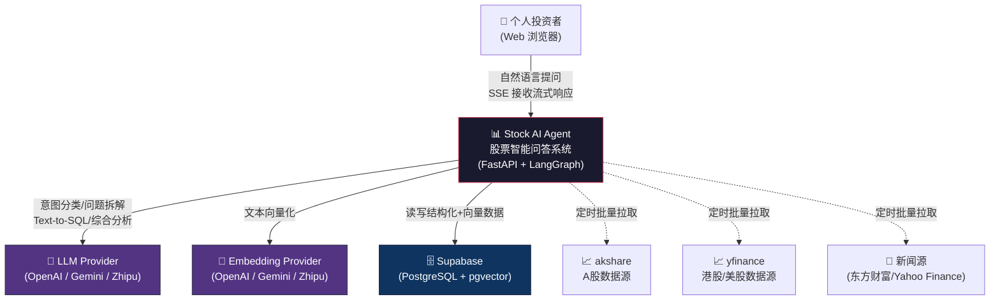
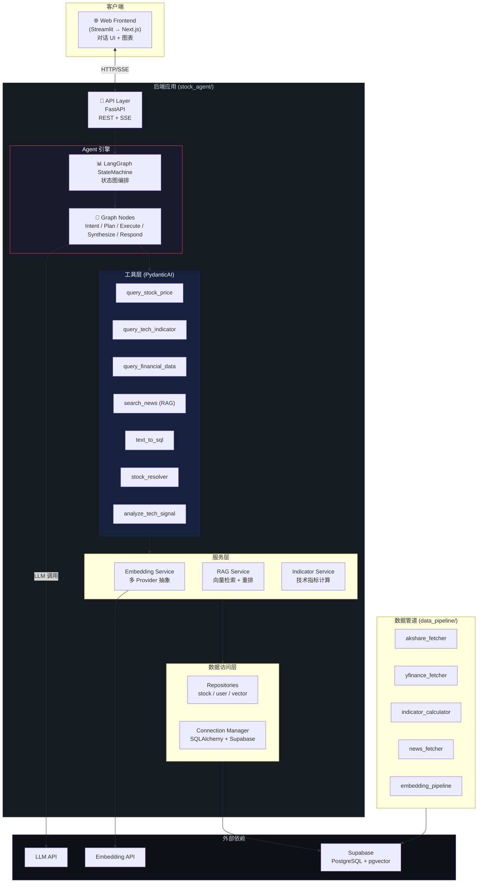
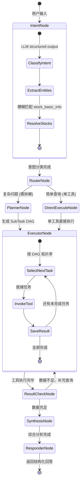
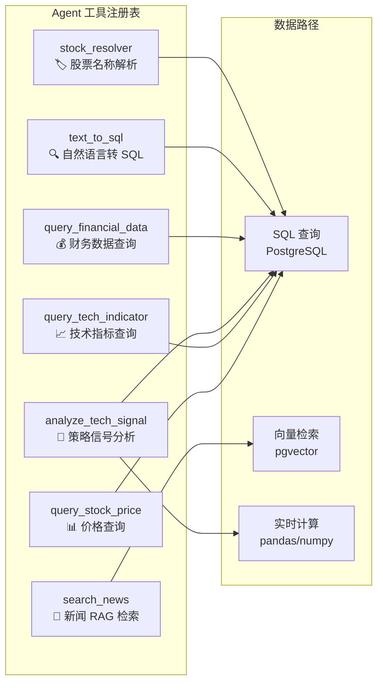
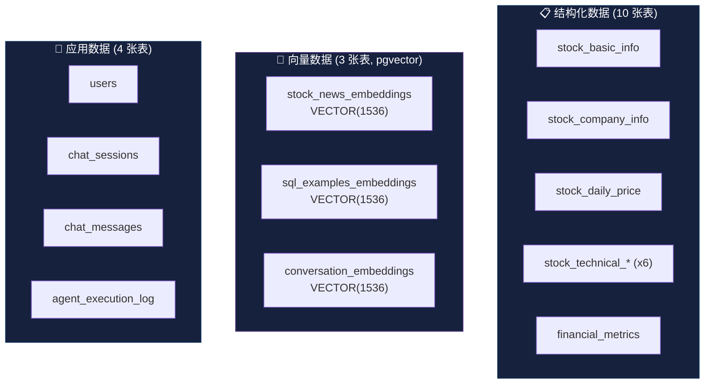
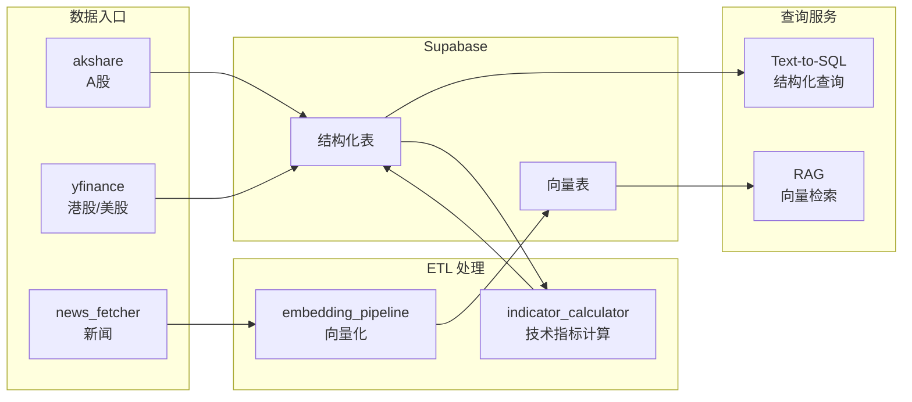
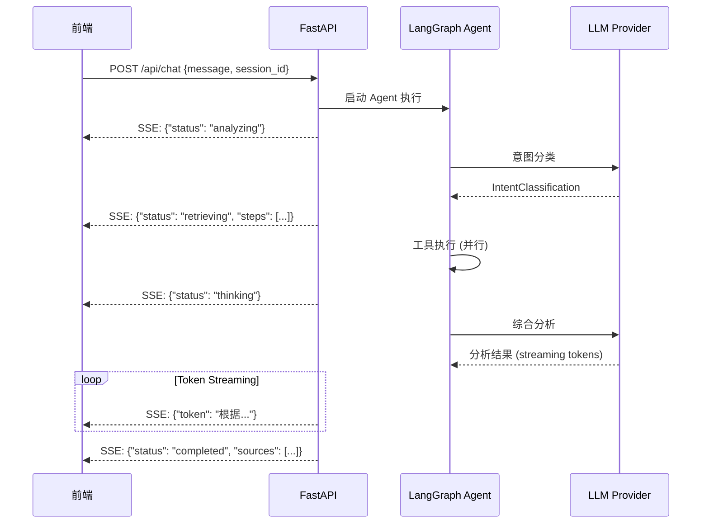
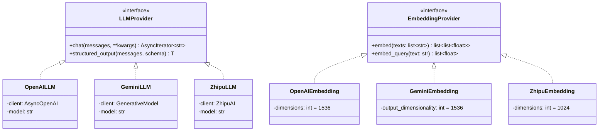
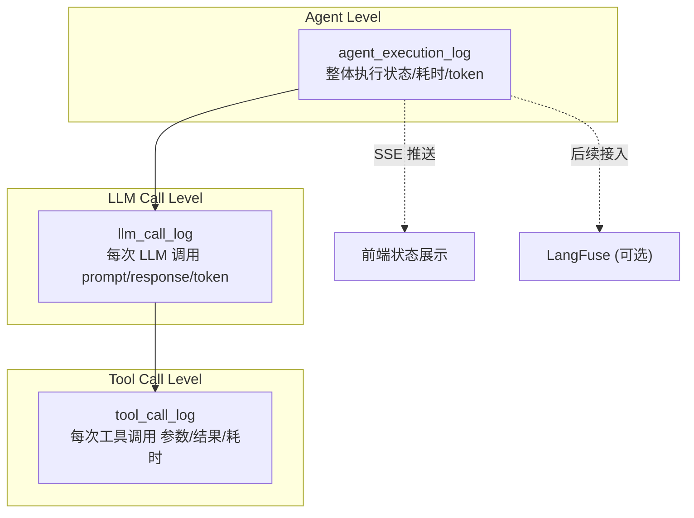

# Stock AI Agent 系统架构文档

> **版本**: v1.0
> **日期**: 2026-02-10
> **关联文档**: [PRD 产品需求文档](./PRD_stock_ai_agent.md) | [技术实现文档](./technical_design.md)

---

## 1. 架构概览

### 1.1 系统定位

Stock AI Agent 是一个基于 LLM 的股票智能问答 Agent 系统。系统采用 **前后端分离 + Agent 编排 + 统一数据层** 的三层架构，核心能力是将用户自然语言问题转化为多工具协作的分析流程，最终输出结构化的投资分析报告。

### 1.2 架构设计原则

| 原则 | 说明 | 体现 |
|------|------|------|
| **关注点分离** | 各层职责单一，通过接口交互 | API 层 / Agent 层 / 数据层 严格分层 |
| **Provider 可插拔** | LLM 和 Embedding 可自由切换 | 环境变量 + 工厂模式抽象 provider |
| **可观测性优先** | 每一步执行过程均可追踪 | 执行日志表 + SSE 实时状态推送 |
| **渐进式扩展** | 从最小可用到完整功能分期迭代 | 5 Phase 路线图 |

### 1.3 C4 模型 — 系统上下文 (Level 1)



---

## 2. 容器视图 (C4 Level 2)

### 2.1 容器架构



### 2.2 各容器职责

| 容器 | 技术 | 职责 | 对外接口 |
|------|------|------|----------|
| **Web Frontend** | Streamlit (Phase 1) → Next.js (Phase 5) | 对话 UI、执行状态展示、图表可视化 | HTTP/SSE → API Layer |
| **API Layer** | FastAPI | REST API + SSE 流式推送、请求路由、身份校验 | POST /api/chat, GET /api/sessions |
| **Agent Engine** | LangGraph | 状态图编排、节点执行、条件路由 | 内部接口，由 API 层调用 |
| **Tool Layer** | PydanticAI | 类型安全的工具定义、参数校验、结果格式化 | 被 Agent Engine 调用 |
| **Services** | Python | Embedding 多 provider 抽象、RAG 检索、指标计算 | 被 Tool Layer 调用 |
| **Data Access** | SQLAlchemy 2.0 | ORM 映射、Repository 模式、连接池管理 | 被 Services 调用 |
| **Data Pipeline** | Python scripts / 定时任务 | 批量数据获取、技术指标计算、新闻向量化 | 直接写入 Supabase |

---

## 3. 组件视图 (C4 Level 3)

### 3.1 Agent Engine 组件



### 3.2 各节点职责

| 节点 | 文件 | 输入 | 输出 | LLM 调用 |
|------|------|------|------|----------|
| **IntentNode** | `nodes/intent.py` | 用户原始消息 | `IntentClassification` + `ExtractedEntities` + `ResolvedStocks` | ✅ 分类 + 实体提取 |
| **RouterNode** | `graph.py` (条件边) | `IntentClassification.requires_decomposition` | 路由到 Plan 或 Direct | ❌ |
| **PlannerNode** | `nodes/planner.py` | 意图 + 实体 | `DecompositionPlan` (SubTask DAG) | ✅ 生成执行计划 |
| **ExecutorNode** | `nodes/executor.py` | `DecompositionPlan` | `tool_results: dict[task_id, result]` | ❌ (工具内部可能调用 LLM) |
| **ResultCheckNode** | `graph.py` (条件边) | tool_results | 路由到补充执行或综合分析 | ❌ |
| **SynthesisNode** | `nodes/synthesizer.py` | 全部 tool_results | 综合分析文本 | ✅ 深度思考 |
| **ResponderNode** | `nodes/responder.py` | 分析文本 | 格式化回答 + 数据来源标注 + 风险提示 | ✅ 格式化 |

### 3.3 工具层组件



---

## 4. 数据架构

### 4.1 数据分区

系统数据分为三个逻辑区域，物理上统一存储在 Supabase PostgreSQL 中：



### 4.2 数据流动



### 4.3 多市场 Ticker 规范

| 市场 | 格式 | 示例 | 数据源 |
|------|------|------|--------|
| A 股 | 6 位数字 | `600519` | akshare |
| 港股 | 数字 + `.HK` | `01024.HK` | yfinance |
| 美股 | 字母代码 | `GOOG` | yfinance |

所有表通过 `market` 字段 (`CN` / `HK` / `US`) 区分市场归属。

---

## 5. 通信架构

### 5.1 前后端通信 — SSE 流式推送



### 5.2 SSE 事件格式

```typescript
// 状态更新事件
{ "type": "status",  "status": "analyzing" | "retrieving" | "thinking" | "completed" }

// 步骤详情事件
{ "type": "step",    "step_name": "query_stock_price", "status": "running", "params": {...} }

// Token 流式输出
{ "type": "token",   "content": "根据技术分析..." }

// 最终结果
{ "type": "result",  "content": "...", "sources": [...], "disclaimer": "..." }

// 错误
{ "type": "error",   "message": "..." }
```

### 5.3 REST API 端点

| 方法 | 路径 | 说明 | 响应 |
|------|------|------|------|
| `POST` | `/api/chat` | 发送消息，返回 SSE 流 | `text/event-stream` |
| `GET` | `/api/sessions` | 获取用户会话列表 | JSON |
| `GET` | `/api/sessions/{id}` | 获取会话详情 + 消息 | JSON |
| `DELETE` | `/api/sessions/{id}` | 删除/归档会话 | 204 |
| `GET` | `/api/health` | 健康检查 | JSON |

---

## 6. LLM/Embedding Provider 抽象

### 6.1 Provider 架构



### 6.2 配置驱动

```python
# config.py — 工厂模式按环境变量创建 provider
def create_llm_provider() -> LLMProvider:
    match settings.LLM_PROVIDER:
        case "openai":  return OpenAILLM(model=settings.LLM_MODEL, ...)
        case "gemini":  return GeminiLLM(model=settings.LLM_MODEL, ...)
        case "zhipu":   return ZhipuLLM(model=settings.LLM_MODEL, ...)

def create_embedding_provider() -> EmbeddingProvider:
    match settings.EMBEDDING_PROVIDER:
        case "openai":  return OpenAIEmbedding(dimensions=settings.EMBEDDING_DIMENSIONS, ...)
        case "gemini":  return GeminiEmbedding(output_dimensionality=settings.EMBEDDING_DIMENSIONS, ...)
        case "zhipu":   return ZhipuEmbedding(dimensions=settings.EMBEDDING_DIMENSIONS, ...)
```

---

## 7. 可观测性架构

### 7.1 三层日志体系



### 7.2 关键指标

| 指标 | 来源 | 用途 |
|------|------|------|
| **端到端延迟** | `agent_execution_log.duration_ms` | 用户体验监控 |
| **LLM Token 消耗** | `llm_call_log.tokens_used` | 成本控制 |
| **工具调用成功率** | `tool_call_log.status` | 工具质量评估 |
| **意图分类准确率** | 人工标注 vs 系统分类 | 模型评估 |
| **RAG 检索质量** | 检索命中率 + 用户反馈 | 向量库优化 |

---

## 8. 部署架构

### 8.1 开发环境

```
┌─────────────────────────────────────────┐
│  本地开发机                              │
│  ├── stock_agent/  (uvicorn dev server) │
│  ├── frontend/     (streamlit run)      │
│  └── data_pipeline/ (手动/cron 执行)     │
└───────────────┬─────────────────────────┘
                │
                ▼
┌─────────────────────────────────────────┐
│  Supabase Cloud                         │
│  ├── PostgreSQL (结构化数据)             │
│  ├── pgvector   (向量数据)              │
│  └── Auth       (可选)                  │
└─────────────────────────────────────────┘
                │
                ▼
┌─────────────────────────────────────────┐
│  外部 LLM API                           │
│  ├── OpenAI API                         │
│  ├── Google Gemini API                  │
│  └── Zhipu AI API                       │
└─────────────────────────────────────────┘
```

### 8.2 环境变量清单

| 变量 | 必填 | 说明 |
|------|------|------|
| `LLM_PROVIDER` | ✅ | `openai` / `gemini` / `zhipu` |
| `LLM_API_KEY` | ✅ | LLM API 密钥 |
| `LLM_MODEL` | ✅ | 模型名称 |
| `LLM_BASE_URL` | ❌ | 自定义端点 |
| `EMBEDDING_PROVIDER` | ✅ | `openai` / `gemini` / `zhipu` |
| `EMBEDDING_API_KEY` | ✅ | Embedding API 密钥 |
| `EMBEDDING_MODEL` | ✅ | Embedding 模型名称 |
| `EMBEDDING_DIMENSIONS` | ❌ | 默认 1536 |
| `SUPABASE_URL` | ✅ | Supabase 项目 URL |
| `SUPABASE_KEY` | ✅ | Supabase anon key |
| `SUPABASE_DB_URL` | ✅ | PostgreSQL 连接字符串 |

---

## 9. 安全考虑

| 风险点 | 缓解措施 |
|--------|----------|
| **SQL 注入** | Text-to-SQL 仅允许 SELECT，参数化查询 |
| **LLM Prompt 注入** | 系统 prompt 隔离用户输入，输入长度限制 |
| **API Key 泄露** | 环境变量管理，不入库 |
| **过度 LLM 调用** | Token 计量 + 日级限额 |
| **投资建议合规** | 每次回答附风险声明 |

---

## 10. 架构决策记录 (ADR)

### ADR-001: Agent 编排选择 LangGraph

**背景**: 需要支持有状态的多步 Agent 执行，含条件路由和并行工具调用。
**决策**: 使用 LangGraph 而非 LangChain AgentExecutor。
**理由**: LangGraph 提供显式的图编排控制、状态持久化、条件路由和子图复用，更适合复杂 Agent 场景，且是学习目标之一。

### ADR-002: 统一 Embedding 维度 1536

**背景**: 三大 provider 原生默认维度不同 (OpenAI: 1536, Gemini: 3072, Zhipu: 2048)。
**决策**: 统一输出 1536 维，利用各 provider 的维度调整参数实现。
**理由**: 避免切换 provider 时重算所有历史向量，1536 是三家均覆盖的维度交集。

### ADR-003: SSE 替代 WebSocket

**背景**: 需要实时推送 Agent 执行状态 + LLM token 流。
**决策**: 使用 SSE 而非 WebSocket。
**理由**: Agent 状态推送是单向服务端到客户端场景，SSE 更轻量、自动重连、开发成本低。后续如需双向控制再升级 WebSocket。

### ADR-004: Supabase 统一存储

**背景**: 结构化数据、向量数据、用户数据需要存储方案。
**决策**: 统一使用 Supabase (PostgreSQL + pgvector)。
**理由**: 避免引入多个存储系统的运维复杂度，pgvector 原生集成，初期数据量完全够用。

---

> **下一步**: 阅读 [技术实现文档](./technical_design.md) 了解具体模块的详细实现方案。
