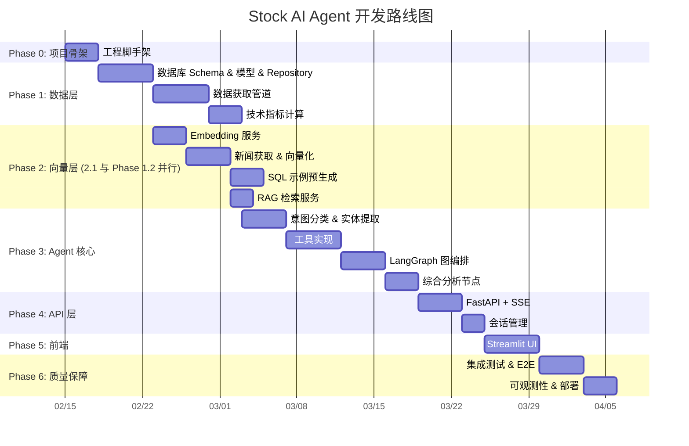
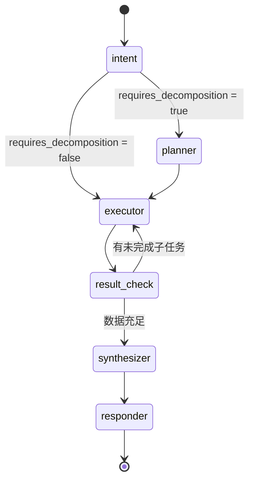

# Stock AI Agent — 开发计划

> **基于文档**:
> - [产品需求文档](./PRD_stock_ai_agent.md) — 产品需求与目标
> - [系统架构文档](./architecture.md) — 高层架构与决策
> - [技术详细设计](./technical_design.md) — 模块实现细节
>
> **MVP 范围**: 2 只 A 股 + 3 只港股 + 7 只美股 = **12 只股票**，日 K 线级别数据

---

## 总览：开发阶段路线图



> [!NOTE]
> **并行优化**: Phase 2.1 (Embedding 服务) 不依赖数据表中实际有数据，仅依赖 Schema 建表完成，
> 因此可与 Phase 1.2 (数据获取管道) **并行开发**，缩短总体时间线约 3 天。

---

## Phase 0: 项目骨架与基础设施 (3 天)

> **目标**: 搭建项目结构、开发规范、本地环境。

### 0.1 项目初始化

| # | 任务 | 产出文件 | 验证方式 |
|---|------|---------|---------|
| 0.1.1 | 创建 `pyproject.toml`，声明所有依赖 (参考 [技术设计 §11](./technical_design.md#11-依赖清单-pyprojecttoml)) | `pyproject.toml` | `uv sync` 安装成功 |
| 0.1.2 | 创建项目目录结构 | 见下方目录树 | 所有 `__init__.py` 就位 |
| 0.1.3 | 配置 `ruff` / `mypy` / `pytest` | `pyproject.toml` [tool.*] | `ruff check .` 无报错 |
| 0.1.4 | 创建 `.env.example` 模板 | `.env.example` | 包含所有必要环境变量 |

**目标目录结构** (参考 [技术设计 §1.1](./technical_design.md)):

```
stock_agent/
├── config/
│   └── settings.py
├── database/
│   ├── base.py
│   ├── session.py
│   └── models/
│       ├── __init__.py
│       ├── stock.py          # 已有 PRPs/models/ 中的模型
│       ├── stock_hk.py
│       ├── stock_us.py
│       ├── vector.py          # 3 张向量表
│       ├── user.py            # User / ChatSession / ChatMessage
│       └── agent_log.py       # AgentExecutionLog
├── agent/
│   ├── graph.py
│   ├── state.py
│   ├── nodes/
│   │   ├── intent.py
│   │   ├── planner.py
│   │   ├── executor.py
│   │   ├── synthesizer.py
│   │   └── responder.py
│   └── prompts/
│       ├── intent_prompt.py
│       ├── synthesis_prompt.py
│       └── text_to_sql_prompt.py
├── tools/
│   ├── stock_price.py
│   ├── tech_indicator.py
│   ├── tech_signal.py
│   ├── financial_data.py
│   ├── news_search.py
│   ├── text_to_sql.py
│   └── stock_resolver.py
├── services/
│   ├── embedding.py
│   ├── rag.py
│   └── llm.py
├── data_pipeline/
│   ├── akshare_fetcher.py
│   ├── yfinance_fetcher.py
│   ├── indicator_calculator.py
│   ├── news_fetcher.py
│   ├── embedding_pipeline.py
│   └── sql_examples_seeder.py
├── api/
│   ├── chat.py
│   └── session.py
├── frontend/
│   └── app.py                 # Streamlit
└── main.py
```

### 0.2 配置管理

| # | 任务 | 产出文件 | 验证方式 |
|---|------|---------|---------|
| 0.2.1 | 实现 `Settings` 类 (pydantic-settings)，包含 DB / LLM / Embedding 全部配置项 | `config/settings.py` | `from stock_agent.config import get_settings` 可导入 |
| 0.2.2 | 实现 `@lru_cache` 的 `get_settings()` 工厂 | `config/settings.py` | 多次调用返回同一实例 |
| 0.2.3 | `.env.example` 注释所有配置项 | `.env.example` | 新开发者复制即可使用 |

> **参考**: [技术设计 §1.3 环境变量清单](./technical_design.md)

---

## Phase 1: 数据层 — 结构化数据 (12 天)

> **目标**: 数据库 Schema 建表、数据获取脚本、技术指标计算，填充 MVP 股票的日 K 线 + 技术指标 + 信号。

### 1.1 数据库 Schema、模型与 Repository (5 天)

| # | 任务 | 产出文件 | 依赖 | 验证方式 |
|---|------|---------|------|---------|
| 1.1.1 | 创建 SQLAlchemy `Base` 和 `async_session` 工厂 (含连接池配置: `pool_size`, `max_overflow`, `pool_timeout`) | `database/base.py`, `database/session.py` | 0.2.1 | `async with get_session() as s: ...` 连通, 连接池参数生效 |
| 1.1.2 | 从 `PRPs/models/` 迁移 A 股数据模型 (11 表) | `database/models/stock.py` | 1.1.1 | Alembic 或 `metadata.create_all()` 建表成功 |
| 1.1.3 | 迁移港股数据模型 (11 表) | `database/models/stock_hk.py` | 1.1.1 | 同上 |
| 1.1.4 | 迁移美股数据模型 (11 表) | `database/models/stock_us.py` | 1.1.1 | 同上 |
| 1.1.5 | 创建向量嵌入表 (3 张: news / sql_examples / conversation) | `database/models/vector.py` | 1.1.1 | pgvector 扩展启用 + 表创建成功 |
| 1.1.6 | 创建用户/会话/日志表 (User, ChatSession, ChatMessage, AgentExecutionLog) | `database/models/user.py`, `database/models/agent_log.py` | 1.1.1 | 外键关系正确 |
| 1.1.7 | 验证全部表在 Supabase 中创建成功 | — | 1.1.2~1.1.6 | SQL 查询 `information_schema.tables` 确认 ≥ 36 张表 |
| 1.1.8 | 实现 Repository 基类 + `StockRepository` (按 market 路由到对应表) | `database/repositories/base.py`, `database/repositories/stock.py` | 1.1.2~1.1.4 | `StockRepository.get_daily_price(ticker, market)` 自动选表 |
| 1.1.9 | 实现 `VectorRepository` + `UserRepository` | `database/repositories/vector.py`, `database/repositories/user.py` | 1.1.5, 1.1.6 | Repository CRUD 操作正常 |

> **参考**: [技术设计 §3.2](./technical_design.md) (结构化数据模型全景图) + [§3.3](./technical_design.md) (向量数据模型)

**涉及的表总览** (参考 [技术设计 §3.2.2](./technical_design.md)):

| 类型 | A 股表名 | 港股表名 (`_hk` 后缀) | 美股表名 (`_us` 后缀) | 行数/表 (估) |
|------|---------|---------|---------|-------------|
| 日 K 线 | `stock_daily_price` | `stock_daily_price_hk` | `stock_daily_price_us` | ~500 |
| 技术指标 | `stock_technical_indicators` | `stock_technical_indicators_hk` | `stock_technical_indicators_us` | ~500 |
| 趋势信号 | `stock_technical_trend_signal_indicators` | `..._hk` | `..._us` | ~500 |
| 均值回归 | `stock_technical_mean_reversion_*` | `..._hk` | `..._us` | ~500 |
| 动量信号 | `stock_technical_momentum_*` | `..._hk` | `..._us` | ~500 |
| 波动率 | `stock_technical_volatility_*` | `..._hk` | `..._us` | ~500 |
| 统计套利 | `stock_technical_stat_arb_*` | `..._hk` | `..._us` | ~500 |
| 财务指标 | `financial_metrics` | `financial_metrics_hk` | `financial_metrics_us` | ~20 |
| 基本信息 | `stock_basic_info`, `stock_basic_info_a` | `stock_basic_hk` | `stock_basic_us` | 2~7 |
| 公司信息 | `stock_company_info` | — | — | 2~7 |
| 指数信息 | — | `stock_index_basic_hk` | `stock_index_basic_us` | 少量 |

> [!WARNING]
> **表命名约定**: 港股/美股表统一使用 `{功能}_{市场后缀}` 格式 (如 `stock_daily_price_hk`)，
> **而非** `hk_stock_daily_price` 前缀风格。此约定与 [技术设计 §3.2.4](./technical_design.md) 保持一致。

### 1.2 数据获取管道 (5 天)

| # | 任务 | 产出文件 | 依赖 | 验证方式 |
|---|------|---------|------|---------|
| 1.2.1 | A 股日 K 线获取 (akshare): 601127, 688981 | `data_pipeline/akshare_fetcher.py` | 1.1.2 | 执行后 `stock_daily_price` 有 ≥ 500 行 |
| 1.2.2 | 港股日 K 线获取 (yfinance): 9988.HK, 0700.HK, 1024.HK | `data_pipeline/yfinance_fetcher.py` | 1.1.3 | `stock_daily_price_hk` 有 ≥ 1500 行 |
| 1.2.3 | 美股日 K 线获取 (yfinance): AAPL, MSFT, NVDA, GOOG, AMZN, META, TSLA | `data_pipeline/yfinance_fetcher.py` | 1.1.4 | `stock_daily_price_us` 有 ≥ 3500 行 |
| 1.2.4 | A 股基本信息 / 公司信息获取 | `data_pipeline/akshare_fetcher.py` | 1.1.2 | `stock_basic_info` 有 ≥ 2 行 |
| 1.2.5 | 港股/美股基本信息获取 | `data_pipeline/yfinance_fetcher.py` | 1.1.3, 1.1.4 | `stock_basic_hk` + `stock_basic_us` 有行 |
| 1.2.6 | 财务数据获取 (akshare + yfinance) | `data_pipeline/` 对应文件 | 1.1.2~1.1.4 | `financial_metrics` 各市场有 ≥ 1 条记录 |

> **参考**: [技术设计 §8.1 执行流程](./technical_design.md) + [架构 §4.4 数据获取](./architecture.md)

### 1.3 技术指标计算 (3 天)

| # | 任务 | 产出文件 | 依赖 | 验证方式 |
|---|------|---------|------|---------|
| 1.3.1 | 实现指标计算引擎 (pandas + ta 库) | `data_pipeline/indicator_calculator.py` | 1.2.1~1.2.3 | — |
| 1.3.2 | 计算 MACD / RSI / KDJ / 布林带 / 均线 → 写入 `stock_technical_indicators` | 同上 | 1.3.1 | 查询 `macd_diff`, `rsi_6` 等列非 NULL |
| 1.3.3 | 计算 5 类策略信号 → 写入 5 张信号表 | 同上 | 1.3.1 | 趋势/动量/均值回归/波动率/统计套利 信号表有数据 |
| 1.3.4 | 全市场指标计算验证 | — | 1.3.2, 1.3.3 | A 股 / 港股 / 美股 技术指标表均有数据 |

> **参考**: [技术设计 §3.2.3](./technical_design.md) (指标字段详情) + [架构 §4.4](./architecture.md)

**Phase 1 里程碑检查点** ✅

```bash
# 验证命令
python -c "
from stock_agent.database.session import get_session
import asyncio

async def check():
    async with get_session() as s:
        for table in ['stock_daily_price', 'stock_technical_indicators',
                       'stock_technical_trend_signal_indicators',
                       'stock_daily_price_hk', 'stock_daily_price_us']:
            result = await s.execute(f'SELECT COUNT(*) FROM {table}')
            print(f'{table}: {result.scalar()} rows')
asyncio.run(check())
"
```

---

## Phase 2: 向量层 — Embedding & RAG (10 天)

> **目标**: 实现 Embedding 服务、新闻向量化管道、SQL 示例预生成入库。

### 2.1 Embedding 服务 (3 天)

| # | 任务 | 产出文件 | 依赖 | 验证方式 |
|---|------|---------|------|---------|
| 2.1.1 | 实现 `EmbeddingProvider` 抽象接口 | `services/embedding.py` | 0.2.1 | 导入不报错 |
| 2.1.2 | 实现 `OpenAIEmbedding` + `GeminiEmbedding` + `ZhipuEmbedding` 三个实现 | `services/embedding.py` | 2.1.1 | 各 Provider `embed_query("test")` 返回 1536-d 向量 |
| 2.1.3 | 实现 `create_embedding_provider()` 工厂函数 (按 env 切换) | `services/embedding.py` | 2.1.2 | 修改 `EMBEDDING_PROVIDER` 环境变量可切换实现 |
| 2.1.4 | 单元测试: 向量维度 / 批量 embed / 异常处理 | `tests/test_embedding.py` | 2.1.2 | `pytest tests/test_embedding.py` 全通过 |

> **参考**: [技术设计 §6.1](./technical_design.md) + [架构 §6 LLM 与 Embedding 配置](./architecture.md)

### 2.2 新闻获取 & 向量化 (4 天)

| # | 任务 | 产出文件 | 依赖 | 验证方式 |
|---|------|---------|------|---------|
| 2.2.1 | A 股新闻获取 (akshare 个股新闻) | `data_pipeline/news_fetcher.py` | 1.1.5 | 获取到 ≥ 10 条新闻 |
| 2.2.2 | 港股/美股新闻获取 (yfinance news) | `data_pipeline/news_fetcher.py` | 1.1.5 | 获取到 ≥ 10 条新闻 |
| 2.2.3 | 实现文本分块 `chunk_text()` (~500 token / 块, 50 token 重叠) | `data_pipeline/embedding_pipeline.py` | — | 长文正确分块 + 重叠验证 |
| 2.2.4 | 实现新闻向量化 pipeline: 分块 → Embedding → INSERT | `data_pipeline/embedding_pipeline.py` | 2.1.3, 2.2.1 | `stock_news_embeddings` 表有数据 + `embedding` 维度 = 1536 |
| 2.2.5 | pgvector IVFFlat 索引创建 + 检索验证 | SQL migration | 2.2.4 | `ORDER BY embedding <=> $1::vector LIMIT 5` 正常返回 |

> **参考**: [技术设计 §8.2](./technical_design.md) (新闻向量化管道) + [§3.3.1](./technical_design.md) (新闻向量表)

### 2.3 SQL 示例预生成 (3 天)

| # | 任务 | 产出文件 | 依赖 | 验证方式 |
|---|------|---------|------|---------|
| 2.3.1 | 编写 6 类种子示例 (参考技术设计中的示例) | `data_pipeline/sql_examples_seeder.py` | — | ≥ 15 条覆盖 price / indicator / signal / financial / meta / composite |
| 2.3.2 | 实现 `--seed-only` 模式: 种子 → Embedding → UPSERT | `data_pipeline/sql_examples_seeder.py` | 2.1.3 | `sql_examples_embeddings` 表有数据 |
| 2.3.3 | 实现 LLM 扩充模式: Prompt 设计 + JSON 解析 + 质量校验 | `data_pipeline/sql_examples_seeder.py` | 2.3.1 | `--expand --dry-run` 输出合法示例 |
| 2.3.4 | 实现语义去重 (Embedding 余弦相似度 > 0.92 剔除) | `data_pipeline/sql_examples_seeder.py` | 2.3.3 | 重复问题被正确剔除 |
| 2.3.5 | 执行完整入库 (种子 + 扩充), 目标 50-80 条 | — | 2.3.2, 2.3.3 | `SELECT COUNT(*) FROM sql_examples_embeddings` ≥ 50 |

> **参考**: [技术设计 §8.3](./technical_design.md) (SQL Query Examples 预生成 — 完整设计)

### 2.4 RAG 检索服务 (与 2.2/2.3 并行)

| # | 任务 | 产出文件 | 依赖 | 验证方式 |
|---|------|---------|------|---------|
| 2.4.1 | 实现 `RAGService.search_news()` — 新闻向量检索 | `services/rag.py` | 2.2.4 | 返回 TOP-K 结果 + similarity 分数 |
| 2.4.2 | 实现 `RAGService.search_sql_examples()` — SQL 示例检索 | `services/rag.py` | 2.3.2 | 自然语言问题检索到相关 SQL 示例 |
| 2.4.3 | 单元测试: 检索精度 / 过滤条件 / 空结果处理 | `tests/test_rag.py` | 2.4.1, 2.4.2 | `pytest tests/test_rag.py` 全通过 |

> **参考**: [技术设计 §6.2](./technical_design.md) (RAG 检索服务)

**Phase 2 里程碑检查点** ✅

```bash
# 新闻向量检索
python -c "
from stock_agent.services.rag import RAGService
# ... search_news('赛力斯利好消息') → 返回结果
"

# SQL 示例检索
python -c "
from stock_agent.services.rag import RAGService
# ... search_sql_examples('茅台最近的收盘价') → 返回 price 类示例
"
```

---

## Phase 3: Agent 核心 — 意图理解 + 工具 + 图编排 (16 天)

> **目标**: 实现 LangGraph 状态图驱动的 Agent，包含意图分类、任务拆解、工具执行、综合分析全流程。

### 3.1 LLM 服务层 (2 天)

| # | 任务 | 产出文件 | 依赖 | 验证方式 |
|---|------|---------|------|---------|
| 3.1.1 | 实现 LLM Provider 抽象 + 工厂 (OpenAI / Gemini / Zhipu) | `services/llm.py` | 0.2.1 | `create_llm_provider(settings)` 返回可用客户端 |
| 3.1.2 | 实现 `structured_output()` — LLM 结构化输出 (JSON Schema) | `services/llm.py` | 3.1.1 | 返回 Pydantic 对象而非字符串 |
| 3.1.3 | 实现 `llm_call_with_retry()` — tenacity 重试包装 | `services/llm.py` | 3.1.1 | 超时/限流重试 3 次 |

> **参考**: [技术设计 §10.1](./technical_design.md) (重试策略) + [架构 §6](./architecture.md) (LLM Provider)

### 3.2 Prompt 工程 (2 天)

| # | 任务 | 产出文件 | 依赖 | 验证方式 |
|---|------|---------|------|---------|
| 3.2.1 | 实现意图分类 Prompt (`INTENT_PROMPT`) | `agent/prompts/intent_prompt.py` | — | Prompt 模板可格式化 |
| 3.2.2 | 实现实体提取 Prompt (`ENTITY_EXTRACTION_PROMPT`) | `agent/prompts/intent_prompt.py` | — | 同上 |
| 3.2.3 | 实现综合分析 Prompt (`SYNTHESIS_PROMPT`) | `agent/prompts/synthesis_prompt.py` | — | 同上 |
| 3.2.4 | 实现 Text-to-SQL Prompt (`TEXT_TO_SQL_PROMPT`) + `build_few_shot_section()` | `agent/prompts/text_to_sql_prompt.py` | — | 同上 |

> **参考**: [技术设计 §9](./technical_design.md) (Prompt 工程) + [§8.3.8](./technical_design.md) (Text-to-SQL Prompt)

### 3.3 数据模型 & 状态定义 (1 天)

| # | 任务 | 产出文件 | 依赖 | 验证方式 |
|---|------|---------|------|---------|
| 3.3.1 | 定义 `AgentState` TypedDict | `agent/state.py` | — | 类型检查通过 |
| 3.3.2 | 定义 Pydantic 模型: `IntentClassification`, `ExtractedEntities`, `StockEntity`, `ExecutionPlan`, `SubTask` | `agent/state.py` | — | `.model_validate()` 测试通过 |

> **参考**: [技术设计 §3.1](./technical_design.md) (核心数据模型)

### 3.4 意图分类 & 实体提取节点 (4 天)

| # | 任务 | 产出文件 | 依赖 | 验证方式 |
|---|------|---------|------|---------|
| 3.4.1 | 实现 `intent_node()`: LLM 意图分类 → `IntentClassification` | `agent/nodes/intent.py` | 3.1.2, 3.2.1, 3.3.2 | 6 类意图正确分类 |
| 3.4.2 | 实现实体提取: 股票名称/代码/时间范围 → `ExtractedEntities` | `agent/nodes/intent.py` | 3.2.2, 3.3.2 | "帮我看看茅台最近的K线" → ticker=600519, period=recent |
| 3.4.3 | 实现 `StockResolver` — 股票名称模糊解析 (精确→LIKE→向量) | `tools/stock_resolver.py` | 1.1.2 | "中芯国际" → 688981, "腾讯" → 0700.HK |
| 3.4.4 | 单元测试: 意图分类准确率 / 实体提取完整性 | `tests/test_intent.py` | 3.4.1~3.4.3 | 覆盖 simple_query / technical_analysis / composite 等 |

> **参考**: [技术设计 §4.2](./technical_design.md) (意图理解节点) + [§5.4](./technical_design.md) (StockResolver)

### 3.5 工具实现 (5 天)

| # | 任务 | 产出文件 | 依赖 | 验证方式 |
|---|------|---------|------|---------|
| 3.5.1 | `query_stock_price_tool` — 股票价格查询 | `tools/stock_price.py` | 1.1.2 | 返回 `StockPriceResult` 含 records / latest_close |
| 3.5.2 | `query_tech_indicator_tool` — 技术指标查询 | `tools/tech_indicator.py` | 1.1.2, 1.3.2 | 返回 MACD / RSI / KDJ 等指标值 |
| 3.5.3 | `analyze_tech_signal_tool` — 策略信号查询 | `tools/tech_signal.py` | 1.1.2, 1.3.3 | 返回 5 类策略信号 + 置信度 |
| 3.5.4 | `query_financial_data_tool` — 财务数据查询 | `tools/financial_data.py` | 1.1.2, 1.2.6 | 返回 PE / ROE / 营收等财务指标 |
| 3.5.5 | `search_news_tool` — 新闻 RAG 语义检索 | `tools/news_search.py` | 2.4.1 | 返回 TOP-K 相似新闻 + similarity |
| 3.5.6 | `text_to_sql_tool` — 自然语言 → SQL → 执行 | `tools/text_to_sql.py` | 2.4.2, 3.2.4 | "茅台最近的收盘价" → SELECT → 返回结果 |
| 3.5.7 | `validate_sql_safety()` — SQL 安全校验 (仅 SELECT) | `tools/text_to_sql.py` | — | INSERT/DELETE/DROP 被拒绝 |
| 3.5.8 | 工具注册表 `TOOL_REGISTRY` | `tools/__init__.py` | 3.5.1~3.5.6 | 所有 6 个工具可按名称查找 |
| 3.5.9 | 工具级容错包装 `safe_tool_execute()` | `tools/base.py` | — | 超时/异常返回 `{success: False}` 而非崩溃 |
| 3.5.10 | 单元测试: 每个工具独立测试 | `tests/test_tools/` | 3.5.1~3.5.7 | `pytest tests/test_tools/` 全通过 |

> **参考**: [技术设计 §5](./technical_design.md) (工具实现) + [§10.2](./technical_design.md) (工具级容错)

### 3.6 LangGraph 编排 & 综合分析 (4 天)

| # | 任务 | 产出文件 | 依赖 | 验证方式 |
|---|------|---------|------|---------|
| 3.6.1 | 实现 `planner_node()` — 复杂问题拆解为子任务 DAG | `agent/nodes/planner.py` | 3.1.2, 3.3.2 | 返回 `ExecutionPlan` 含 tasks + execution_order |
| 3.6.2 | 实现 `executor_node()` — 按 DAG 拓扑并行执行工具 | `agent/nodes/executor.py` | 3.5.8 | 同层工具并行, 跨层串行 |
| 3.6.3 | 实现 `synthesizer_node()` — 多工具结果综合分析 | `agent/nodes/synthesizer.py` | 3.1.2, 3.2.3 | 多数据源整合为结构化分析报告 |
| 3.6.4 | 实现 `responder_node()` — 格式化最终输出 | `agent/nodes/responder.py` | 3.6.3 | 包含 analysis_result + data_sources + risk_disclaimer |
| 3.6.5 | 实现 `build_agent_graph()` — 组装 StateGraph, 条件路由 | `agent/graph.py` | 3.4.1, 3.6.1~3.6.4 | 图编译成功 |
| 3.6.6 | 条件路由函数: `should_decompose()`, `needs_more_data()` | `agent/graph.py` | 3.6.5 | 简单查询直达 executor, 复杂查询经 planner |
| 3.6.7 | 集成测试: 端到端 Agent 调用 | `tests/test_agent.py` | 3.6.5 | 完整跑通 intent → executor → synthesizer → responder |

> **参考**: [技术设计 §4](./technical_design.md) (Agent Graph) + [架构 §3 组件图](./architecture.md)

**Agent 状态图** (参考 [技术设计 §4.1](./technical_design.md)):



**Phase 3 里程碑检查点** ✅

```bash
# 简单查询
python -c "
from stock_agent.agent.graph import agent
result = await agent.ainvoke({
    'messages': [HumanMessage(content='茅台今天的收盘价')],
    ...
})
print(result['analysis_result'])
"

# 复杂查询 (触发 planner + 多工具)
python -c "
result = await agent.ainvoke({
    'messages': [HumanMessage(content='结合技术面和基本面分析赛力斯')],
    ...
})
print(result['analysis_result'])
"
```

---

## Phase 4: API 层 — FastAPI + SSE (6 天)

> **目标**: 对外暴露 RESTful API，支持 SSE 流式推送 Agent 执行过程。

### 4.1 聊天 API (4 天)

| # | 任务 | 产出文件 | 依赖 | 验证方式 |
|---|------|---------|------|---------|
| 4.1.1 | FastAPI App 入口 + CORS / 异常处理中间件 | `main.py` | — | `uvicorn stock_agent.main:app` 启动成功 |
| 4.1.2 | `POST /api/chat` — SSE 流式推送 | `api/chat.py` | 3.6.5 | curl 请求收到 `data: {...}` 事件流 |
| 4.1.3 | SSE 事件类型实现: `status` (进度) / `result` (结果) / `[DONE]` (结束) | `api/chat.py` | 4.1.2 | 事件类型与前端约定一致 |
| 4.1.4 | `status_callback` 注入 Agent: 各节点实时推送状态 | `api/chat.py` + `agent/nodes/*.py` | 4.1.2 | 前端收到 analyzing → retrieving → synthesizing 状态流 |

> **参考**: [技术设计 §7.1](./technical_design.md) (聊天 API — SSE) + [架构 §5](./architecture.md) (通信协议)

**SSE 事件流格式** (参考 [技术设计 §7.1](./technical_design.md)):

```
data: {"type": "status", "status": "analyzing"}
data: {"type": "status", "status": "retrieving", "steps": [...]}
data: {"type": "status", "status": "synthesizing"}
data: {"type": "result", "content": "分析结果...", "sources": [...], "disclaimer": "..."}
data: [DONE]
```

### 4.2 会话管理 API (2 天)

| # | 任务 | 产出文件 | 依赖 | 验证方式 |
|---|------|---------|------|---------|
| 4.2.1 | `GET /api/sessions` — 会话列表 | `api/session.py` | 1.1.6 | 返回用户的会话列表 |
| 4.2.2 | `GET /api/sessions/{id}` — 会话详情 + 消息历史 | `api/session.py` | 1.1.6 | 返回该会话的全部消息 |
| 4.2.3 | `DELETE /api/sessions/{id}` — 归档会话 | `api/session.py` | 1.1.6 | 会话 status 变为 archived |
| 4.2.4 | API 层单元测试 | `tests/test_api.py` | 4.1.2, 4.2.1~4.2.3 | `pytest tests/test_api.py` 全通过 |

> **参考**: [技术设计 §7.2](./technical_design.md) (会话管理 API)

**Phase 4 里程碑检查点** ✅

```bash
# 启动服务
uvicorn stock_agent.main:app --reload --port 8000

# 测试 SSE
curl -N -X POST http://localhost:8000/api/chat \
  -H "Content-Type: application/json" \
  -d '{"message": "赛力斯最近一周的K线怎么样?"}'
# 应收到多条 data: {...} 事件
```

---

## Phase 5: 前端 — Streamlit MVP (5 天)

> **目标**: 构建可交互的对话式 Web UI，消费 SSE API。
>
> **参考**: [架构 §2 容器图](./architecture.md) (Frontend Container)

### 5.1 Streamlit 实现

| # | 任务 | 产出文件 | 依赖 | 验证方式 |
|---|------|---------|------|---------|
| 5.1.1 | 对话界面: 消息列表 + 输入框 + 发送按钮 | `frontend/app.py` | 4.1.2 | `streamlit run frontend/app.py` 启动成功 |
| 5.1.2 | SSE 客户端: 消费 `/api/chat` 流式事件 | `frontend/app.py` | 4.1.3 | 实时显示 Agent 执行进度 |
| 5.1.3 | 进度状态展示: 分析中 → 获取数据 → 综合分析 → 完成 | `frontend/app.py` | 4.1.4 | 每个阶段有视觉反馈 |
| 5.1.4 | 分析结果展示: Markdown 渲染、数据源引用、风险提示 | `frontend/app.py` | 4.1.3 | 结果格式化展示 |
| 5.1.5 | 会话管理: 侧边栏会话列表 / 新建 / 切换 | `frontend/app.py` | 4.2.1~4.2.3 | 可切换历史会话 |
| 5.1.6 | 错误提示 & 重试 | `frontend/app.py` | — | 网络错误/超时有友好提示 |

**Phase 5 里程碑检查点** ✅

```bash
# 启动后端
uvicorn stock_agent.main:app --reload --port 8000 &

# 启动前端
streamlit run frontend/app.py

# 手动测试场景:
# 1. "茅台今天收盘价多少?" → 简单查询
# 2. "中芯国际的MACD金叉了吗?" → 技术指标
# 3. "结合价格、技术面和新闻分析赛力斯" → 复杂多工具
```

---

## Phase 6: 质量保障 & 部署 (7 天)

> **目标**: 集成测试、错误处理加固、可观测性、部署配置。

### 6.1 测试 (4 天)

| # | 任务 | 产出文件 | 依赖 | 验证方式 |
|---|------|---------|------|---------|
| 6.1.1 | 端到端集成测试: 6 类意图各 2 个用例 | `tests/test_e2e.py` | Phase 3~4 | 12 个 E2E 用例全通过 |
| 6.1.2 | Text-to-SQL 精度测试: 预设问题 → 生成 SQL → 结果校验 | `tests/test_text_to_sql.py` | 3.5.6 | ≥ 80% 的预设问题生成正确 SQL |
| 6.1.3 | 意图分类准确率测试: 30 个测试问题 | `tests/test_intent_accuracy.py` | 3.4.1 | ≥ 90% 分类正确 |
| 6.1.4 | 工具容错测试: 模拟超时/异常/空数据 | `tests/test_error_handling.py` | 3.5.9 | Agent 不崩溃, 返回降级结果 |
| 6.1.5 | 性能基准: 单轮对话延迟 < 15s (不含 LLM 等待) | `tests/test_performance.py` | Phase 4 | 平均延迟在阈值内 |

**测试覆盖要求**:

| 测试层级 | 覆盖范围 | 执行方式 |
|---------|---------|---------|
| 单元测试 | Embedding / RAG / Tools / StockResolver | `pytest tests/` |
| 集成测试 | Agent Graph 端到端 | `pytest tests/test_e2e.py` |
| E2E 测试 | HTTP API + SSE 流 | `pytest tests/test_api.py` |
| 精度测试 | 意图分类 / Text-to-SQL | 手动验证 + 指标统计 |

### 6.2 错误处理 (1 天)

| # | 任务 | 产出文件 | 依赖 | 验证方式 |
|---|------|---------|------|---------|
| 6.2.1 | 定义全局异常层级: `AgentExecutionError` / `ToolExecutionError` / `LLMProviderError` | `exceptions.py` | — | 异常类型可被 API 层捕获 |
| 6.2.2 | API 层全局异常处理中间件 | `main.py` | 6.2.1 | 所有异常返回结构化 JSON 错误 |

> **参考**: [技术设计 §10.3](./technical_design.md) (全局异常层级)

### 6.3 可观测性 & 部署 (2 天)

| # | 任务 | 产出文件 | 依赖 | 验证方式 |
|---|------|---------|------|---------|
| 6.3.1 | 结构化日志 (structlog): 每步输出 JSON 日志 | 各模块 | — | 日志包含 session_id, step_name, duration_ms |
| 6.3.2 | `AgentExecutionLog` 持久化: 每步操作写入审计表 | `agent/nodes/*.py` | 1.1.6 | 查询 `agent_execution_log` 有记录 |
| 6.3.3 | Dockerfile + docker-compose.yml (FastAPI + Streamlit + PostgreSQL) | `Dockerfile`, `docker-compose.yml` | Phase 5 | `docker-compose up` 启动成功 |
| 6.3.4 | 健康检查端点 `GET /health` | `main.py` | — | 返回 200 + DB/LLM 连接状态 |

> **参考**: [架构 §7](./architecture.md) (可观测性) + [§8](./architecture.md) (部署)

---

## 附录 A: 关键技术决策参考

| ADR | 决策 | 文档引用 |
|-----|------|---------|
| ADR-001 | LangGraph 作为 Agent Flow 引擎 | [架构 §10.1](./architecture.md) |
| ADR-002 | Supabase (PostgreSQL + pgvector) 作为唯一数据库 | [架构 §10.2](./architecture.md) |
| ADR-003 | 多 LLM Provider 支持 (OpenAI / Gemini / Zhipu) | [架构 §10.3](./architecture.md) |
| ADR-004 | SSE 替代 WebSocket (Phase 1) | [架构 §10.4](./architecture.md) |
| ADR-005 | 分市场独立表 (当前) vs 统一表 (未来) | [技术设计 §3.2.4](./technical_design.md) |

## 附录 B: 依赖与风险

| 风险 | 影响 | 缓解措施 |
|------|------|---------|
| LLM API 限流/不稳定 | Agent 响应延迟或失败 | tenacity 重试 + 多 Provider 降级 |
| akshare / yfinance 数据源不稳定 | 数据获取失败 | 错误重试 + 数据时效标记 |
| pgvector 检索精度不足 | RAG 返回无关结果 | 调优 IVFFlat lists/probes + 阈值过滤 |
| Text-to-SQL 生成错误 SQL | 查询失败或返回错误数据 | SQL 安全校验 + 执行超时 + 结果校验 |
| Embedding 维度变化 (Provider 切换) | 向量不兼容 | 统一 1536 维 + 切换时需重新入库 |

## 附录 C: MVP 股票池

| 市场 | 代码 | 名称 | 说明 |
|------|------|------|------|
| A 股 | 601127 | 赛力斯 | 新能源汽车 |
| A 股 | 688981 | 中芯国际 | 半导体 |
| 港股 | 9988.HK | 阿里巴巴 | 互联网/电商 |
| 港股 | 0700.HK | 腾讯 | 互联网/游戏 |
| 港股 | 1024.HK | 快手 | 短视频 |
| 美股 | AAPL | 苹果 | 硬件/生态 |
| 美股 | MSFT | 微软 | 云/AI |
| 美股 | NVDA | 英伟达 | GPU/AI |
| 美股 | GOOG | 谷歌 | 搜索/AI |
| 美股 | AMZN | 亚马逊 | 电商/云 |
| 美股 | META | Meta | 社交/VR |
| 美股 | TSLA | 特斯拉 | 电动车 |

---

> **关联文档**:
> - [PRD 产品需求文档](./PRD_stock_ai_agent.md) — 产品定义与需求
> - [系统架构文档](./architecture.md) — 高层架构与决策
> - [技术详细设计](./technical_design.md) — 模块实现细节
