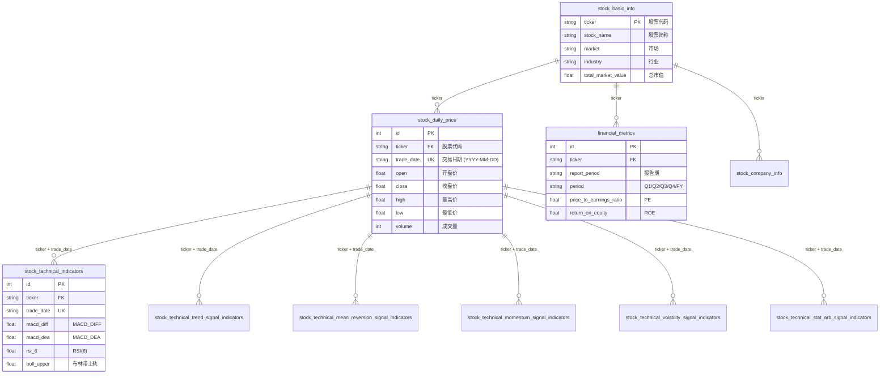
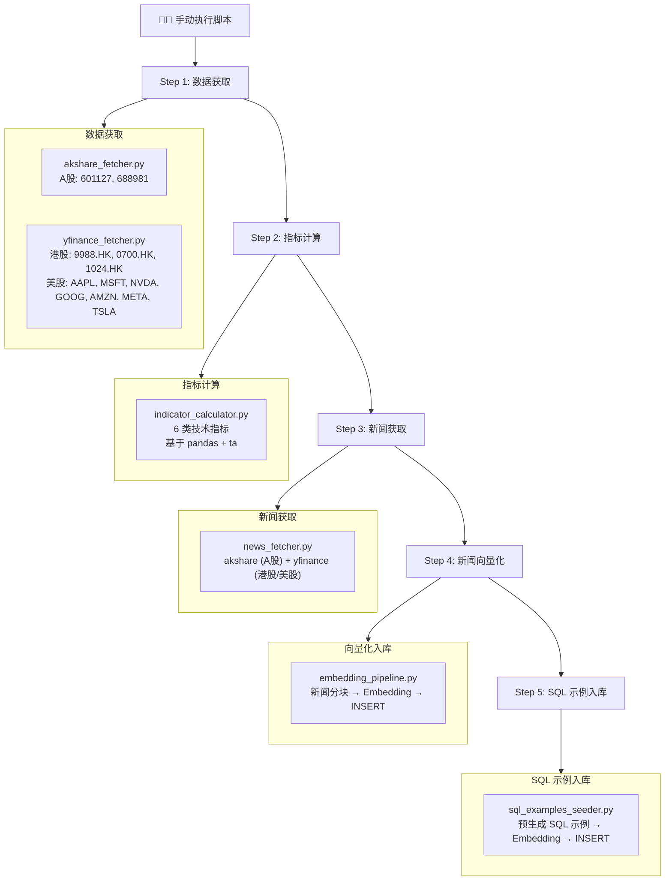
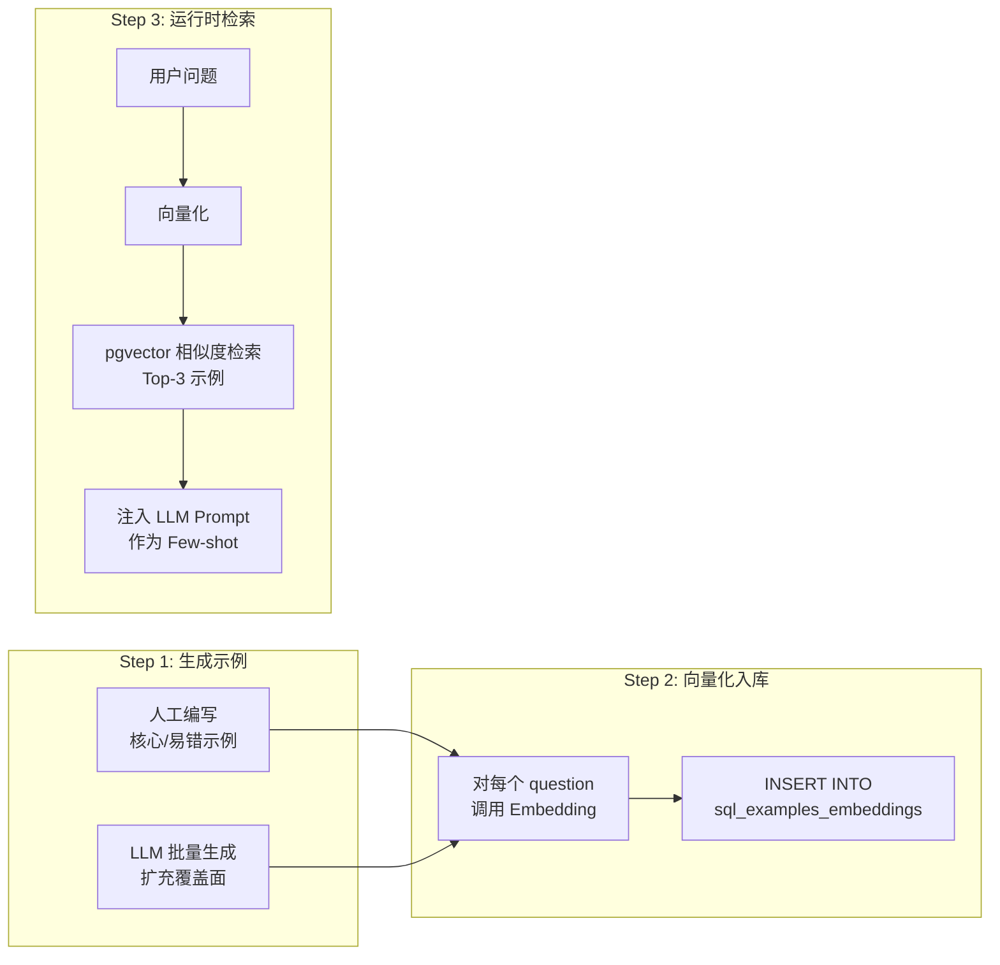
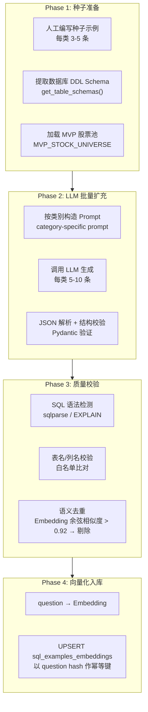

# Stock AI Agent 技术实现文档

> **版本**: v1.0
> **日期**: 2026-02-10
> **关联文档**: [PRD 产品需求文档](./PRD_stock_ai_agent.md) | [系统架构文档](./architecture.md)

---

## 1. 概述

本文档基于 PRD 和系统架构文档，提供各模块的详细实现方案，包含核心数据模型、Agent 编排、工具实现、服务层、API 层和数据管道的具体代码设计。

### 1.1 目录结构回顾

```
stock_agent/
├── config.py           # 配置管理
├── main.py             # FastAPI 入口
├── agent/              # Agent 核心
│   ├── graph.py        # LangGraph 图定义
│   ├── state.py        # 全局状态
│   ├── nodes/          # 图节点
│   └── prompts/        # Prompt 模板
├── tools/              # Agent 工具
├── database/           # 数据库层
│   ├── models/         # SQLAlchemy 模型
│   └── repositories/   # 数据访问层
├── services/           # 业务服务层
└── api/                # API 路由

data_pipeline/          # 数据管道
frontend/               # 前端
```

### 1.2 MVP 开发范围

> [!IMPORTANT]
> MVP 和前期开发阶段以 **跑通核心流程** 为目标，数据规模和自动化程度刻意缩减。

#### 数据更新策略

MVP 阶段 **不需要** 定时任务或自动调度。所有数据获取通过手动执行脚本完成：

```bash
# 数据更新 — 手动执行
python -m data_pipeline.akshare_fetcher        # A股数据
python -m data_pipeline.yfinance_fetcher        # 港股/美股数据
python -m data_pipeline.indicator_calculator    # 技术指标 (依赖上面两步)
python -m data_pipeline.news_fetcher            # 新闻获取
python -m data_pipeline.embedding_pipeline      # 新闻向量化
python -m data_pipeline.sql_examples_seeder     # SQL 示例向量化入库
```

#### MVP 股票标的池

每个市场只选取少量具有代表性的股票，确保数据可快速准备，同时覆盖三大市场核心场景：

| 市场 | 股票 | Ticker | 选择理由 |
|------|------|--------|----------|
| **美股 (NASDAQ)** | Apple | `AAPL` | 市值最大 |
| | Microsoft | `MSFT` | 云+AI 领军 |
| | NVIDIA | `NVDA` | AI 芯片 |
| | Alphabet (Google) | `GOOG` | 搜索+AI |
| | Amazon | `AMZN` | 电商+云 |
| | Meta | `META` | 社交+AI |
| | Tesla | `TSLA` | 新能源+自动驾驶 |
| **港股** | 阿里巴巴 | `9988.HK` | 电商平台 |
| | 腾讯 | `0700.HK` | 社交+游戏 |
| | 快手 | `1024.HK` | 短视频+AI |
| **A股** | 赛力斯 | `601127` | 新能源汽车 |
| | 中芯国际 | `688981` | 半导体 |

共计 **12 支股票**，数据量：
- 日K线 (1年): ~12 × 250 ≈ 3,000 行
- 技术指标 (6表): ~18,000 行
- 新闻 (~100条/股): ~1,200 条

#### MVP 标的池配置

```python
# config.py 中添加 MVP 标的池
MVP_STOCK_UNIVERSE: dict[str, list[str]] = {
    "US": ["AAPL", "MSFT", "NVDA", "GOOG", "AMZN", "META", "TSLA"],
    "HK": ["9988.HK", "0700.HK", "1024.HK"],
    "CN": ["601127", "688981"],
}
```

---

## 2. 配置管理 (`config.py`)

使用 Pydantic Settings 管理所有配置，支持 `.env` 文件和环境变量。

```python
from pydantic_settings import BaseSettings
from functools import lru_cache


class Settings(BaseSettings):
    """应用配置 — 所有值通过环境变量注入"""
    
    # ---- LLM Provider ----
    LLM_PROVIDER: str = "openai"          # openai | gemini | zhipu
    LLM_BASE_URL: str | None = None       # 可选自定义端点
    LLM_API_KEY: str
    LLM_MODEL: str = "gpt-4o"
    LLM_TEMPERATURE: float = 0.1          # Agent 场景建议低温度
    LLM_MAX_TOKENS: int = 4096
    
    # ---- Embedding Provider ----
    EMBEDDING_PROVIDER: str = "openai"    # openai | gemini | zhipu
    EMBEDDING_BASE_URL: str | None = None
    EMBEDDING_API_KEY: str
    EMBEDDING_MODEL: str = "text-embedding-3-small"
    EMBEDDING_DIMENSIONS: int = 1536      # 统一维度
    
    # ---- Supabase ----
    SUPABASE_URL: str
    SUPABASE_KEY: str
    SUPABASE_DB_URL: str                  # postgresql://...
    
    # ---- Application ----
    APP_ENV: str = "development"
    LOG_LEVEL: str = "INFO"
    MAX_RETRIES: int = 3
    TOOL_TIMEOUT_SECONDS: int = 30
    MAX_SUB_TASKS: int = 10               # 单次问题最大子任务数
    RAG_TOP_K: int = 10                   # RAG 检索返回数
    SQL_MAX_ROWS: int = 500               # SQL 查询行数限制
    
    class Config:
        env_file = ".env"
        env_file_encoding = "utf-8"


@lru_cache
def get_settings() -> Settings:
    return Settings()
```

---

## 3. 核心数据模型

### 3.1 Agent 状态模型 (`agent/state.py`)

```python
from typing import Annotated, Any
from typing_extensions import TypedDict
from langgraph.graph.message import add_messages
from langchain_core.messages import BaseMessage
from pydantic import BaseModel, Field
from enum import Enum


# ---- 意图分类 ----

class IntentCategory(str, Enum):
    """6 大意图类别"""
    SIMPLE_QUERY = "simple_query"           # 简单事实查询
    TECHNICAL_ANALYSIS = "technical_analysis" # 技术分析
    FINANCIAL_ANALYSIS = "financial_analysis" # 财务分析
    NEWS_SENTIMENT = "news_sentiment"         # 新闻舆情
    COMPOSITE = "composite"                   # 综合分析
    COMPARISON = "comparison"                 # 对比分析


class IntentClassification(BaseModel):
    """LLM 结构化输出的意图分类结果"""
    category: IntentCategory
    confidence: float = Field(ge=0, le=1)
    reasoning: str                            # LLM 分类理由
    requires_decomposition: bool = False       # 是否需要问题拆解
    suggested_tools: list[str] = []            # 建议使用的工具


# ---- 实体提取 ----

class MarketType(str, Enum):
    CN = "CN"     # A股
    HK = "HK"     # 港股
    US = "US"     # 美股


class StockEntity(BaseModel):
    """解析后的股票实体"""
    name: str                  # 股票名称 (如 "贵州茅台")
    ticker: str                # 标准代码 (如 "600519")
    market: MarketType         # 市场
    raw_input: str = ""        # 用户原始输入 (如 "茅台")


class TimeRange(BaseModel):
    """时间范围"""
    start_date: str | None = None  # YYYY-MM-DD
    end_date: str | None = None
    relative: str | None = None     # "最近30天", "今年" 等


class ExtractedEntities(BaseModel):
    """从用户问题中提取的全部实体"""
    stocks: list[StockEntity] = []
    time_range: TimeRange | None = None
    indicators: list[str] = []        # 技术指标名 (MACD, RSI)
    financial_metrics: list[str] = []  # 财务指标名 (PE, ROE)
    comparison_targets: list[str] = []
    keywords: list[str] = []           # 新闻检索关键词


# ---- 执行计划 ----

class TaskStatus(str, Enum):
    PENDING = "pending"
    RUNNING = "running"
    COMPLETED = "completed"
    FAILED = "failed"
    SKIPPED = "skipped"


class SubTask(BaseModel):
    """子任务"""
    task_id: str
    description: str
    tool_name: str
    tool_params: dict[str, Any] = {}
    dependencies: list[str] = []
    status: TaskStatus = TaskStatus.PENDING
    result: Any | None = None
    error: str | None = None
    duration_ms: int | None = None


class DecompositionPlan(BaseModel):
    """问题拆解执行计划"""
    original_question: str
    tasks: list[SubTask]
    execution_order: list[list[str]]  # [[并行层1 task_ids], [并行层2], ...]


# ---- LangGraph 全局状态 ----

class AgentState(TypedDict):
    """LangGraph 状态定义"""
    # 对话上下文
    session_id: str
    user_id: str
    messages: Annotated[list[BaseMessage], add_messages]
    
    # 意图理解结果
    intent: IntentClassification | None
    entities: ExtractedEntities | None
    resolved_stocks: list[StockEntity]
    
    # 执行计划
    plan: DecompositionPlan | None
    current_layer: int               # 当前执行到第几层
    
    # 工具执行结果
    tool_results: dict[str, Any]     # task_id → result
    
    # SSE 状态推送回调
    status_callback: Any             # async callable for SSE
    
    # 最终输出
    analysis_result: str
    data_sources: list[str]
    risk_disclaimer: str
```

### 3.2 数据库模型 (`database/models/`)

> [!NOTE]
> 现有结构化数据模型定义于 `PRPs/models/`，按市场拆分为 3 个文件：
> - [stock_data_db_model.py](file:///Users/niwen/PycharmProjects/my_dev_agent/stock-ai-agent/PRPs/models/stock_data_db_model.py) — A股 + 通用
> - [stock_data_db_model_hk.py](file:///Users/niwen/PycharmProjects/my_dev_agent/stock-ai-agent/PRPs/models/stock_data_db_model_hk.py) — 港股
> - [stock_data_db_model_us.py](file:///Users/niwen/PycharmProjects/my_dev_agent/stock-ai-agent/PRPs/models/stock_data_db_model_us.py) — 美股

#### 3.2.1 数据模型全景图



#### 3.2.2 结构化数据表总览

系统共有 **11 类结构化表**，每类按市场拆分为 A股/港股/美股 3 张表 (命名后缀: 无后缀=A股, `_hk`, `_us`)。

| # | 表名 (A股) | 表名 (港股) | 表名 (美股) | 说明 | 联合唯一键 |
|---|-----------|-----------|-----------|------|-----------|
| 1 | `stock_daily_price` | `stock_daily_price_hk` | `stock_daily_price_us` | 日K线行情 | ticker + trade_date |
| 2 | `stock_technical_indicators` | `stock_technical_indicators_hk` | `stock_technical_indicators_us` | 基本技术指标 | ticker + trade_date |
| 3 | `stock_technical_trend_signal_indicators` | `..._hk` | `..._us` | 趋势跟踪策略信号 | ticker + trade_date |
| 4 | `stock_technical_mean_reversion_signal_indicators` | `..._hk` | `..._us` | 均值回归策略信号 | ticker + trade_date |
| 5 | `stock_technical_momentum_signal_indicators` | `..._hk` | `..._us` | 动量策略信号 | ticker + trade_date |
| 6 | `stock_technical_volatility_signal_indicators` | `..._hk` | `..._us` | 波动率策略信号 | ticker + trade_date |
| 7 | `stock_technical_stat_arb_signal_indicators` | `..._hk` | `..._us` | 统计套利策略信号 | ticker + trade_date |
| 8 | `financial_metrics` | `financial_metrics_hk` | `financial_metrics_us` | 财务指标 | ticker + report_period + period |
| 9 | `stock_basic_info` | `stock_basic_hk` | `stock_basic_us` | 股票基本信息 | ticker |
| 10 | `stock_basic_info_a` | — | — | A股额外基本信息 | ticker |
| 11 | `stock_company_info` | — | — | A股公司详细信息 | ticker |
| 12 | — | `stock_index_basic_hk` | `stock_index_basic_us` | 指数基本信息 | ticker |

#### 3.2.3 各表详细字段

##### 📊 日K线行情表 (`stock_daily_price` / `_hk` / `_us`)

```python
class StockDailyPriceDB(Base):
    __tablename__ = "stock_daily_price"

    id          = Column(Integer, primary_key=True, autoincrement=True)
    ticker      = Column(String(10), nullable=False, index=True, comment="股票代码")
    symbol      = Column(String(20), comment="股票代码（含市场标识）")
    name        = Column(String(50), index=True, comment="股票名称")
    trade_date  = Column(String(10), index=True, comment="交易日期 (YYYY-MM-DD)")
    open        = Column(Float, comment="开盘价")
    high        = Column(Float, comment="最高价")
    low         = Column(Float, comment="最低价")
    close       = Column(Float, comment="收盘价")
    volume      = Column(Integer, comment="成交量")
    amount      = Column(Float, comment="成交额")
    amplitude   = Column(Float, comment="振幅")
    pct_change  = Column(Float, comment="涨跌幅")
    amount_change = Column(Float, comment="涨跌额")
    turnover_rate = Column(Float, comment="换手率")
    created_at  = Column(DateTime)
    updated_at  = Column(DateTime)

    __table_args__ = (
        UniqueConstraint('ticker', 'trade_date', name='uq_stock_daily_ticker_date'),
    )
```

##### 📈 基本技术指标表 (`stock_technical_indicators` / `_hk` / `_us`)

```python
class StockTechnicalIndicatorsDB(Base):
    __tablename__ = "stock_technical_indicators"
    __table_args__ = {'comment': '股票基本技术指标数据表'}

    id          = Column(Integer, primary_key=True, autoincrement=True)
    ticker      = Column(String(10), nullable=False, index=True, comment="股票代码")
    symbol      = Column(String(20), comment="股票代码（含市场标识）")
    name        = Column(String(50), index=True, comment="股票名称")
    trade_date  = Column(String(10), index=True, comment="交易日期")
    # 移动均线
    ma5         = Column(Float, comment="5日均线")
    ma10        = Column(Float, comment="10日均线")
    ma20        = Column(Float, comment="20日均线")
    ma30        = Column(Float, comment="30日均线")
    ma60        = Column(Float, comment="60日均线")
    # 布林带
    boll_upper  = Column(Float, comment="布林带上轨")
    boll_middle = Column(Float, comment="布林带中轨")
    boll_lower  = Column(Float, comment="布林带下轨")
    # KDJ
    kdj_k       = Column(Float, comment="KDJ-K值")
    kdj_d       = Column(Float, comment="KDJ-D值")
    kdj_j       = Column(Float, comment="KDJ-J值")
    # RSI
    rsi_6       = Column(Float, comment="6日RSI")
    rsi_12      = Column(Float, comment="12日RSI")
    rsi_24      = Column(Float, comment="24日RSI")
    # MACD
    macd_diff   = Column(Float, comment="MACD_DIFF")
    macd_dea    = Column(Float, comment="MACD_DEA")
    macd_hist   = Column(Float, comment="MACD柱状图")

    __table_args__ = (
        UniqueConstraint('ticker', 'trade_date', name='uq_stock_tech_ind_ticker_date'),
    )
```

##### 🎯 策略信号表组 (5 张)

5 张策略信号表结构相似，均以 `ticker + trade_date` 为联合唯一键。以下列出每张表的**特有字段**：

| 表名 | 信号字段 | 置信度字段 | 核心指标字段 |
|------|---------|-----------|-------------|
| **趋势跟踪** `stock_technical_trend_signal_indicators` | `trend_signal` (bullish/bearish/neutral) | `trend_confidence` | `ema_8`, `ema_21`, `ema_55`, `adx`, `plus_di`, `minus_di`, `short_trend` (bool), `medium_trend` (bool), `trend_strength` |
| **均值回归** `stock_technical_mean_reversion_signal_indicators` | `mean_reversion_signal` | `mean_reversion_confidence` | `ma_50`, `std_50`, `z_score`, `bb_upper`, `bb_middle`, `bb_lower`, `rsi_14`, `rsi_28`, `price_vs_bb` |
| **动量** `stock_technical_momentum_signal_indicators` | `momentum_signal` | `momentum_confidence` | `returns`, `mom_1m`, `mom_3m`, `mom_6m`, `volume_ma_21`, `volume_momentum`, `momentum_score`, `volume_confirmation` (bool) |
| **波动率** `stock_technical_volatility_signal_indicators` | `volatility_signal` | `volatility_confidence` | `returns`, `hist_vol_21`, `vol_ma_63`, `vol_regime`, `vol_std_63`, `vol_z_score`, `atr_14`, `atr_ratio` |
| **统计套利** `stock_technical_stat_arb_signal_indicators` | `stat_arb_signal` | `stat_arb_confidence` | `returns`, `skew_63`, `kurt_63`, `hurst_exponent` |

每张表的通用字段 (省略不重复):

```python
# 每张策略信号表都包含以下通用字段
id          = Column(Integer, primary_key=True, autoincrement=True)
ticker      = Column(String(10), nullable=False, index=True, comment="股票代码")
symbol      = Column(String(20), comment="股票代码（含市场标识）")
name        = Column(String(50), index=True, comment="股票名称")
trade_date  = Column(String(10), index=True, comment="交易日期")
# ... (各策略特有字段见上表) ...
created_at  = Column(DateTime)
updated_at  = Column(DateTime)
```

##### 💰 财务指标表 (`financial_metrics` / `_hk` / `_us`)

```python
class FinancialMetricsDB(Base):
    __tablename__ = "financial_metrics"

    id             = Column(Integer, primary_key=True, autoincrement=True)
    ticker         = Column(String(20), nullable=False, index=True, comment="股票代码")
    report_period  = Column(String(20), nullable=False, comment="报告期")
    period         = Column(String(10), nullable=False, comment="Q1/Q2/Q3/Q4/H1/H2/FY")
    currency       = Column(String(10), comment="货币类型 (CNY/USD)")

    # ---- 市场估值 ----
    market_cap                      = Column(Float, comment="市值")
    enterprise_value                = Column(Float, comment="企业价值")
    price_to_earnings_ratio         = Column(Float, comment="市盈率 (P/E)")
    price_to_book_ratio             = Column(Float, comment="市净率 (P/B)")
    price_to_sales_ratio            = Column(Float, comment="市销率 (P/S)")
    enterprise_value_to_ebitda_ratio = Column(Float, comment="EV/EBITDA")
    enterprise_value_to_revenue_ratio = Column(Float, comment="EV/Revenue")
    free_cash_flow_yield            = Column(Float, comment="自由现金流收益率")
    peg_ratio                       = Column(Float, comment="PEG比率")

    # ---- 盈利能力 ----
    gross_margin     = Column(Float, comment="毛利率")
    operating_margin = Column(Float, comment="营业利润率")
    net_margin       = Column(Float, comment="净利率")

    # ---- 回报率 ----
    return_on_equity            = Column(Float, comment="ROE")
    return_on_assets            = Column(Float, comment="ROA")
    return_on_invested_capital  = Column(Float, comment="ROIC")

    # ---- 运营效率 ----
    asset_turnover          = Column(Float, comment="资产周转率")
    inventory_turnover      = Column(Float, comment="存货周转率")
    receivables_turnover    = Column(Float, comment="应收账款周转率")
    days_sales_outstanding  = Column(Float, comment="应收账款周转天数")
    operating_cycle         = Column(Float, comment="营业周期")
    working_capital_turnover = Column(Float, comment="营运资本周转率")

    # ---- 流动性 ----
    current_ratio           = Column(Float, comment="流动比率")
    quick_ratio             = Column(Float, comment="速动比率")
    cash_ratio              = Column(Float, comment="现金比率")
    operating_cash_flow_ratio = Column(Float, comment="经营现金流比率")

    # ---- 负债 ----
    debt_to_equity    = Column(Float, comment="资产负债率")
    debt_to_assets    = Column(Float, comment="债务资产比")
    interest_coverage = Column(Float, comment="利息覆盖率")

    # ---- 增长 ----
    revenue_growth          = Column(Float, comment="收入增长率")
    earnings_growth         = Column(Float, comment="盈利增长率")
    book_value_growth       = Column(Float, comment="账面价值增长率")
    earnings_per_share_growth = Column(Float, comment="EPS增长率")
    free_cash_flow_growth   = Column(Float, comment="FCF增长率")
    operating_income_growth = Column(Float, comment="营业收入增长率")
    ebitda_growth           = Column(Float, comment="EBITDA增长率")

    # ---- 每股指标 ----
    payout_ratio            = Column(Float, comment="派息比率")
    earnings_per_share      = Column(Float, comment="每股收益 (EPS)")
    book_value_per_share    = Column(Float, comment="每股账面价值")
    free_cash_flow_per_share = Column(Float, comment="每股自由现金流")

    __table_args__ = (
        UniqueConstraint('ticker', 'report_period', 'period',
                         name='uq_financial_metrics_ticker_report_period'),
    )
```

##### 🏷️ 基本信息表组

**`stock_basic_info`** — 通用股票基本信息 (A股通过 akshare 获取):

| 字段 | 类型 | 说明 |
|------|------|------|
| `ticker` (PK) | String(20) | 股票代码 |
| `stock_name` | String(100) | 股票简称 |
| `total_shares` | Float | 总股本 |
| `float_shares` | Float | 流通股 |
| `total_market_value` | Float | 总市值 |
| `float_market_value` | Float | 流通市值 |
| `industry` | String(100) | 行业 |
| `listing_date` | String(20) | 上市时间 |
| `latest_price` | Float | 最新股价 |

**`stock_basic_info_a`** — A股额外基本信息:

| 字段 | 类型 | 说明 |
|------|------|------|
| `ticker` (PK) | String(10) | 股票代码 |
| `symbol` | String(10) | 不含市场标识的代码 |
| `name` | String(50) | 股票名称 |
| `area` | String(50) | 地区 |
| `industry` | String(50) | 所属行业 |
| `fullname` | String(100) | 股票全称 |
| `enname` | String(100) | 英文名称 |
| `market` | String(20) | 市场类型 |
| `exchange` | String(20) | 交易所 |
| `list_status` | String(1) | 上市状态 (L/D/P) |
| `list_date` | String(10) | 上市日期 |
| `is_hs` | String(1) | 是否沪深港通标的 |
| `act_name` | String(100) | 实际控制人名称 |

**`stock_company_info`** — A股公司详细信息:

| 字段 | 类型 | 说明 |
|------|------|------|
| `ticker` (PK) | String(20) | A股代码 |
| `company_name` | String(255) | 公司名称 |
| `english_name` | String(255) | 英文名称 |
| `a_share_abbreviation` | String(100) | A股简称 |
| `b_share_code` / `h_share_code` | String(20) | B/H股代码 |
| `selected_index` | Text | 入选指数 |
| `market` | String(50) | 所属市场 |
| `industry` | String(100) | 所属行业 |
| `legal_representative` | String(100) | 法人代表 |
| `registered_capital` | String(100) | 注册资金 |
| `establishment_date` | String(20) | 成立日期 |
| `official_website` | String(255) | 官方网站 |

**`stock_basic_hk` / `stock_basic_us`** — 港股/美股基本信息 (通过 yfinance 获取):

| 字段 | 类型 | 说明 |
|------|------|------|
| `ticker` (PK) | String(20) | 股票代码 |
| `short_name` | String(100) | 简称 |
| `long_name` | String(255) | 全称 |
| `exchange` | String(20) | 交易所 |
| `market` | String(20) | 市场 |
| `currency` | String(10) | 交易货币 |
| `sector` | String(100) | 行业板块 |
| `industry` | String(200) | 细分行业 |
| `market_cap` | Float | 市值 |
| `float_shares` | Float | 流通股 |
| `dividend_yield` | Float | 股息率 |
| `beta` | Float | Beta系数 |
| `pe_trailing` / `pe_forward` | Float | 历史PE / 远期PE |
| `country` | String(50) | 国家 |
| `website` | String(255) | 官网 |
| `logo_url` | String(500) | Logo URL |
| `long_business_summary` | Text | 公司业务描述 |

##### 📋 指数信息表 (`stock_index_basic_hk` / `_us`)

| 字段 | 类型 | 说明 |
|------|------|------|
| `id` (PK) | Integer | 自增主键 |
| `ticker` | String | 指数代码 |
| `name` | String | 指数名称 |
| `full_name` | String | 指数全称 |
| `market` | String | 市场 |
| `publisher` | String | 发布方 |
| `index_type` | String | 指数类型 |
| `category` | String | 指数类别 |
| `base_date` | String | 基期 |
| `base_point` | Float | 基点 |
| `list_date` | String | 发布日期 |
| `weight_rule` | String | 加权规则 |
| `desc` | String | 指数描述 |

#### 3.2.4 表命名约定 & 约束策略

| 维度 | 规则 |
|------|------|
| **表名** | `{功能}_{市场后缀}` — 无后缀=A股, `_hk`=港股, `_us`=美股 |
| **主键** | 自增 `id` (行情/指标/财务) 或 `ticker` (基本信息) |
| **唯一约束** | `ticker + trade_date` 或 `ticker + report_period + period` |
| **索引** | `ticker`, `trade_date` 各自独立索引 + 联合唯一约束 |
| **时间戳** | 所有表包含 `created_at` + `updated_at` |
| **trade_date 类型** | `VARCHAR(10)`, 格式 `'YYYY-MM-DD'` (⚠️ 非 DATE 类型) |

> [!WARNING]
> 当前各市场表结构完全相同但独立存储。后续可考虑统一为单表 + `market` 字段的设计 (参见 Conversation `7c2bfe41` 中讨论的 unified schema)。

#### 3.2.5 新增模型: 用户/会话/日志


```python
# database/models/user.py
from sqlalchemy import Column, String, Text, DateTime, ForeignKey, Integer, JSON
from sqlalchemy.dialects.postgresql import UUID, JSONB
from sqlalchemy.orm import relationship
import uuid
from datetime import datetime, timezone
from .base import Base


class User(Base):
    __tablename__ = "users"
    
    id = Column(UUID(as_uuid=True), primary_key=True, default=uuid.uuid4)
    username = Column(String(50), unique=True, nullable=False)
    email = Column(String(255), unique=True)
    display_name = Column(String(100))
    avatar_url = Column(Text)
    preferences = Column(JSONB, default={})
    created_at = Column(DateTime(timezone=True), default=lambda: datetime.now(timezone.utc))
    updated_at = Column(DateTime(timezone=True), onupdate=lambda: datetime.now(timezone.utc))
    
    sessions = relationship("ChatSession", back_populates="user")


class ChatSession(Base):
    __tablename__ = "chat_sessions"
    
    id = Column(UUID(as_uuid=True), primary_key=True, default=uuid.uuid4)
    user_id = Column(UUID(as_uuid=True), ForeignKey("users.id"), nullable=False)
    title = Column(String(255))
    summary = Column(Text)
    status = Column(String(20), default="active")
    metadata_ = Column("metadata", JSONB, default={})
    created_at = Column(DateTime(timezone=True), default=lambda: datetime.now(timezone.utc))
    updated_at = Column(DateTime(timezone=True), onupdate=lambda: datetime.now(timezone.utc))
    
    user = relationship("User", back_populates="sessions")
    messages = relationship("ChatMessage", back_populates="session", order_by="ChatMessage.created_at")


class ChatMessage(Base):
    __tablename__ = "chat_messages"
    
    id = Column(UUID(as_uuid=True), primary_key=True, default=uuid.uuid4)
    session_id = Column(UUID(as_uuid=True), ForeignKey("chat_sessions.id"), nullable=False)
    role = Column(String(20), nullable=False)       # user / assistant / system / tool
    content = Column(Text, nullable=False)
    metadata_ = Column("metadata", JSONB, default={})
    parent_message_id = Column(UUID(as_uuid=True))
    created_at = Column(DateTime(timezone=True), default=lambda: datetime.now(timezone.utc))
    
    session = relationship("ChatSession", back_populates="messages")
```

```python
# database/models/agent_log.py
class AgentExecutionLog(Base):
    __tablename__ = "agent_execution_log"
    
    id = Column(Integer, primary_key=True, autoincrement=True)
    session_id = Column(UUID(as_uuid=True), ForeignKey("chat_sessions.id"), nullable=False)
    message_id = Column(UUID(as_uuid=True), ForeignKey("chat_messages.id"), nullable=False)
    step_name = Column(String(100), nullable=False)
    step_order = Column(Integer)
    status = Column(String(20), nullable=False)
    input_data = Column(JSONB)
    output_data = Column(JSONB)
    error_message = Column(Text)
    duration_ms = Column(Integer)
    llm_tokens_used = Column(JSONB)   # {prompt_tokens, completion_tokens, total_tokens}
    started_at = Column(DateTime(timezone=True))
    completed_at = Column(DateTime(timezone=True))
    created_at = Column(DateTime(timezone=True), default=lambda: datetime.now(timezone.utc))
```

### 3.3 向量数据模型 (`database/models/vector.py`)

系统中有 **3 类信息** 需要向量化存储，用于不同的 RAG 场景。以下是每张向量表的详细设计。

#### 需要向量化的信息一览

| 向量表 | 数据内容 | RAG 用途 | 向量化对象 | 数据来源 |
|--------|---------|---------|-----------|----------|
| `stock_news_embeddings` | 新闻/公告 | 新闻语义检索 | `title + content_chunk` 拼接后向量化 | akshare (A股), yfinance (港股/美股) |
| `sql_examples_embeddings` | SQL 查询示例 | Text-to-SQL Few-shot 检索 | `question` (自然语言问题) 向量化 | 人工/LLM 预生成 |
| `conversation_embeddings` | 对话历史摘要 | 跨会话上下文检索 | `content_summary` (对话摘要) 向量化 | 系统自动生成 |

> [!IMPORTANT]
> 所有向量表统一使用 `VECTOR(1536)` 维度，IVFFlat 索引 + 余弦相似度 (`vector_cosine_ops`)。

#### 3.3.1 新闻向量表 (`stock_news_embeddings`)

存储新闻/公告的分块向量。长文章按 ~500 token 分块，每块单独向量化。

```python
from pgvector.sqlalchemy import Vector

class StockNewsEmbedding(Base):
    """新闻/公告向量嵌入表"""
    __tablename__ = "stock_news_embeddings"
    
    id = Column(Integer, primary_key=True, autoincrement=True)
    
    # ---- 内容字段 ----
    source_type = Column(String(20), nullable=False, comment="news / announcement")
    ticker = Column(String(20), index=True, comment="关联股票 (可为空=宏观新闻)")
    market = Column(String(5), comment="CN / HK / US")
    title = Column(Text, nullable=False, comment="新闻标题")
    content = Column(Text, nullable=False, comment="原文内容 (或分块片段)")
    chunk_index = Column(Integer, default=0, comment="分块索引 (0=不分块或第一块)")
    total_chunks = Column(Integer, default=1, comment="该文章总块数")
    
    # ---- 元信息 ----
    summary = Column(Text, comment="LLM 生成的摘要 (可选)")
    sentiment = Column(String(10), comment="positive / negative / neutral")
    published_at = Column(DateTime(timezone=True), index=True, comment="发布时间")
    source = Column(String(100), comment="数据来源 (eastmoney / yahoo / ...)")
    source_url = Column(Text, comment="原文链接")
    
    # ---- 向量 ----
    embedding = Column(Vector(1536), comment="文本向量 (title+content 拼接后向量化)")
    
    # ---- 时间戳 ----
    created_at = Column(DateTime(timezone=True), default=lambda: datetime.now(timezone.utc))
    
    __table_args__ = (
        Index('idx_news_emb_ticker', 'ticker'),
        Index('idx_news_emb_published', 'published_at'),
        Index('idx_news_emb_source_type', 'source_type'),
        Index('idx_news_emb_market', 'market'),
        # pgvector 向量索引 (IVFFlat, 数据量大后可换 HNSW)
        Index('idx_news_emb_vector', 'embedding',
              postgresql_using='ivfflat',
              postgresql_with={'lists': 100},
              postgresql_ops={'embedding': 'vector_cosine_ops'}),
    )
```

**向量化规则**：
- **向量化对象**: 将 `title` 和 `content` 拼接为 `"{title}\n{content}"` 后传给 Embedding 模型
- **分块策略**: 按段落边界分块，每块 ~500 token，相邻块重叠 50 token
- **每条新闻可能产生 1~N 条记录** (取决于长度)，通过 `chunk_index` 和 `total_chunks` 关联

#### 3.3.2 SQL 示例向量表 (`sql_examples_embeddings`)

存储预生成的「自然语言问题 ↔ SQL 查询」对。Agent 执行 Text-to-SQL 时，先用用户问题向量检索最相似的示例作为 Few-shot 参考。

```python
class SQLExampleEmbedding(Base):
    """SQL 示例向量嵌入表 — Text-to-SQL RAG Few-shot"""
    __tablename__ = "sql_examples_embeddings"
    
    id = Column(Integer, primary_key=True, autoincrement=True)
    
    # ---- 示例内容 ----
    question = Column(Text, nullable=False, comment="自然语言问题")
    sql_query = Column(Text, nullable=False, comment="对应的 SQL 查询")
    description = Column(Text, comment="示例说明/解释")
    
    # ---- 分类标签 ----
    category = Column(String(30), comment="查询类别: price/indicator/financial/news/comparison")
    tables_involved = Column(ARRAY(String), comment="涉及的表名")
    difficulty = Column(String(10), comment="easy / medium / hard")
    market = Column(String(5), comment="CN / HK / US / ALL")
    
    # ---- 向量 ----
    embedding = Column(Vector(1536), comment="question 的向量嵌入")
    
    # ---- 时间戳 ----
    created_at = Column(DateTime(timezone=True), default=lambda: datetime.now(timezone.utc))
    
    __table_args__ = (
        Index('idx_sql_exm_category', 'category'),
        Index('idx_sql_exm_difficulty', 'difficulty'),
        Index('idx_sql_exm_vector', 'embedding',
              postgresql_using='ivfflat',
              postgresql_with={'lists': 50},
              postgresql_ops={'embedding': 'vector_cosine_ops'}),
    )
```

**向量化规则**：
- **向量化对象**: 仅对 `question` (自然语言问题) 进行向量化
- 查询时用用户的原始问题向量检索最接近的示例
- 需要预生成覆盖各种查询场景的示例 (详见 [Section 8.3](#83-sql-query-examples-预生成))

#### 3.3.3 对话历史向量表 (`conversation_embeddings`)

存储对话摘要的向量，用于跨会话的上下文检索（如 "我上次问过的那只股票"）。

```python
class ConversationEmbedding(Base):
    """对话历史向量嵌入表 — 跨会话上下文检索"""
    __tablename__ = "conversation_embeddings"
    
    id = Column(Integer, primary_key=True, autoincrement=True)
    
    # ---- 关联 ----
    session_id = Column(UUID(as_uuid=True), ForeignKey("chat_sessions.id"), index=True)
    message_id = Column(UUID(as_uuid=True), ForeignKey("chat_messages.id"))
    user_id = Column(UUID(as_uuid=True), ForeignKey("users.id"), index=True)
    
    # ---- 内容 ----
    content_summary = Column(Text, comment="对话摘要 (由 LLM 生成)")
    mentioned_tickers = Column(ARRAY(String), comment="提到的股票代码")
    intent_category = Column(String(30), comment="原始意图分类")
    
    # ---- 向量 ----
    embedding = Column(Vector(1536), comment="摘要的向量嵌入")
    
    # ---- 时间戳 ----
    created_at = Column(DateTime(timezone=True), default=lambda: datetime.now(timezone.utc))
    
    __table_args__ = (
        Index('idx_conv_emb_session', 'session_id'),
        Index('idx_conv_emb_user', 'user_id'),
        Index('idx_conv_emb_vector', 'embedding',
              postgresql_using='ivfflat',
              postgresql_with={'lists': 50},
              postgresql_ops={'embedding': 'vector_cosine_ops'}),
    )
```

**向量化规则**：
- **向量化对象**: `content_summary` (对话摘要)
- 每次对话结束后，由 LLM 对整轮对话生成一段摘要，向量化后入库
- 查询时按 `user_id` 过滤 + 向量相似度排序，找到用户历史中语义最相关的对话

#### 3.3.4 向量索引策略

| 阶段 | 索引类型 | 适用场景 | 配置 |
|------|---------|---------|------|
| **初期 (MVP)** | IVFFlat | 数据量 < 10万 | `lists = 50~100`, `probes = 10` |
| **中期** | HNSW | 数据量 10万~100万 | `m = 16`, `ef_construction = 64` |
| **大规模** | HNSW + 分区表 | 数据量 > 100万 | 按 market 或 published_at 分区 |

```sql
-- MVP 阶段查询示例 (IVFFlat)
SET ivfflat.probes = 10;  -- 搜索时探测 10 个聚类

SELECT id, title, content,
       1 - (embedding <=> $1::vector) AS similarity
FROM stock_news_embeddings
WHERE ticker = '601127' AND published_at >= NOW() - INTERVAL '30 days'
ORDER BY embedding <=> $1::vector
LIMIT 10;
```

---

## 4. Agent Graph 实现 (`agent/graph.py`)

### 4.1 LangGraph 图构建

```python
from langgraph.graph import StateGraph, END
from .state import AgentState
from .nodes.intent import intent_node
from .nodes.planner import planner_node
from .nodes.executor import executor_node
from .nodes.synthesizer import synthesizer_node
from .nodes.responder import responder_node


def should_decompose(state: AgentState) -> str:
    """条件路由：是否需要问题拆解"""
    if state["intent"] and state["intent"].requires_decomposition:
        return "planner"
    return "executor"


def needs_more_data(state: AgentState) -> str:
    """条件路由：数据是否充足"""
    plan = state.get("plan")
    if plan:
        incomplete = [t for t in plan.tasks if t.status == "pending"]
        if incomplete:
            return "executor"
    return "synthesizer"


def build_agent_graph() -> StateGraph:
    """构建 Agent 状态图"""
    graph = StateGraph(AgentState)
    
    # 添加节点
    graph.add_node("intent", intent_node)
    graph.add_node("planner", planner_node)
    graph.add_node("executor", executor_node)
    graph.add_node("result_check", lambda s: s)  # passthrough
    graph.add_node("synthesizer", synthesizer_node)
    graph.add_node("responder", responder_node)
    
    # 定义边
    graph.set_entry_point("intent")
    graph.add_conditional_edges("intent", should_decompose, {
        "planner": "planner",
        "executor": "executor",
    })
    graph.add_edge("planner", "executor")
    graph.add_edge("executor", "result_check")
    graph.add_conditional_edges("result_check", needs_more_data, {
        "executor": "executor",
        "synthesizer": "synthesizer",
    })
    graph.add_edge("synthesizer", "responder")
    graph.add_edge("responder", END)
    
    return graph.compile()


# 全局 agent 实例
agent = build_agent_graph()
```

### 4.2 意图理解节点 (`nodes/intent.py`)

```python
async def intent_node(state: AgentState) -> dict:
    """意图分类 + 实体提取 + 股票解析"""
    user_message = state["messages"][-1].content
    
    # Step 1: LLM 结构化输出 — 意图分类
    intent = await llm.structured_output(
        messages=[
            SystemMessage(content=INTENT_PROMPT),
            HumanMessage(content=user_message),
        ],
        schema=IntentClassification,
    )
    
    # Step 2: LLM 结构化输出 — 实体提取
    entities = await llm.structured_output(
        messages=[
            SystemMessage(content=ENTITY_EXTRACTION_PROMPT),
            HumanMessage(content=user_message),
        ],
        schema=ExtractedEntities,
    )
    
    # Step 3: 股票名称解析 (查库匹配)
    resolver = StockResolver(db_session)
    resolved_stocks = []
    for stock in entities.stocks:
        resolved = await resolver.resolve(stock.raw_input or stock.name)
        if resolved:
            resolved_stocks.append(resolved)
    
    # SSE 推送状态
    if state.get("status_callback"):
        await state["status_callback"]({"type": "status", "status": "analyzing"})
    
    return {
        "intent": intent,
        "entities": entities,
        "resolved_stocks": resolved_stocks,
    }
```

### 4.3 执行器节点 (`nodes/executor.py`)

```python
import asyncio
from ..state import AgentState, SubTask, TaskStatus


# 工具注册表
TOOL_REGISTRY: dict[str, callable] = {
    "query_stock_price": query_stock_price_tool,
    "query_tech_indicator": query_tech_indicator_tool,
    "analyze_tech_signal": analyze_tech_signal_tool,
    "query_financial_data": query_financial_data_tool,
    "search_news": search_news_tool,
    "text_to_sql": text_to_sql_tool,
}


async def executor_node(state: AgentState) -> dict:
    """按 DAG 拓扑序执行工具，支持层级并行"""
    plan = state.get("plan")
    tool_results = dict(state.get("tool_results", {}))
    
    if not plan:
        # 简单查询 — 直接调用单个工具
        tool_name = state["intent"].suggested_tools[0]
        tool_fn = TOOL_REGISTRY[tool_name]
        result = await tool_fn(state)
        tool_results["direct"] = result
        return {"tool_results": tool_results}
    
    # 按 execution_order 分层并行执行
    for layer_idx, layer_task_ids in enumerate(plan.execution_order):
        if layer_idx < state.get("current_layer", 0):
            continue  # 跳过已完成层
        
        # 收集本层就绪任务
        ready_tasks = [
            t for t in plan.tasks
            if t.task_id in layer_task_ids and t.status == TaskStatus.PENDING
        ]
        
        # SSE 推送当前步骤
        if state.get("status_callback"):
            await state["status_callback"]({
                "type": "status",
                "status": "retrieving",
                "steps": [{"task_id": t.task_id, "tool": t.tool_name} for t in ready_tasks],
            })
        
        # 并行执行本层所有任务
        async def run_task(task: SubTask):
            tool_fn = TOOL_REGISTRY.get(task.tool_name)
            if not tool_fn:
                task.status = TaskStatus.FAILED
                task.error = f"Unknown tool: {task.tool_name}"
                return
            try:
                task.status = TaskStatus.RUNNING
                result = await asyncio.wait_for(
                    tool_fn(state, **task.tool_params),
                    timeout=get_settings().TOOL_TIMEOUT_SECONDS,
                )
                task.status = TaskStatus.COMPLETED
                task.result = result
                tool_results[task.task_id] = result
            except asyncio.TimeoutError:
                task.status = TaskStatus.FAILED
                task.error = "Tool execution timeout"
            except Exception as e:
                task.status = TaskStatus.FAILED
                task.error = str(e)
        
        await asyncio.gather(*[run_task(t) for t in ready_tasks])
    
    return {
        "tool_results": tool_results,
        "current_layer": len(plan.execution_order),
        "plan": plan,
    }
```

---

## 5. 工具实现 (`tools/`)

### 5.1 股票价格查询 (`tools/stock_price.py`)

```python
from pydantic import BaseModel, Field


class StockPriceParams(BaseModel):
    ticker: str
    days: int = Field(default=30, ge=1, le=365)
    market: str = "CN"


class StockPriceResult(BaseModel):
    ticker: str
    market: str
    records: list[dict]   # [{trade_date, open, close, high, low, volume}, ...]
    latest_close: float | None
    period: str


async def query_stock_price_tool(state: AgentState, **kwargs) -> StockPriceResult:
    """查询股票价格数据"""
    params = StockPriceParams(**kwargs) if kwargs else _extract_params(state)
    
    query = (
        select(StockDailyPrice)
        .where(StockDailyPrice.ticker == params.ticker)
        .order_by(StockDailyPrice.trade_date.desc())
        .limit(params.days)
    )
    
    async with db_session() as session:
        results = await session.execute(query)
        records = results.scalars().all()
    
    return StockPriceResult(
        ticker=params.ticker,
        market=params.market,
        records=[row_to_dict(r) for r in reversed(records)],
        latest_close=records[0].close if records else None,
        period=f"最近{params.days}日",
    )
```

### 5.2 新闻 RAG 检索 (`tools/news_search.py`)

```python
class NewsSearchParams(BaseModel):
    query: str             # 自然语言查询
    ticker: str | None     # 可选 ticker 过滤
    top_k: int = 10
    days: int | None = 30  # 时间范围


class NewsSearchResult(BaseModel):
    articles: list[dict]   # [{title, content, source, published_at, similarity}, ...]
    total_found: int


async def search_news_tool(state: AgentState, **kwargs) -> NewsSearchResult:
    """新闻语义检索 — RAG"""
    params = NewsSearchParams(**kwargs) if kwargs else _extract_params(state)
    
    # Step 1: 向量化查询
    embedding_service = get_embedding_service()
    query_vector = await embedding_service.embed_query(params.query)
    
    # Step 2: pgvector 相似度检索 + 过滤
    rag_service = get_rag_service()
    results = await rag_service.search_news(
        query_vector=query_vector,
        ticker=params.ticker,
        top_k=params.top_k,
        days=params.days,
    )
    
    return NewsSearchResult(
        articles=[
            {
                "title": r.title,
                "content": r.content[:500],   # 截断过长内容
                "source": r.source,
                "published_at": r.published_at.isoformat(),
                "similarity": round(r.similarity, 4),
            }
            for r in results
        ],
        total_found=len(results),
    )
```

### 5.3 Text-to-SQL (`tools/text_to_sql.py`)

```python
class TextToSQLResult(BaseModel):
    generated_sql: str
    query_result: list[dict]
    row_count: int
    explanation: str


async def text_to_sql_tool(state: AgentState, **kwargs) -> TextToSQLResult:
    """自然语言 → SQL 查询"""
    question = kwargs.get("question", state["messages"][-1].content)
    
    # Step 1: RAG 检索相似 SQL 示例
    embedding_svc = get_embedding_service()
    q_vector = await embedding_svc.embed_query(question)
    similar_examples = await rag_service.search_sql_examples(q_vector, top_k=3)
    
    # Step 2: 构建 prompt (Schema + Few-shot Examples)
    prompt = TEXT_TO_SQL_PROMPT.format(
        schema=get_table_schemas(),
        examples=format_sql_examples(similar_examples),
        question=question,
    )
    
    # Step 3: LLM 生成 SQL
    generated_sql = await llm.chat([
        SystemMessage(content=prompt),
        HumanMessage(content=question),
    ])
    
    # Step 4: 安全校验 (仅允许 SELECT)
    if not validate_sql_safety(generated_sql):
        raise ValueError("Generated SQL contains unsafe operations")
    
    # Step 5: 执行查询
    async with db_session() as session:
        result = await session.execute(text(generated_sql))
        rows = result.fetchmany(get_settings().SQL_MAX_ROWS)
    
    return TextToSQLResult(
        generated_sql=generated_sql,
        query_result=[dict(r._mapping) for r in rows],
        row_count=len(rows),
        explanation=f"基于 SQL 查询获取了 {len(rows)} 条记录",
    )


def validate_sql_safety(sql: str) -> bool:
    """SQL 安全校验 — 仅允许 SELECT"""
    sql_upper = sql.strip().upper()
    forbidden = ["INSERT", "UPDATE", "DELETE", "DROP", "ALTER", "TRUNCATE", "CREATE"]
    return sql_upper.startswith("SELECT") and not any(kw in sql_upper for kw in forbidden)
```

### 5.4 股票名称解析 (`tools/stock_resolver.py`)

```python
class StockResolver:
    """基于 stock_basic_info 的模糊股票名称解析"""
    
    def __init__(self, db_session):
        self.db = db_session
    
    async def resolve(self, query: str) -> StockEntity | None:
        """多策略匹配：精确 → 模糊 → 向量"""
        
        # 1. 精确匹配 ticker
        result = await self._exact_ticker_match(query)
        if result:
            return result
        
        # 2. 精确匹配 stock_name
        result = await self._exact_name_match(query)
        if result:
            return result
        
        # 3. LIKE 模糊匹配
        result = await self._fuzzy_match(query)
        if result:
            return result
        
        # 4. (可选) 向量相似度匹配
        return None
    
    async def _exact_ticker_match(self, query: str) -> StockEntity | None:
        """精确 ticker 匹配 (600519 / 01024.HK / GOOG)"""
        stmt = select(StockBasicInfo).where(StockBasicInfo.ticker == query)
        result = await self.db.execute(stmt)
        row = result.scalar_one_or_none()
        if row:
            return StockEntity(
                name=row.stock_name,
                ticker=row.ticker,
                market=self._detect_market(row.ticker),
                raw_input=query,
            )
        return None
    
    async def _fuzzy_match(self, query: str) -> StockEntity | None:
        """模糊匹配 (LIKE %query%)"""
        stmt = (
            select(StockBasicInfo)
            .where(StockBasicInfo.stock_name.ilike(f"%{query}%"))
            .limit(5)
        )
        result = await self.db.execute(stmt)
        rows = result.scalars().all()
        if len(rows) == 1:
            return self._to_entity(rows[0], query)
        elif len(rows) > 1:
            # 多个候选 — 按名称长度排序取最短 (最精确)
            best = min(rows, key=lambda r: len(r.stock_name))
            return self._to_entity(best, query)
        return None
    
    @staticmethod
    def _detect_market(ticker: str) -> MarketType:
        if ticker.endswith(".HK"):
            return MarketType.HK
        elif ticker.isdigit() and len(ticker) == 6:
            return MarketType.CN
        else:
            return MarketType.US
```

---

## 6. 服务层 (`services/`)

### 6.1 Embedding 服务 (`services/embedding.py`)

```python
from abc import ABC, abstractmethod


class EmbeddingProvider(ABC):
    """Embedding 抽象接口"""
    
    @abstractmethod
    async def embed(self, texts: list[str]) -> list[list[float]]:
        """批量文本向量化"""
        ...
    
    async def embed_query(self, text: str) -> list[float]:
        """单条文本向量化"""
        results = await self.embed([text])
        return results[0]


class OpenAIEmbedding(EmbeddingProvider):
    def __init__(self, api_key: str, model: str, dimensions: int, base_url: str | None = None):
        from openai import AsyncOpenAI
        self.client = AsyncOpenAI(api_key=api_key, base_url=base_url)
        self.model = model
        self.dimensions = dimensions
    
    async def embed(self, texts: list[str]) -> list[list[float]]:
        response = await self.client.embeddings.create(
            model=self.model,
            input=texts,
            dimensions=self.dimensions,     # OpenAI 原生参数
        )
        return [item.embedding for item in response.data]


class GeminiEmbedding(EmbeddingProvider):
    def __init__(self, api_key: str, model: str, dimensions: int):
        import google.generativeai as genai
        genai.configure(api_key=api_key)
        self.model = model
        self.dimensions = dimensions
    
    async def embed(self, texts: list[str]) -> list[list[float]]:
        import google.generativeai as genai
        result = genai.embed_content(
            model=self.model,
            content=texts,
            task_type="retrieval_document",
            output_dimensionality=self.dimensions,  # Gemini 截断参数
        )
        return result["embedding"] if isinstance(result["embedding"][0], list) else [result["embedding"]]


class ZhipuEmbedding(EmbeddingProvider):
    def __init__(self, api_key: str, model: str, dimensions: int):
        from zhipuai import ZhipuAI
        self.client = ZhipuAI(api_key=api_key)
        self.model = model
        self.dimensions = dimensions
    
    async def embed(self, texts: list[str]) -> list[list[float]]:
        results = []
        for text in texts:  # Zhipu 不支持批量
            response = self.client.embeddings.create(
                model=self.model,
                input=text,
                dimensions=self.dimensions,
            )
            results.append(response.data[0].embedding)
        return results


# ---- 工厂函数 ----

def create_embedding_provider(settings: Settings) -> EmbeddingProvider:
    match settings.EMBEDDING_PROVIDER:
        case "openai":
            return OpenAIEmbedding(
                api_key=settings.EMBEDDING_API_KEY,
                model=settings.EMBEDDING_MODEL,
                dimensions=settings.EMBEDDING_DIMENSIONS,
                base_url=settings.EMBEDDING_BASE_URL,
            )
        case "gemini":
            return GeminiEmbedding(
                api_key=settings.EMBEDDING_API_KEY,
                model=settings.EMBEDDING_MODEL,
                dimensions=settings.EMBEDDING_DIMENSIONS,
            )
        case "zhipu":
            return ZhipuEmbedding(
                api_key=settings.EMBEDDING_API_KEY,
                model=settings.EMBEDDING_MODEL,
                dimensions=settings.EMBEDDING_DIMENSIONS,
            )
        case _:
            raise ValueError(f"Unsupported embedding provider: {settings.EMBEDDING_PROVIDER}")
```

### 6.2 RAG 检索服务 (`services/rag.py`)

```python
from sqlalchemy import text as sql_text


class RAGService:
    """向量检索服务 — 封装 pgvector 查询"""
    
    def __init__(self, db_session_factory, embedding_provider: EmbeddingProvider):
        self.db_factory = db_session_factory
        self.embedder = embedding_provider
    
    async def search_news(
        self,
        query_vector: list[float],
        ticker: str | None = None,
        top_k: int = 10,
        days: int | None = 30,
    ) -> list[dict]:
        """新闻向量检索"""
        filters = []
        params = {"query_vec": str(query_vector), "top_k": top_k}
        
        if ticker:
            filters.append("ticker = :ticker")
            params["ticker"] = ticker
        if days:
            filters.append("published_at >= NOW() - INTERVAL ':days days'")
            params["days"] = days
        
        where_clause = " AND ".join(filters) if filters else "TRUE"
        
        query = f"""
            SELECT id, ticker, title, content, source, published_at,
                   1 - (embedding <=> :query_vec::vector) AS similarity
            FROM stock_news_embeddings
            WHERE {where_clause}
            ORDER BY embedding <=> :query_vec::vector
            LIMIT :top_k
        """
        
        async with self.db_factory() as session:
            result = await session.execute(sql_text(query), params)
            return [dict(row._mapping) for row in result.fetchall()]
    
    async def search_sql_examples(
        self,
        query_vector: list[float],
        top_k: int = 3,
    ) -> list[dict]:
        """SQL 示例向量检索 (用于 Text-to-SQL Few-shot)"""
        query = """
            SELECT question, sql_query, description, tables_involved,
                   1 - (embedding <=> :query_vec::vector) AS similarity
            FROM sql_examples_embeddings
            ORDER BY embedding <=> :query_vec::vector
            LIMIT :top_k
        """
        async with self.db_factory() as session:
            result = await session.execute(
                sql_text(query),
                {"query_vec": str(query_vector), "top_k": top_k},
            )
            return [dict(row._mapping) for row in result.fetchall()]
```

---

## 7. API 层 (`api/`)

### 7.1 聊天 API — SSE 流式推送 (`api/chat.py`)

```python
import json
import asyncio
from fastapi import APIRouter, Depends
from fastapi.responses import StreamingResponse
from pydantic import BaseModel


router = APIRouter(prefix="/api")


class ChatRequest(BaseModel):
    message: str
    session_id: str | None = None


@router.post("/chat")
async def chat(request: ChatRequest):
    """处理用户消息，返回 SSE 流"""
    
    async def event_stream():
        queue: asyncio.Queue = asyncio.Queue()
        
        async def status_callback(event: dict):
            """Agent 内部调用此回调推送状态"""
            await queue.put(event)
        
        # 初始化 Agent 状态
        initial_state: AgentState = {
            "session_id": request.session_id or str(uuid.uuid4()),
            "user_id": "default",
            "messages": [HumanMessage(content=request.message)],
            "intent": None,
            "entities": None,
            "resolved_stocks": [],
            "plan": None,
            "current_layer": 0,
            "tool_results": {},
            "status_callback": status_callback,
            "analysis_result": "",
            "data_sources": [],
            "risk_disclaimer": "",
        }
        
        # 异步启动 Agent 执行
        agent_task = asyncio.create_task(agent.ainvoke(initial_state))
        
        # 持续从队列读取事件并推送
        while not agent_task.done():
            try:
                event = await asyncio.wait_for(queue.get(), timeout=0.5)
                yield f"data: {json.dumps(event, ensure_ascii=False)}\n\n"
            except asyncio.TimeoutError:
                continue
        
        # Agent 执行完毕，推送最终结果
        final_state = agent_task.result()
        yield f"data: {json.dumps({'type': 'result', 'content': final_state['analysis_result'], 'sources': final_state['data_sources'], 'disclaimer': final_state['risk_disclaimer']}, ensure_ascii=False)}\n\n"
        yield "data: [DONE]\n\n"
    
    return StreamingResponse(
        event_stream(),
        media_type="text/event-stream",
        headers={
            "Cache-Control": "no-cache",
            "Connection": "keep-alive",
            "X-Accel-Buffering": "no",   # Nginx SSE 兼容
        },
    )
```

### 7.2 会话管理 API (`api/session.py`)

```python
router = APIRouter(prefix="/api/sessions")


@router.get("/")
async def list_sessions(user_id: str = "default"):
    """获取用户会话列表"""
    async with db_session() as session:
        stmt = (
            select(ChatSession)
            .where(ChatSession.user_id == user_id, ChatSession.status == "active")
            .order_by(ChatSession.updated_at.desc())
        )
        result = await session.execute(stmt)
        return [session_to_dict(s) for s in result.scalars().all()]


@router.get("/{session_id}")
async def get_session(session_id: str):
    """获取会话详情 + 消息历史"""
    async with db_session() as session:
        chat_session = await session.get(ChatSession, session_id)
        messages = await session.execute(
            select(ChatMessage)
            .where(ChatMessage.session_id == session_id)
            .order_by(ChatMessage.created_at)
        )
        return {
            "session": session_to_dict(chat_session),
            "messages": [msg_to_dict(m) for m in messages.scalars().all()],
        }


@router.delete("/{session_id}", status_code=204)
async def archive_session(session_id: str):
    """归档会话"""
    async with db_session() as session:
        chat_session = await session.get(ChatSession, session_id)
        chat_session.status = "archived"
        await session.commit()
```

---

## 8. 数据管道 (`data_pipeline/`)

### 8.1 执行流程

> [!NOTE]
> **MVP 阶段**：所有数据获取均为手动脚本执行 (参见 [Section 1.2](#12-mvp-开发范围))，不设置定时任务。后期再引入调度框架。



### 8.2 新闻向量化管道 (`data_pipeline/embedding_pipeline.py`)

```python
async def process_news_batch(news_items: list[dict], embedding_provider: EmbeddingProvider):
    """新闻文章 → 分块 → 向量化 → 入库"""
    
    for item in news_items:
        # Step 1: 长文分块 (~500 token)
        chunks = chunk_text(item["content"], max_tokens=500, overlap_tokens=50)
        
        # Step 2: 批量向量化 (title + chunk 拼接)
        texts = [f"{item['title']}\n{chunk}" for chunk in chunks]
        vectors = await embedding_provider.embed(texts)
        
        # Step 3: 写入 pgvector 表
        for i, (chunk, vector) in enumerate(zip(chunks, vectors)):
            await insert_news_embedding(
                ticker=item.get("ticker"),
                title=item["title"],
                content=chunk,
                chunk_index=i,
                total_chunks=len(chunks),
                published_at=item["published_at"],
                source=item["source"],
                embedding=vector,
            )


def chunk_text(text: str, max_tokens: int = 500, overlap_tokens: int = 50) -> list[str]:
    """按段落/句子边界分块"""
    paragraphs = text.split("\n\n")
    chunks, current_chunk = [], ""
    
    for para in paragraphs:
        if estimate_tokens(current_chunk + para) > max_tokens:
            if current_chunk:
                chunks.append(current_chunk.strip())
            current_chunk = para
        else:
            current_chunk += "\n\n" + para
    
    if current_chunk:
        chunks.append(current_chunk.strip())
    
    return chunks if chunks else [text]
```

### 8.3 SQL Query Examples 预生成

Text-to-SQL 的 **RAG 增强 Few-shot** 是系统核心能力之一。Agent 在生成 SQL 前，先用用户问题向量检索 `sql_examples_embeddings` 表中最相似的示例作为参考。这些示例需要 **预先批量生成并向量化入库**。

#### 8.3.1 设计思路



#### 8.3.2 示例数据格式

每条 SQL 示例包含以下信息：

```python
class SQLExample(BaseModel):
    """一条 SQL 查询示例"""
    question: str          # 自然语言问题 (中文)
    sql_query: str         # 对应的 SQL 查询
    description: str       # 示例说明
    category: str          # price | indicator | financial | news | comparison | meta
    tables_involved: list[str]  # 涉及的表名
    difficulty: str        # easy | medium | hard
    market: str            # CN | HK | US | ALL
```

#### 8.3.3 预生成示例清单

按 **查询类别** 和 **涉及表** 系统性覆盖，初期目标 **50-80 条** 精选示例。以下是各类别的代表性示例：

##### 📊 价格查询 (category: `price`)

```python
SQL_EXAMPLES_PRICE = [
    {
        "question": "茅台最近30天的收盘价",
        "sql_query": """SELECT ticker, trade_date, close
FROM stock_daily_price
WHERE ticker = '600519'
ORDER BY trade_date DESC
LIMIT 30;""",
        "category": "price",
        "tables_involved": ["stock_daily_price"],
        "difficulty": "easy",
        "market": "CN",
    },
    {
        "question": "NVIDIA今年以来的最高价和最低价",
        "sql_query": """SELECT ticker, MAX(high) AS year_high, MIN(low) AS year_low,
       MAX(high) - MIN(low) AS price_range
FROM stock_daily_price
WHERE ticker = 'NVDA'
  AND trade_date >= DATE_TRUNC('year', CURRENT_DATE)
GROUP BY ticker;""",
        "category": "price",
        "tables_involved": ["stock_daily_price"],
        "difficulty": "easy",
        "market": "US",
    },
    {
        "question": "对比腾讯和阿里最近一周的日成交量",
        "sql_query": """SELECT ticker, trade_date, volume
FROM stock_daily_price
WHERE ticker IN ('0700.HK', '9988.HK')
  AND trade_date >= CURRENT_DATE - INTERVAL '7 days'
ORDER BY trade_date, ticker;""",
        "category": "price",
        "tables_involved": ["stock_daily_price"],
        "difficulty": "easy",
        "market": "HK",
    },
    {
        "question": "赛力斯最近5个交易日涨跌幅",
        "sql_query": """SELECT ticker, trade_date, close, pct_chg
FROM stock_daily_price
WHERE ticker = '601127'
ORDER BY trade_date DESC
LIMIT 5;""",
        "category": "price",
        "tables_involved": ["stock_daily_price"],
        "difficulty": "easy",
        "market": "CN",
    },
    {
        "question": "苹果过去三个月平均收盘价",
        "sql_query": """SELECT ticker, AVG(close) AS avg_close, COUNT(*) AS trading_days
FROM stock_daily_price
WHERE ticker = 'AAPL'
  AND trade_date >= CURRENT_DATE - INTERVAL '3 months'
GROUP BY ticker;""",
        "category": "price",
        "tables_involved": ["stock_daily_price"],
        "difficulty": "easy",
        "market": "US",
    },
]
```

##### 📈 技术指标查询 (category: `indicator`)

```python
SQL_EXAMPLES_INDICATOR = [
    {
        "question": "中芯国际最近的MACD指标",
        "sql_query": """SELECT ticker, trade_date, macd_diff, macd_dea, macd_hist
FROM stock_technical_indicators
WHERE ticker = '688981'
ORDER BY trade_date DESC
LIMIT 20;""",
        "description": "基础单指标查询，展示 MACD 三个分量的正确字段名",
        "category": "indicator",
        "tables_involved": ["stock_technical_indicators"],
        "difficulty": "easy",
        "market": "CN",
    },
    {
        "question": "快手RSI是否超买",
        "sql_query": """SELECT ticker, trade_date, rsi_6, rsi_12, rsi_24,
       CASE WHEN rsi_6 > 80 THEN '超买'
            WHEN rsi_6 < 20 THEN '超卖'
            ELSE '正常' END AS rsi_status
FROM stock_technical_indicators
WHERE ticker = '1024.HK'
ORDER BY trade_date DESC
LIMIT 1;""",
        "description": "CASE WHEN 条件判断，展示 RSI 超买超卖阈值判定",
        "category": "indicator",
        "tables_involved": ["stock_technical_indicators"],
        "difficulty": "medium",
        "market": "HK",
    },
    {
        "question": "Tesla布林带收窄了吗",
        "sql_query": """SELECT ticker, trade_date,
       boll_upper, boll_middle, boll_lower,
       boll_upper - boll_lower AS boll_width
FROM stock_technical_indicators
WHERE ticker = 'TSLA'
ORDER BY trade_date DESC
LIMIT 20;""",
        "description": "计算派生字段 (布林带宽度)，展示列名 boll_upper/middle/lower",
        "category": "indicator",
        "tables_involved": ["stock_technical_indicators"],
        "difficulty": "medium",
        "market": "US",
    },
]
```

##### 🎯 策略信号查询 (category: `signal`)

```python
SQL_EXAMPLES_SIGNAL = [
    {
        "question": "NVIDIA目前有没有趋势跟踪的买入信号",
        "sql_query": """SELECT ticker, trade_date,
       trend_signal, trend_strength, trend_confidence,
       adx, plus_di, minus_di
FROM stock_technical_trend_signal_indicators
WHERE ticker = 'NVDA'
ORDER BY trade_date DESC
LIMIT 5;""",
        "description": "趋势信号表查询，包含 ADX 和 DI 方向指标的完整字段",
        "category": "signal",
        "tables_involved": ["stock_technical_trend_signal_indicators"],
        "difficulty": "medium",
        "market": "US",
    },
    {
        "question": "赛力斯动量策略给出什么信号",
        "sql_query": """SELECT ticker, trade_date,
       momentum_signal, momentum_score, momentum_confidence,
       mom_1m, mom_3m, volume_momentum
FROM stock_technical_momentum_signal_indicators
WHERE ticker = '601127'
ORDER BY trade_date DESC
LIMIT 5;""",
        "description": "动量策略信号查询，展示多周期动量和成交量确认指标",
        "category": "signal",
        "tables_involved": ["stock_technical_momentum_signal_indicators"],
        "difficulty": "medium",
        "market": "CN",
    },
    {
        "question": "腾讯的波动率策略指标",
        "sql_query": """SELECT ticker, trade_date,
       volatility_signal, volatility_confidence,
       hist_vol_21, atr_14, vol_z_score
FROM stock_technical_volatility_signal_indicators
WHERE ticker = '0700.HK'
ORDER BY trade_date DESC
LIMIT 10;""",
        "description": "波动率策略信号查询，展示正确的字段名 hist_vol_21/vol_z_score",
        "category": "signal",
        "tables_involved": ["stock_technical_volatility_signal_indicators"],
        "difficulty": "medium",
        "market": "HK",
    },
]
```

##### 💰 财务数据查询 (category: `financial`)

```python
SQL_EXAMPLES_FINANCIAL = [
    {
        "question": "阿里巴巴最新一季的营收和净利润",
        "sql_query": """SELECT ticker, report_period, period,
       gross_margin, operating_margin, net_margin
FROM financial_metrics
WHERE ticker = '9988.HK'
ORDER BY report_period DESC
LIMIT 1;""",
        "description": "最新一期财报查询 (ORDER BY + LIMIT 1 模式)",
        "category": "financial",
        "tables_involved": ["financial_metrics"],
        "difficulty": "easy",
        "market": "HK",
    },
    {
        "question": "Google近两年的PE变化趋势",
        "sql_query": """SELECT ticker, report_period, price_to_earnings_ratio
FROM financial_metrics
WHERE ticker = 'GOOG'
  AND report_period >= '2023-01-01'
ORDER BY report_period;""",
        "description": "PE 字段名是 price_to_earnings_ratio (不是 pe_ratio)，日期用字符串比较",
        "category": "financial",
        "tables_involved": ["financial_metrics"],
        "difficulty": "easy",
        "market": "US",
    },
    {
        "question": "对比苹果和微软的ROE",
        "sql_query": """SELECT ticker, report_period, return_on_equity
FROM financial_metrics
WHERE ticker IN ('AAPL', 'MSFT')
ORDER BY report_period DESC, ticker
LIMIT 10;""",
        "description": "ROE 字段名是 return_on_equity (不是 roe)，多股对比用 IN 子句",
        "category": "financial",
        "tables_involved": ["financial_metrics"],
        "difficulty": "medium",
        "market": "US",
    },
]
```

##### 🏷️ 元数据/基本信息查询 (category: `meta`)

```python
SQL_EXAMPLES_META = [
    {
        "question": "快手的上市时间和所属行业",
        "sql_query": """SELECT ticker, stock_name, market, industry, list_date
FROM stock_basic_info
WHERE ticker = '1024.HK';""",
        "category": "meta",
        "tables_involved": ["stock_basic_info"],
        "difficulty": "easy",
        "market": "HK",
    },
    {
        "question": "A股有哪些半导体行业的股票",
        "sql_query": """SELECT ticker, stock_name, industry
FROM stock_basic_info
WHERE market = 'CN' AND industry ILIKE '%半导体%'
ORDER BY stock_name;""",
        "category": "meta",
        "tables_involved": ["stock_basic_info"],
        "difficulty": "easy",
        "market": "CN",
    },
]
```

##### 🔗 跨表联合查询 (category: `composite`)

```python
SQL_EXAMPLES_COMPOSITE = [
    {
        "question": "赛力斯最近一周的价格和MACD指标一起看",
        "sql_query": """SELECT p.ticker, p.trade_date, p.close, p.volume,
       t.macd_diff, t.macd_dea, t.macd_hist
FROM stock_daily_price p
JOIN stock_technical_indicators t
  ON p.ticker = t.ticker AND p.trade_date = t.trade_date
WHERE p.ticker = '601127'
ORDER BY p.trade_date DESC
LIMIT 7;""",
        "description": "价格 + 技术指标双表 JOIN，展示 ticker + trade_date 联合键",
        "category": "composite",
        "tables_involved": ["stock_daily_price", "stock_technical_indicators"],
        "difficulty": "medium",
        "market": "CN",
    },
    {
        "question": "Tesla的股价加上基本面数据",
        "sql_query": """SELECT p.ticker, p.trade_date, p.close,
       f.gross_margin, f.net_margin, f.price_to_earnings_ratio
FROM stock_daily_price p
LEFT JOIN financial_metrics f
  ON p.ticker = f.ticker
  AND f.report_period = (
    SELECT MAX(report_period) FROM financial_metrics WHERE ticker = p.ticker
  )
WHERE p.ticker = 'TSLA'
ORDER BY p.trade_date DESC
LIMIT 10;""",
        "description": "价格 + 财务跨表 JOIN，展示子查询获取最新财报期",
        "category": "composite",
        "tables_involved": ["stock_daily_price", "financial_metrics"],
        "difficulty": "hard",
        "market": "US",
    },
]
```

#### 8.3.4 LLM 批量扩充 — 整体流程

除了人工种子示例，使用 LLM 按类别批量扩充以覆盖更多查询变体。整体流程如下：



#### 8.3.5 LLM 扩充 Prompt 设计

> [!IMPORTANT]
> Prompt 按 **类别** 分别设计。每个类别有不同的侧重点和约束。通用部分抽为 `BASE_SYSTEM_PROMPT`，类别特有指导作为 `CATEGORY_GUIDANCE` 注入。

##### 通用 System Prompt (所有类别共享)

```python
BASE_SYSTEM_PROMPT = """你是一个专业的 SQL 示例生成助手，为股票分析 AI Agent 的 Text-to-SQL 功能生成训练数据。

## 数据库 Schema (PostgreSQL)

{schema}

## MVP 股票池

| 市场 | 代码 | 名称 |
|------|------|------|
| A股 | 601127 | 赛力斯 |
| A股 | 688981 | 中芯国际 |
| 港股 | 9988.HK | 阿里巴巴 |
| 港股 | 0700.HK | 腾讯 |
| 港股 | 1024.HK | 快手 |
| 美股 | AAPL | 苹果 |
| 美股 | MSFT | 微软 |
| 美股 | NVDA | 英伟达 |
| 美股 | GOOG | 谷歌 |
| 美股 | AMZN | 亚马逊 |
| 美股 | META | Meta |
| 美股 | TSLA | 特斯拉 |

## 严格约束

1. **question** 必须用自然语言中文提问，模拟真实散户投资者的口语化表述
2. **sql_query** 必须是合法的 PostgreSQL SELECT 语句，禁止 INSERT/UPDATE/DELETE
3. **仅使用上述 Schema 中存在的表名和列名**，不要臆造不存在的字段
4. **ticker 必须来自上述股票池**，不要使用不在列表中的股票代码
5. 每条示例的 question 必须与已有示例 **语义不同**（不是简单换股票名）
6. SQL 中的日期处理使用 PostgreSQL 标准语法：`CURRENT_DATE`, `INTERVAL`, `DATE_TRUNC`
7. trade_date 字段类型为 VARCHAR(10)，格式 'YYYY-MM-DD'，比较时注意类型转换

## 输出格式

严格输出 JSON 数组，每个元素包含以下字段：
```json
[
  {{
    "question": "自然语言问题",
    "sql_query": "SELECT ... FROM ...",
    "description": "这个查询做了什么、教了 LLM 什么技巧",
    "category": "{category}",
    "tables_involved": ["table1", "table2"],
    "difficulty": "easy|medium|hard",
    "market": "CN|HK|US|ALL"
  }}
]
```

不要输出 JSON 以外的任何内容。
"""
```

##### 分类别 Prompt 指导 (CATEGORY_GUIDANCE)

```python
CATEGORY_GUIDANCE = {
    "price": """## 类别指导: 价格查询 (price)

涉及表: stock_daily_price
重点覆盖的查询模式:
- 单股近 N 天/周/月的价格走势
- 涨跌幅排序 (pct_change)
- 多股横向对比 (IN 子句 + 分组)
- 价格区间统计 (MAX/MIN/AVG)
- 成交量放大/缩小 (volume 对比)
- 连续涨跌天数 (窗口函数 LAG)
- 换手率异常 (turnover_rate 排序)

请确保覆盖以下查询技巧各至少 1 条:
- WHERE + ORDER BY + LIMIT
- GROUP BY + 聚合函数 (AVG, MAX, MIN, SUM)
- 窗口函数 (LAG, ROW_NUMBER)
- CASE WHEN 条件判断
""",

    "indicator": """## 类别指导: 技术指标查询 (indicator)

涉及表: stock_technical_indicators
重点覆盖的查询模式:
- 单指标最新值查询 (MACD, RSI, KDJ, 布林带, 均线)
- 金叉/死叉判断 (MACD: macd_diff 与 macd_dea 交叉; KDJ: kdj_k 与 kdj_d 交叉)
- 超买/超卖判断 (RSI > 70 / RSI < 30)
- 均线多头/空头排列 (ma5 > ma10 > ma20 > ma30)
- 布林带位置判断 (close 与 boll_upper/boll_lower 关系)
- 多指标组合筛选 (如 MACD金叉 + RSI未超买)
- 指标与前日对比 (LAG 窗口函数)

注意: 该表的 MACD 相关字段名是 macd_diff, macd_dea, macd_hist (不是 macd, macd_signal)
""",

    "signal": """## 类别指导: 策略信号查询 (signal)

涉及表 (5 张策略信号表):
- stock_technical_trend_signal_indicators: 趋势跟踪 (trend_signal, trend_strength, trend_confidence, adx, ema_8/21/55)
- stock_technical_mean_reversion_signal_indicators: 均值回归 (mean_reversion_signal, z_score, price_vs_bb, rsi_14)
- stock_technical_momentum_signal_indicators: 动量 (momentum_signal, momentum_score, mom_1m/3m/6m, volume_momentum)
- stock_technical_volatility_signal_indicators: 波动率 (volatility_signal, hist_vol_21, atr_14, vol_z_score)
- stock_technical_stat_arb_signal_indicators: 统计套利 (stat_arb_signal, hurst_exponent, skew_63, kurt_63)

重点覆盖的查询模式:
- 某股票某策略最新信号是什么
- 哪些股票当前是 bullish 信号
- 某策略信号置信度排名
- 多策略共振 (多表 JOIN: 趋势 + 动量同时 bullish)
- 信号变化检测 (JOIN + LAG: 信号从 bearish 转 bullish)
""",

    "financial": """## 类别指导: 财务数据查询 (financial)

涉及表: financial_metrics
重点覆盖的查询模式:
- 最新一期财务指标 (按 report_period DESC)
- 盈利能力对比 (gross_margin, operating_margin, net_margin)
- 估值指标 (price_to_earnings_ratio / PE, price_to_book_ratio / PB, price_to_sales_ratio / PS)
- ROE/ROA/ROIC 回报率比较
- 负债风险 (debt_to_equity, current_ratio, interest_coverage)
- 成长性分析 (revenue_growth, earnings_growth 多期趋势)
- 多股财务横向对比 (IN 子句 + 排序)
- 同比/环比变化 (LAG 窗口函数 + report_period 排序)

注意:
- report_period 是 VARCHAR(20)，格式如 '2024-Q3', '2024-FY'
- period 字段标识类型: 'Q1','Q2','Q3','Q4','H1','H2','FY'
- PE 字段名是 price_to_earnings_ratio (不是 pe_ratio)
- ROE 字段名是 return_on_equity (不是 roe)
""",

    "meta": """## 类别指导: 元数据/基本信息查询 (meta)

涉及表: stock_basic_info, stock_company_info, stock_basic_info_a
重点覆盖的查询模式:
- 查某股票基本信息 (名称、行业、上市时间)
- 按行业筛选 (industry ILIKE '%关键词%')
- 按市值排序 (total_market_value)
- 公司详情 (注册资金、法人代表、官网 — stock_company_info)
- 沪深港通标的筛选 (stock_basic_info_a.is_hs)
- 两张信息表 JOIN (stock_basic_info + stock_company_info)
""",

    "composite": """## 类别指导: 跨表联合查询 (composite)

涉及多张表的 JOIN 查询,这是最重要的类别:
重点覆盖的查询模式:
- 价格 + 技术指标 (stock_daily_price JOIN stock_technical_indicators)
- 价格 + 策略信号 (stock_daily_price JOIN stock_technical_*_signal_indicators)
- 价格 + 财务 (stock_daily_price JOIN financial_metrics)
- 基本信息 + 价格 (stock_basic_info JOIN stock_daily_price)
- 三表联合 (基本信息 + 价格 + 指标)
- 多策略共振 (趋势 JOIN 动量 JOIN 均值回归)
- 子查询/CTE 模式 (WITH ... AS ...)

JOIN 时注意:
- 联合键通常是 ticker + trade_date
- financial_metrics 用 report_period 不是 trade_date
- 使用 LEFT JOIN 应对缺失数据
- 适当使用子查询获取"最新一条"记录
"""
}
```

##### User Prompt (触发生成)

```python
USER_PROMPT_TEMPLATE = """请生成 {count} 条 **{category}** 类别的 SQL 查询示例。

## 已有示例 (参考风格，不要重复)

{existing_examples}

## 要求
- 每条示例的 question 必须在语义上与已有示例不同
- 多样化问法: 包含陈述句("我想看...")、疑问句("...是多少?")、口语("...咋样?")
- 多样化股票: 均匀分布到不同市场的股票
- 多样化难度: 至少包含 1 条 hard 难度 (涉及窗口函数/子查询/CASE WHEN)
- description 字段要说明这个示例 **教了 LLM 什么查询技巧**

请直接输出 JSON 数组，不要输出其他内容。"""
```

##### 完整调用示例

```python
async def generate_examples_with_llm(
    category: str,
    count: int = 5,
    llm_client = None,
) -> list[dict]:
    """按类别调用 LLM 生成 SQL 示例"""

    # 1) 组装 System Prompt = 通用部分 + 类别指导
    schema_ddl = get_table_schemas()   # 返回所有表的 CREATE TABLE DDL (含注释)
    system_prompt = BASE_SYSTEM_PROMPT.format(
        schema=schema_ddl,
        category=category,
    ) + "\n\n" + CATEGORY_GUIDANCE.get(category, "")

    # 2) 组装 User Prompt = 已有示例 + 生成要求
    existing = [e for e in SEED_EXAMPLES if e["category"] == category]
    user_prompt = USER_PROMPT_TEMPLATE.format(
        count=count,
        category=category,
        existing_examples=json.dumps(existing[:3], ensure_ascii=False, indent=2),
    )

    # 3) 调用 LLM
    response = await llm_client.chat([
        SystemMessage(content=system_prompt),
        HumanMessage(content=user_prompt),
    ])

    # 4) 解析 JSON + Pydantic 校验
    raw = extract_json_from_response(response.content)
    validated = [SQLExample(**item).model_dump() for item in raw]

    return validated
```

#### 8.3.6 质量校验与去重

LLM 生成的示例需要经过三道校验：

```python
# ---- 校验 1: SQL 语法 (sqlparse) ----
import sqlparse

def validate_sql_syntax(sql: str) -> bool:
    """基础 SQL 语法检查"""
    parsed = sqlparse.parse(sql)
    if not parsed:
        return False
    stmt = parsed[0]
    # 必须是 SELECT 语句
    if stmt.get_type() != "SELECT":
        return False
    return True


# ---- 校验 2: 表名/列名白名单 ----
VALID_TABLES = {
    "stock_daily_price", "stock_technical_indicators",
    "stock_technical_trend_signal_indicators",
    "stock_technical_mean_reversion_signal_indicators",
    "stock_technical_momentum_signal_indicators",
    "stock_technical_volatility_signal_indicators",
    "stock_technical_stat_arb_signal_indicators",
    "financial_metrics", "stock_basic_info",
    "stock_basic_info_a", "stock_company_info",
}

def validate_tables(tables_involved: list[str]) -> bool:
    """检查涉及的表名是否在已知 Schema 中"""
    return all(t in VALID_TABLES for t in tables_involved)


# ---- 校验 3: 语义去重 (Embedding 余弦相似度) ----
import numpy as np

async def deduplicate_examples(
    new_examples: list[dict],
    existing_embeddings: list[np.ndarray],
    existing_questions: list[str],
    embedding_provider,
    threshold: float = 0.92,
) -> list[dict]:
    """
    对新生成的示例逐条与已有示例做 Embedding 余弦相似度比对。
    相似度 > threshold 的视为重复，剔除。
    """
    kept = []
    for example in new_examples:
        vec = await embedding_provider.embed_query(example["question"])
        is_dup = False
        for i, existing_vec in enumerate(existing_embeddings):
            similarity = np.dot(vec, existing_vec) / (
                np.linalg.norm(vec) * np.linalg.norm(existing_vec)
            )
            if similarity > threshold:
                print(f"  ⚠️ 重复剔除: '{example['question']}' "
                      f"≈ '{existing_questions[i]}' (sim={similarity:.3f})")
                is_dup = True
                break
        if not is_dup:
            example["_embedding"] = vec  # 缓存 embedding，后续入库复用
            kept.append(example)
            # 将新例加入已有集合，支持内部去重
            existing_embeddings.append(vec)
            existing_questions.append(example["question"])
    return kept
```

#### 8.3.7 完整入库脚本 (`data_pipeline/sql_examples_seeder.py`)

```python
#!/usr/bin/env python3
"""
SQL 示例预生成 & 入库脚本

用法:
  # 仅写入人工种子 (安全、无 LLM 依赖)
  python -m data_pipeline.sql_examples_seeder --seed-only

  # 种子 + LLM 扩充 (需要 LLM API)
  python -m data_pipeline.sql_examples_seeder --expand --count 8

  # 干跑 (只打印不入库，用于审核)
  python -m data_pipeline.sql_examples_seeder --expand --dry-run
"""

import argparse
import asyncio
import hashlib
import json
from typing import Optional

# ---- 人工种子示例 ----
SEED_EXAMPLES = (
    SQL_EXAMPLES_PRICE
    + SQL_EXAMPLES_INDICATOR
    + SQL_EXAMPLES_SIGNAL
    + SQL_EXAMPLES_FINANCIAL
    + SQL_EXAMPLES_META
    + SQL_EXAMPLES_COMPOSITE
)

CATEGORIES = ["price", "indicator", "signal", "financial", "meta", "composite"]


def question_hash(question: str) -> str:
    """question 文本 → MD5 hash (用于幂等 UPSERT)"""
    return hashlib.md5(question.strip().encode()).hexdigest()


async def seed_sql_examples(
    expand: bool = False,
    count_per_category: int = 5,
    dry_run: bool = False,
):
    """
    主入口: 初始化 SQL 示例向量库
    
    Args:
        expand: 是否启用 LLM 扩充
        count_per_category: LLM 每类别生成条数
        dry_run: 仅打印不入库
    """
    settings = get_settings()
    embedding_provider = create_embedding_provider(settings)
    
    all_examples: list[dict] = list(SEED_EXAMPLES)
    print(f"📝 人工种子示例: {len(all_examples)} 条")

    # ---- Phase 2: LLM 扩充 (可选) ----
    if expand:
        llm_client = create_llm_client(settings)
        for category in CATEGORIES:
            print(f"\n🤖 LLM 扩充类别: {category} (目标 {count_per_category} 条)")
            try:
                generated = await generate_examples_with_llm(
                    category=category,
                    count=count_per_category,
                    llm_client=llm_client,
                )
                # 质量校验 — 语法 + 表名
                valid = []
                for ex in generated:
                    if not validate_sql_syntax(ex["sql_query"]):
                        print(f"  ❌ SQL 语法无效: {ex['question'][:30]}...")
                        continue
                    if not validate_tables(ex["tables_involved"]):
                        print(f"  ❌ 表名无效: {ex['tables_involved']}")
                        continue
                    valid.append(ex)
                print(f"  ✅ 语法校验通过: {len(valid)}/{len(generated)} 条")
                all_examples.extend(valid)
            except Exception as e:
                print(f"  ⚠️ LLM 扩充 {category} 失败: {e}, 跳过")

    # ---- Phase 3: 语义去重 ----
    print(f"\n🔍 去重前: {len(all_examples)} 条")
    existing_embeddings = []
    existing_questions = []
    deduplicated = await deduplicate_examples(
        all_examples, existing_embeddings, existing_questions,
        embedding_provider, threshold=0.92,
    )
    print(f"🔍 去重后: {len(deduplicated)} 条 (剔除 {len(all_examples) - len(deduplicated)} 条)")

    # ---- Phase 4: 向量化 + 入库 ----
    if dry_run:
        print(f"\n🏃 Dry-run 模式，打印结果:")
        for ex in deduplicated:
            print(f"  [{ex['category']}][{ex['difficulty']}] {ex['question']}")
        return

    success_count = 0
    for ex in deduplicated:
        vector = ex.pop("_embedding", None)
        if vector is None:
            vector = await embedding_provider.embed_query(ex["question"])
        
        await upsert_sql_example(
            question_hash=question_hash(ex["question"]),
            question=ex["question"],
            sql_query=ex["sql_query"],
            description=ex.get("description", ""),
            category=ex["category"],
            tables_involved=ex["tables_involved"],
            difficulty=ex["difficulty"],
            market=ex.get("market", "ALL"),
            embedding=vector,
        )
        success_count += 1

    print(f"\n✅ 共入库 {success_count} 条 SQL 示例")


if __name__ == "__main__":
    parser = argparse.ArgumentParser(description="SQL 示例预生成 & 入库")
    parser.add_argument("--seed-only", action="store_true", help="仅写入人工种子")
    parser.add_argument("--expand", action="store_true", help="启用 LLM 批量扩充")
    parser.add_argument("--count", type=int, default=5, help="LLM 每类别生成条数")
    parser.add_argument("--dry-run", action="store_true", help="仅打印不入库")
    args = parser.parse_args()

    asyncio.run(seed_sql_examples(
        expand=args.expand and not args.seed_only,
        count_per_category=args.count,
        dry_run=args.dry_run,
    ))
```

#### 8.3.8 运行时 Text-to-SQL Prompt 模板

`text_to_sql_tool` 在运行时检索 Few-shot 示例并注入 LLM Prompt。以下是完整的 Prompt 模板：

```
用户: "中芯国际最近的MACD金叉了吗"
          │
          ▼
┌──────────────────────────────────┐
│ 1. Embedding("中芯国际MACD金叉")  │
│    → query_vector               │
└────────────┬─────────────────────┘
             ▼
┌──────────────────────────────────┐
│ 2. pgvector 检索 Top-3 相似示例   │
│    cosine similarity 排序        │
│    → 最相似: "中芯国际最近的MACD"  │
│    → 次相似: "快手RSI是否超买"     │
│    → 第三: "Tesla布林带收窄了吗"   │
└────────────┬─────────────────────┘
             ▼
┌──────────────────────────────────┐
│ 3. 构建 LLM Prompt               │
│    System: schema + examples     │
│    User: 原始问题                │
└────────────┬─────────────────────┘
             ▼
┌──────────────────────────────────┐
│ 4. LLM 生成 SQL + 执行 + 返回结果 │
└──────────────────────────────────┘
```

##### Text-to-SQL System Prompt

```python
TEXT_TO_SQL_PROMPT = """你是一个 PostgreSQL 查询生成专家。根据用户的自然语言问题，生成准确的 SQL 查询。

## 数据库 Schema

{schema}

## 参考示例 (Few-shot)

以下是与用户问题最相似的查询示例，请参考它们的风格和模式：

{few_shot_examples}

## 规则

1. 只生成 SELECT 查询，禁止任何修改数据的语句
2. 严格使用上述 Schema 中存在的表名和列名
3. trade_date 是 VARCHAR(10) 格式 'YYYY-MM-DD'，日期比较时注意：
   - 正确: WHERE trade_date >= '2024-01-01'
   - 正确: WHERE trade_date >= TO_CHAR(CURRENT_DATE - INTERVAL '30 days', 'YYYY-MM-DD')
4. 默认返回最近的数据 (ORDER BY trade_date DESC)
5. 有明确数量限制时用 LIMIT，否则默认 LIMIT 30 防止返回过多
6. 多表 JOIN 时使用 ticker + trade_date 作为联合键
7. 如果问题涉及"金叉"/"死叉"，需要用 LAG 窗口函数对比前一日

## 输出格式

只输出一个 JSON 对象:
```json
{{
  "sql": "SELECT ...",
  "explanation": "简要解释查询逻辑"
}}
```
"""


def build_few_shot_section(examples: list[dict]) -> str:
    """将检索到的 Top-K 示例格式化为 Prompt 片段"""
    parts = []
    for i, ex in enumerate(examples, 1):
        parts.append(f"""### 示例 {i}
**问题**: {ex['question']}
**SQL**:
```sql
{ex['sql_query']}
```
**说明**: {ex.get('description', '')}
""")
    return "\n".join(parts)
```

### 8.4 调度频率

> [!NOTE]
> MVP 阶段全部手动执行，以下频率仅作后期自动化参考。

| 任务 | 频率 | 触发时间 | 执行方式 |
|------|------|----------|----------|
| A股日K | 每日 | 15:30 CST | `python -m data_pipeline.akshare_fetcher` |
| 港股日K | 每日 | 16:15 HKT | `python -m data_pipeline.yfinance_fetcher` |
| 美股日K | 每日 | 06:00 CST (次日) | `python -m data_pipeline.yfinance_fetcher` |
| 技术指标 | 每日 | K线入库后 | `python -m data_pipeline.indicator_calculator` |
| 新闻 | 每日 1-2 次 | 按需 | `python -m data_pipeline.news_fetcher` |
| 新闻向量化 | 新闻入库后 | 按需 | `python -m data_pipeline.embedding_pipeline` |
| SQL 示例 | 一次性 | 初始化时 | `python -m data_pipeline.sql_examples_seeder` |
| 财务数据 | 每季 | 财报发布后 | 手动 |

---

## 9. Prompt 工程 (`agent/prompts/`)

### 9.1 意图分类 Prompt 结构

```python
INTENT_PROMPT = """你是一个股票分析 Agent 的意图分类模块。

## 任务
分析用户的问题，输出结构化的意图分类结果。

## 6 大意图类别
1. simple_query: 简单事实查询 (价格、基本信息)
2. technical_analysis: 技术分析 (K线、指标、策略信号)
3. financial_analysis: 基本面/财务分析 (PE、ROE、营收)
4. news_sentiment: 新闻舆情分析
5. composite: 综合分析 (多维度交叉)
6. comparison: 对比分析 (多只股票)

## 判断 requires_decomposition
- 涉及多个工具 → True
- 包含 "结合"/"综合"/"分析" 等词 → True
- 简单查询单一数据 → False

## 输出格式
严格按 IntentClassification schema 输出 JSON。
"""
```

### 9.2 综合分析 Prompt 结构

```python
SYNTHESIS_PROMPT = """你是一个专业的股票分析师。

## 任务
基于以下多维度数据，对用户的问题进行综合分析。

## 提供的数据
{tool_results}

## 输出要求
1. **核心结论**: 1-2 句总结
2. **详细分析**: 分维度展开 (价格走势/技术面/基本面/新闻面)
3. **风险提示**: 客观列出潜在风险
4. **数据来源**: 标注引用的数据来源 [1] [2] ...

## 重要声明
你的分析仅供参考，不构成投资建议。
"""
```

---

## 10. 错误处理与重试

### 10.1 重试策略

```python
from tenacity import retry, stop_after_attempt, wait_exponential, retry_if_exception_type
from openai import RateLimitError, APITimeoutError


@retry(
    stop=stop_after_attempt(3),
    wait=wait_exponential(multiplier=1, min=1, max=10),
    retry=retry_if_exception_type((RateLimitError, APITimeoutError)),
)
async def llm_call_with_retry(messages, **kwargs):
    """带重试的 LLM 调用"""
    return await llm_provider.chat(messages, **kwargs)
```

### 10.2 工具级容错

```python
async def safe_tool_execute(tool_fn, state, **kwargs):
    """工具执行容错包装"""
    try:
        result = await asyncio.wait_for(
            tool_fn(state, **kwargs),
            timeout=get_settings().TOOL_TIMEOUT_SECONDS,
        )
        return {"success": True, "data": result}
    except asyncio.TimeoutError:
        return {"success": False, "error": "Tool execution timeout"}
    except Exception as e:
        logger.error(f"Tool {tool_fn.__name__} failed: {e}")
        return {"success": False, "error": str(e)}
```

### 10.3 全局异常层级

```
APIError (返回给前端)
├── AgentExecutionError    # Agent 整体执行失败
├── ToolExecutionError     # 单个工具执行失败 (不一定中断整体)
├── LLMProviderError       # LLM API 异常
├── DatabaseError          # 数据库连接/查询异常
└── ValidationError        # 参数校验失败
```

---

## 11. 依赖清单 (`pyproject.toml`)

```toml
[project]
name = "stock-ai-agent"
version = "0.1.0"
requires-python = ">=3.12"

dependencies = [
    # ---- Web Framework ----
    "fastapi>=0.115",
    "uvicorn[standard]>=0.34",
    
    # ---- LLM & Agent ----
    "langgraph>=0.2",
    "langchain-core>=0.3",
    "pydantic-ai>=0.0.14",
    "openai>=1.50",
    "google-generativeai>=0.8",
    "zhipuai>=2.1",
    
    # ---- Database ----
    "sqlalchemy[asyncio]>=2.0",
    "asyncpg>=0.30",
    "pgvector>=0.3",
    "supabase>=2.0",
    
    # ---- Data Fetching ----
    "akshare>=1.14",
    "yfinance>=0.2.40",
    
    # ---- Computation ----
    "pandas>=2.2",
    "numpy>=1.26",
    "ta>=0.11",
    
    # ---- Utilities ----
    "pydantic>=2.9",
    "pydantic-settings>=2.5",
    "tenacity>=9.0",
    "httpx>=0.27",
    
    # ---- Frontend (Phase 1) ----
    "streamlit>=1.39",
]

[project.optional-dependencies]
dev = [
    "pytest>=8.3",
    "pytest-asyncio>=0.24",
    "ruff>=0.7",
]
```

---

> **关联文档**:
> - [PRD 产品需求文档](./PRD_stock_ai_agent.md) — 产品定义与需求
> - [系统架构文档](./architecture.md) — 高层架构与决策
